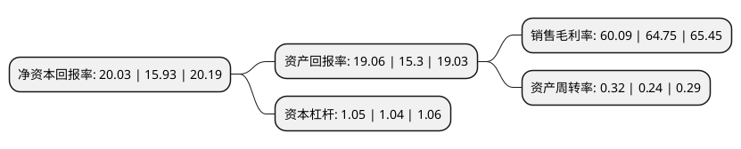

> 本页面由自动化程序生成于 2022年5月20日 01:38
> 内容可能存在错误，如有bug请提交issue至：https://github.com/Eroleice/doc-pi/issues
{.is-warning}

# 上市公司基本情况

## 基本资料

上海柏楚电子科技股份有限公司（以下简称“柏楚电子”）成立于2007年09月11日，上海市。于2019年08月08日在上交所科创板上市。

柏楚电子注册资本10,033.535万元，主营业务为各类激光切割设备制造商提供以激光切割控制系统为核心的各类自动化产品，主要产品包括随动控制系统，板卡控制系统，总线控制系统及其他相关配套产品。以下是详细信息：

- 公司名称: 上海柏楚电子科技股份有限公司
- 股票代码: 688188.SH
- 所在地: 上海 - 上海市
- 成立日期: 2007年09月11日
- 注册资本: 10,033.535万元
- 法定代表人: 唐晔
- 主营业务: 主营业务为各类激光切割设备制造商提供以激光切割控制系统为核心的各类自动化产品，主要产品包括随动控制系统，板卡控制系统，总线控制系统及其他相关配套产品
- 公司官网: www.fscut.com
- 公司介绍: 公司是一家从事激光切割控制系统的研发、生产和销售的高新技术企业和重点软件企业，是国家首批从事光纤激光切割成套控制系统开发的民营企业，致力于为激光加工提供稳定、高效的自动化控制解决方案，推动中国工业自动化的发展，公司主营业务系为各类激光切割设备制造商提供以激光切割控制系统为核心的各类自动化产品，公司产品以自主软件开发为核心，并与板卡、总线主站、电容调高器等硬件集成后进行销售，其中部分硬件通过外协厂商进行加工。公司全部产品均直接销售给下游客户，不存在通过代理或经销商销售的情形。中低功率激光切割控制系统领域中，目前国产激光运动控制系统已占据中国市场的主导地位。公司通过自主研发，承担了国家技术创新基金项目、上海市创新资金项目、上海市软件和集成电路产业发展专项资金项目、闵行区科研项目与闵行区产学研项目等一系列技术项目，技术水平获得肯定。公司先后荣获“上海市小巨人企业”，上海市“专精特新”企业，“闵行区小巨人培育企业”，“闵行区研发机构”等多项企业荣誉。

## 股东及高管情况

上市公司第一大股东为唐晔，持股21,000,000股，占比20.19%，**疑似为**上市公司实际控制人。

截至2022年04月19日，上市公司的前十大股东中，共有7名自然人股东，3个产品账户，其中5%以上大股东共有7名。上市公司前十大股东明细如下：

> 未能通过持股比例判定出上市公司实际控制人（持股30%以上）
> 可能存在通过间接持股、联合持股、协议控制等方式拥有实际控制权的主体，具体请参考上市公司定期公告！
{.is-warning}

> 截至2022年04月19日，上市公司前十大股东信息如下：

| 股东名称 | 持股数量（股） | 持股比例 |
| --- | --- | --- |
| 唐晔 | 21,000,000 | 20.19% |
| 唐晔 | 21,000,000 | 20.93% |
| 代田田 | 16,425,000 | 15.79% |
| 卢琳 | 14,250,000 | 13.7% |
| 万章 | 12,750,000 | 12.26% |
| 万章 | 12,750,000 | 12.71% |
| 谢淼 | 9,000,000 | 8.65% |
| 全国社保基金四零六组合 | 1,960,996 | 1.95% |
| 中国邮政储蓄银行股份有限公司-易方达新收益灵活配置混合型证券投资基金 | 1,171,078 | 1.17% |
| 招商银行股份有限公司-泓德丰润三年持有期混合型证券投资基金 | 973,748 | 0.97% |

## 利润表分析

上市公司2021年总收入为9.13亿元，净利润为5.48亿元，实现盈利。

## 杜邦分析

> 数据列示周期：2021年 | 2020年 | 2019年
{.is-info}

上市公司的净资产收益率在近一年有所上升，上升幅度为25.74%，其变化情况分解如下：
- 上市公司的销售毛利率在近一年下降了-7.2%，可能是生产效率的下降、商品原材料价格上涨或商品价格的下跌所致。
- 上市公司的资产周转率在近一年上升了33.33%，可能是源自于更快的销售回款或库存管理效果提升。
- 上市公司的财务杠杆比率在近一年上升了0.96%，可能是增加负债扩大生产规模。

