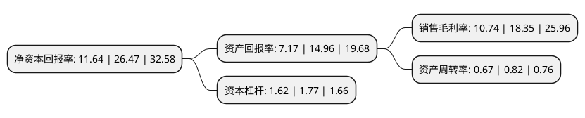

> 本页面由自动化程序生成于 2022年5月20日 01:38
> 内容可能存在错误，如有bug请提交issue至：https://github.com/Eroleice/doc-pi/issues
{.is-warning}

# 上市公司基本情况

## 基本资料

智洋创新科技股份有限公司（以下简称“智洋创新”）成立于2006年03月27日，淄博市。于2021年04月08日在上交所科创板上市。

智洋创新注册资本15,304.605万元，提供集监控，管理，分析，预警，告警，联动于一体的智能运维分析管理系统。以下是详细信息：

- 公司名称: 智洋创新科技股份有限公司
- 股票代码: 688191.SH
- 所在地: 山东 - 淄博市
- 成立日期: 2006年03月27日
- 注册资本: 15,304.605万元
- 法定代表人: 刘国永
- 主营业务: 提供集监控，管理，分析，预警，告警，联动于一体的智能运维分析管理系统
- 公司官网: www.zhiyangcn.cn
- 公司介绍: 公司是国内专业的电力智能运维分析管理系统提供商，公司产品具有较高的技术水平。公司研发的“基于边缘计算的输电线路智能监测终端”、“适用于无信号区的输电线路智能监测系统”2项技术成果被鉴定为国际领先；“环网柜智能运维管理系统”、“基于中央集控和智能诊断的变电站直流电源系统”、“直流电源培训及测试系统”3项技术成果被鉴定为国际先进；“基于移动互联的输电线路通道监测管理平台”、“基于人工智能的输电通道隐患主动识别和预警软件平台”、“人工智能和虚拟技术在变电站监控中的应用”等9项技术成果被鉴定为国内领先。公司输电线路智能运维分析管理系统前端智能感知层可视化装置获得了2019年国家电网“通道可视化图像人工智能识别技术检测”前端设备组第一名，公司输电智能运检解决方案获得了“2019华为开发者大赛Atlas赛道(商业组)”一等奖。此外，公司“ZHY1600变电站设备热点温度无线监测系统”被列为“国家重点新产品”；“直流远程监控系统”被列为“国家火炬计划项目”；“变电站智慧管理系统”被列入“国家火炬计划产业化示范项目”；“蓄电池在线监测系统”获得科技型中小企业技术创新基金支持。

## 股东及高管情况

上市公司第一大股东为淄博智洋控股有限公司，持股52,416,000股，占比34.25%，为上市公司实际控制人。

截至2022年03月31日，上市公司的前十大股东中，共有4名自然人股东，6名机构股东，其中5%以上大股东共有4名。上市公司前十大股东明细如下：

> 截至2022年03月31日，上市公司前十大股东信息如下：

| 股东名称 | 持股数量（股） | 持股比例 |
| --- | --- | --- |
| 淄博智洋控股有限公司 | 52,416,000 | 34.25% |
| 民生证券投资有限公司 | 8,492,176 | 5.55% |
| 淄博智洋投资合伙企业(有限合伙) | 8,320,000 | 5.44% |
| 刘国永 | 8,219,520 | 5.37% |
| 宁波昆石天利股权投资合伙企业(有限合伙) | 6,981,335 | 4.56% |
| 聂树刚 | 6,388,480 | 4.17% |
| 赵砚青 | 4,816,000 | 3.15% |
| 国高(淄博)创业投资有限公司 | 2,766,400 | 1.81% |
| 宁波梅山保税港区昆石成长股权投资合伙企业(有限合伙) | 2,192,000 | 1.43% |
| 谷凤琴 | 1,624,000 | 1.06% |

## 利润表分析

上市公司2021年总收入为6.56亿元，净利润为0.7亿元，实现盈利。

## 杜邦分析

> 数据列示周期：2021年 | 2020年 | 2019年
{.is-info}

上市公司的净资产收益率在近一年有所下降，下降幅度为-56.03%，其变化情况分解如下：
- 上市公司的销售毛利率在近一年下降了-41.47%，可能是生产效率的下降、商品原材料价格上涨或商品价格的下跌所致。
- 上市公司的资产周转率在近一年下降了-18.29%，可能是源自于更慢的销售回款或库存管理效果下降。
- 上市公司的财务杠杆比率在近一年下降了-8.47%，可能是减少负债降低财务费用。

