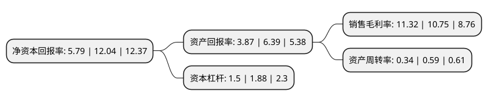

> 本页面由自动化程序生成于 2022年5月20日 01:38
> 内容可能存在错误，如有bug请提交issue至：https://github.com/Eroleice/doc-pi/issues
{.is-warning}

# 上市公司基本情况

## 基本资料

广州市品高软件股份有限公司（以下简称“品高股份”）成立于2003年01月01日，广州市。于2021年12月30日在上交所科创板上市。

品高股份注册资本11,305.528万元，公司是国内专业的云计算及行业信息化服务提供商，面向轨交，政府，电信，公安，汽车，金融，教育，军工等行业客户提供从IaaS基础设施层，PaaS平台层，DaaS数据层到SaaS软件层的全栈企业级云平台和信息化服务。经过多年的研发，公司目前拥有以云计算为核心的基础产品BingoCloudOS，BingoFuse，BingoInsight和BingoLink等。以下是详细信息：

- 公司名称: 广州市品高软件股份有限公司
- 股票代码: 688227.SH
- 所在地: 广东 - 广州市
- 成立日期: 2003年01月01日
- 注册资本: 11,305.528万元
- 法定代表人: 黄海
- 主营业务: 公司是国内专业的云计算及行业信息化服务提供商，面向轨交，政府，电信，公安，汽车，金融，教育，军工等行业客户提供从IaaS基础设施层，PaaS平台层，DaaS数据层到SaaS软件层的全栈企业级云平台和信息化服务经过多年的研发，公司目前拥有以云计算为核心的基础产品BingoCloudOS，BingoFuse，BingoInsight和BingoLink等
- 公司官网: www.bingosoft.net
- 公司介绍: 公司以自主研发的基础产品为支撑，立足于“行业+云”的发展战略，为行业客户提供围绕业务交付的全生命周期服务，包括基础设施、应用交付、数据治理及IT运营管理的规划设计、定制开发、实施及运维等，推动客户实现具备快速需求响应和业务创新能力的数字化、网络化及智能化转型。公司一直专注于为客户提供软件和信息技术服务，一方面公司行业信息化解决方案业务在轨交、电信、政府、汽车等行业深耕多年，充分了解客户的业务需求，积累了大量稳定优质的客户，该类客户成为公司云产品支撑业务服务转型的重要来源和业务实践；另一方面，公司积极开拓云产品及服务业务，并在政府、公安、金融、教育、军工等领域积累了大量的新型的标杆客户，同时为这些客户发挥云的整体效能提供应用入云、数据入云和业务整合的顾问和技术能力支撑。因此，公司根据客户需求及对其业务的了解，为其提供涵盖云计算、大数据和行业信息化的整体解决方案，行业信息化服务与云产品及服务业务相辅相成，共同促进公司业务的发展，形成了“行业+云”的业务模式，客户的粘性和稳定性高，业务连续性和持续性强。

## 股东及高管情况

上市公司第一大股东为北京市尚高企业管理有限公司，持股47,224,294股，占比41.77%，为上市公司实际控制人。

截至2022年03月31日，上市公司的前十大股东中，共有1名自然人股东，7名机构股东，2个产品账户，其中5%以上大股东共有2名。上市公司前十大股东明细如下：

> 截至2022年03月31日，上市公司前十大股东信息如下：

| 股东名称 | 持股数量（股） | 持股比例 |
| --- | --- | --- |
| 北京市尚高企业管理有限公司 | 47,224,294 | 41.77% |
| 广州市旌德企业管理咨询企业(有限合伙) | 6,465,300 | 5.72% |
| 广州市煦昇企业管理咨询企业(有限合伙) | 4,276,458 | 3.78% |
| 广州轨道交通产业投资发展基金(有限合伙) | 3,428,820 | 3.03% |
| 广州合赢投资合伙企业(有限合伙) | 3,114,079 | 2.75% |
| 宁波晨晖盛景股权投资合伙企业(有限合伙) | 2,905,263 | 2.57% |
| 广州白云电器设备股份有限公司 | 2,244,315 | 1.99% |
| 广州越秀智创升级产业投资基金合伙企业(有限合伙) | 1,851,563 | 1.64% |
| 邹志锦 | 1,734,200 | 1.53% |
| 广州红土天科创业投资有限公司 | 1,661,400 | 1.47% |

## 利润表分析

上市公司2021年总收入为4.71亿元，净利润为0.53亿元，实现盈利。

## 杜邦分析

> 数据列示周期：2021年 | 2020年 | 2019年
{.is-info}

上市公司的净资产收益率在近一年有所下降，下降幅度为-51.91%，其变化情况分解如下：
- 上市公司的销售毛利率在近一年上升了5.3%，可能是生产效率的提升、商品原材料价格下跌或商品价格的上涨所致。
- 上市公司的资产周转率在近一年下降了-42.37%，可能是源自于更慢的销售回款或库存管理效果下降。
- 上市公司的财务杠杆比率在近一年下降了-20.21%，可能是减少负债降低财务费用。

