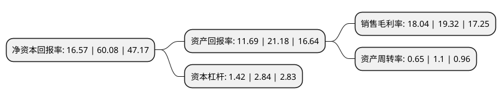

> 本页面由自动化程序生成于 2022年5月20日 01:38
> 内容可能存在错误，如有bug请提交issue至：https://github.com/Eroleice/doc-pi/issues
{.is-warning}

# 上市公司基本情况

## 基本资料

国泰新点软件股份有限公司（以下简称“新点软件”）成立于1998年10月06日，苏州市。于2021年11月17日在上交所科创板上市。

新点软件注册资本33,000万元，专注于为智慧城市中的智慧招采，智慧政务及数字建设三个细分领域提供以软件为核心的智慧化整体解决方案。以下是详细信息：

- 公司名称: 国泰新点软件股份有限公司
- 股票代码: 688232.SH
- 所在地: 江苏 - 苏州市
- 成立日期: 1998年10月06日
- 注册资本: 33,000万元
- 法定代表人: 曹立斌
- 主营业务: 专注于为智慧城市中的智慧招采，智慧政务及数字建设三个细分领域提供以软件为核心的智慧化整体解决方案
- 公司官网: www.epoint.com.cn
- 公司介绍: 公司是国家规划布局内重点软件企业。公司专注于为智慧城市中的智慧招采、智慧政务及数字建设三个细分领域提供以软件为核心的智慧化整体解决方案。公司通过将AI和大数据等新兴信息技术与相关行业信息化需求深度融合，提升软件平台智慧化程度。公司围绕新一代信息技术为核心的软件平台，搭配运营维护服务、智能化硬件设备、智能化工程服务，具备覆盖客户全信息化需求的产品及服务。公司在软件开发、实施方面通过了多个国际标准体系的认证，包括获得CMMI L5认证评估、ISO9001:2000质量体系认定、ISO27001信息技术服务运行维护等证书，并获中国软件诚信示范企业、江苏省生产性服务业领军企业等奖项。公司还多次参加《中国电子政务论坛》、《数字中国》、《数博会》、《住建部工改项目研讨会》等重量级行业会议，并在相应分论坛上作专题发言。

## 股东及高管情况

上市公司第一大股东为江苏国泰国际贸易有限公司，持股62,083,643股，占比18.81%，**疑似为**上市公司实际控制人。

截至2022年03月31日，上市公司的前十大股东中，共有4名自然人股东，5名机构股东，1个产品账户，其中5%以上大股东共有8名。上市公司前十大股东明细如下：

> 未能通过持股比例判定出上市公司实际控制人（持股30%以上）
> 可能存在通过间接持股、联合持股、协议控制等方式拥有实际控制权的主体，具体请参考上市公司定期公告！
{.is-warning}

> 截至2022年03月31日，上市公司前十大股东信息如下：

| 股东名称 | 持股数量（股） | 持股比例 |
| --- | --- | --- |
| 江苏国泰国际贸易有限公司 | 62,083,643 | 18.81% |
| 曹立斌 | 35,413,290 | 10.73% |
| 黄素龙 | 31,478,535 | 9.54% |
| 李强(男) | 21,641,400 | 6.56% |
| 张家港华慧企业管理服务部(有限合伙) | 20,657,835 | 6.26% |
| 张家港亿瑞企业咨询服务部(有限合伙) | 20,067,548 | 6.08% |
| 张家港保税区百胜企业管理企业(有限合伙) | 19,674,021 | 5.96% |
| 张家港保税区恒兴投资有限公司 | 16,612,695 | 5.03% |
| 陈俊荣 | 3,934,755 | 1.19% |
| 招商银行股份有限公司-鹏华新兴产业混合型证券投资基金 | 3,374,034 | 1.02% |

## 利润表分析

上市公司2021年总收入为27.94亿元，净利润为5.04亿元，实现盈利。

## 杜邦分析

> 数据列示周期：2021年 | 2020年 | 2019年
{.is-info}

上市公司的净资产收益率在近一年有所下降，下降幅度为-72.42%，其变化情况分解如下：
- 上市公司的销售毛利率在近一年下降了-6.63%，可能是生产效率的下降、商品原材料价格上涨或商品价格的下跌所致。
- 上市公司的资产周转率在近一年下降了-40.91%，可能是源自于更慢的销售回款或库存管理效果下降。
- 上市公司的财务杠杆比率在近一年下降了-50%，可能是减少负债降低财务费用。

