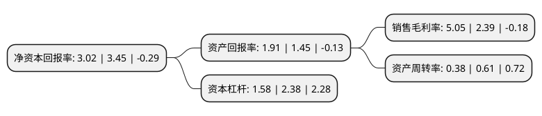

> 本页面由自动化程序生成于 2022年5月20日 01:38
> 内容可能存在错误，如有bug请提交issue至：https://github.com/Eroleice/doc-pi/issues
{.is-warning}

# 上市公司基本情况

## 基本资料

嘉和美康(北京)科技股份有限公司（以下简称“嘉和美康”）成立于2006年03月03日，北京市。于2021年12月14日在上交所科创板上市。

嘉和美康注册资本13,787.75万元，主要产品和业务包括自制软件销售，软件开发及技术服务，外购软硬件销售，医疗器械生产及销售，致力于向医疗相关机构提供综合信息化解决方案。以下是详细信息：

- 公司名称: 嘉和美康(北京)科技股份有限公司
- 股票代码: 688246.SH
- 所在地: 北京 - 北京市
- 成立日期: 2006年03月03日
- 注册资本: 13,787.75万元
- 法定代表人: 夏军
- 主营业务: 主要产品和业务包括自制软件销售，软件开发及技术服务，外购软硬件销售，医疗器械生产及销售，致力于向医疗相关机构提供综合信息化解决方案
- 公司官网: www.bjgoodwill.com
- 公司介绍: 公司是国内最早从事医疗信息化软件研发与产业化的企业之一，长期深耕临床信息化领域，是国内该领域的领军企业之一。经过十余年的发展和投入，公司目前已经形成了具有自主知识产权的医疗信息化核心技术与产品体系，覆盖临床医疗、医院管理、医学科研、医患互动、医养结合、医疗支付优化等产业链环节，致力于向医疗相关机构提供综合信息化解决方案。公司是国家电子病历、互联互通评级标准制定的参与单位，曾在2009年受邀参与完成卫生部《基于电子病历的医院信息系统集成平台》的编写，并于2017年配合北医三院参与《电子病历系统功能应用水平分级评价方法及标准》的修订工作，公司还参与编写了人民卫生出版社的《医院信息平台技术与应用》《电子病历技术与应用》等业内技术发展应用方面的专业书籍。

## 股东及高管情况

上市公司第一大股东为夏军，持股24,690,198股，占比17.91%，**疑似为**上市公司实际控制人。

截至2022年03月31日，上市公司的前十大股东中，共有2名自然人股东，5名机构股东，3个产品账户，其中5%以上大股东共有5名。上市公司前十大股东明细如下：

> 未能通过持股比例判定出上市公司实际控制人（持股30%以上）
> 可能存在通过间接持股、联合持股、协议控制等方式拥有实际控制权的主体，具体请参考上市公司定期公告！
{.is-warning}

> 截至2022年03月31日，上市公司前十大股东信息如下：

| 股东名称 | 持股数量（股） | 持股比例 |
| --- | --- | --- |
| 夏军 | 24,690,198 | 17.91% |
| 国寿成达(上海)健康产业股权投资中心(有限合伙) | 19,569,619 | 14.19% |
| 弘云久康数据技术(北京)有限公司 | 15,045,882 | 10.91% |
| 北京和美嘉和投资管理中心(有限合伙) | 8,861,397 | 6.43% |
| 苏州赛富璞鑫医疗健康产业投资中心(有限合伙) | 8,612,134 | 6.25% |
| 北京凯旋恒业投资管理有限公司-咸宁市凯旋机会成长基金(有限合伙) | 5,741,423 | 4.16% |
| 中金佳泰贰期(天津)股权投资基金合伙企业(有限合伙) | 3,429,954 | 2.49% |
| 中金佳合(天津)股权投资基金管理有限公司-中金佳泰贰期(天津)股权投资基金合伙企业(有限合伙) | 3,429,954 | 2.49% |
| 任勇 | 3,081,966 | 2.24% |
| 广州花城创业投资管理有限公司-广东花城二号股权投资合伙企业(有限合伙) | 2,057,972 | 1.49% |

## 利润表分析

上市公司2021年总收入为6.51亿元，净利润为0.32亿元，实现盈利。

## 杜邦分析

> 数据列示周期：2021年 | 2020年 | 2019年
{.is-info}

上市公司的净资产收益率在近一年有所下降，下降幅度为-12.46%，其变化情况分解如下：
- 上市公司的销售毛利率在近一年上升了111.3%，可能是生产效率的提升、商品原材料价格下跌或商品价格的上涨所致。
- 上市公司的资产周转率在近一年下降了-37.7%，可能是源自于更慢的销售回款或库存管理效果下降。
- 上市公司的财务杠杆比率在近一年下降了-33.61%，可能是减少负债降低财务费用。

