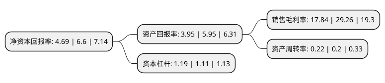

> 本页面由自动化程序生成于 2022年5月20日 01:38
> 内容可能存在错误，如有bug请提交issue至：https://github.com/Eroleice/doc-pi/issues
{.is-warning}

# 上市公司基本情况

## 基本资料

江苏卓易信息科技股份有限公司（以下简称“卓易信息”）成立于2008年05月12日，无锡市。于2019年12月09日在上交所科创板上市。

卓易信息注册资本8,695.659万元，公司拥有自主知识产权的云计算设备核心固件(BIOS，BMC)技术与云平台技术。其中固件技术，主要面向CPU厂商，计算设备厂商等客户，为其提供BIOS，BMC固件定制开发及固件产品销售;云平台技术主要面向政府，企业等客户，为其提供定制化软件开发或标准化应用软件产品，软硬件整体解决方案，并提供配套计算资源租赁，运维等服务。以下是详细信息：

- 公司名称: 江苏卓易信息科技股份有限公司
- 股票代码: 688258.SH
- 所在地: 江苏 - 无锡市
- 成立日期: 2008年05月12日
- 注册资本: 8,695.659万元
- 法定代表人: 谢乾
- 主营业务: 公司拥有自主知识产权的云计算设备核心固件(BIOS，BMC)技术与云平台技术其中固件技术，主要面向CPU厂商，计算设备厂商等客户，为其提供BIOS，BMC固件定制开发及固件产品销售;云平台技术主要面向政府，企业等客户，为其提供定制化软件开发或标准化应用软件产品，软硬件整体解决方案，并提供配套计算资源租赁，运维等服务
- 公司官网: www.eazytec.com
- 公司介绍: 公司是国内少数掌握X86、ARM、MIPS等多架构BIOS技术及BMC固件开发技术的厂商，是中国大陆唯一、全球四家之一的X86架构BIOS独立供应商,同时作为国内少数能够为国产芯片龙芯(MIPS架构)、华为(ARM架构)等提供BIOS固件技术服务的厂商，公司拥有自主知识产权的云计算设备核心固件(BIOS、BMC)技术与云平台技术。其中固件技术，主要面向CPU厂商、计算设备厂商等客户，为其提供BIOS、BMC固件定制开发及固件产品销售；云平台技术主要面向政府、企业等客户，为其提供定制化软件开发或标准化应用软件产品、软硬件整体解决方案，并提供配套计算资源租赁、运维等服务,能够满足采用自主、可控国产芯片的云计算设备的BIOS、BMC固件配套需求。公司是国家重点软件企业、国家高新技术企业、“安全可靠工作委员会”会员单位。

## 股东及高管情况

上市公司第一大股东为谢乾，持股37,430,696股，占比43.05%，为上市公司实际控制人。

截至2022年03月31日，上市公司的前十大股东中，共有7名自然人股东，2名机构股东，1个产品账户，其中5%以上大股东共有2名。上市公司前十大股东明细如下：

> 截至2022年03月31日，上市公司前十大股东信息如下：

| 股东名称 | 持股数量（股） | 持股比例 |
| --- | --- | --- |
| 谢乾 | 37,430,696 | 43.05% |
| 宜兴中恒企业管理有限公司 | 6,072,000 | 6.98% |
| 英特尔产品(成都)有限公司 | 2,270,000 | 2.61% |
| 刘丹 | 1,318,566 | 1.52% |
| 刘东歌 | 1,000,000 | 1.15% |
| 华软创业投资宜兴合伙企业(有限合伙) | 791,593 | 0.91% |
| 张宇明 | 775,000 | 0.89% |
| 姜雨 | 751,327 | 0.86% |
| 周方平 | 656,565 | 0.76% |
| 殷文远 | 611,561 | 0.7% |

## 杜邦分析

> 数据列示周期：2021年 | 2020年 | 2019年
{.is-info}

上市公司的净资产收益率在近一年有所下降，下降幅度为-28.94%，其变化情况分解如下：
- 上市公司的销售毛利率在近一年下降了-39.03%，可能是生产效率的下降、商品原材料价格上涨或商品价格的下跌所致。
- 上市公司的资产周转率在近一年上升了10%，可能是源自于更快的销售回款或库存管理效果提升。
- 上市公司的财务杠杆比率在近一年上升了7.21%，可能是增加负债扩大生产规模。

