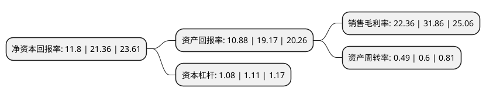

> 本页面由自动化程序生成于 2022年5月20日 01:40
> 内容可能存在错误，如有bug请提交issue至：https://github.com/Eroleice/doc-pi/issues
{.is-warning}

# 上市公司基本情况

## 基本资料

苏州工业园区凌志软件股份有限公司（以下简称“凌志软件”）成立于2003年01月03日，苏州市。于2020年05月11日在上交所科创板上市。

凌志软件注册资本40,001万元，致力于新兴技术在金融行业的应用，为客户提供咨询，设计，开发，维护等全方位的软件服务，业务范围涵盖了证券，保险，银行，信托，资产管理等金融领域以下是详细信息：

- 公司名称: 苏州工业园区凌志软件股份有限公司
- 股票代码: 688588.SH
- 所在地: 江苏 - 苏州市
- 成立日期: 2003年01月03日
- 注册资本: 40,001万元
- 法定代表人: 张宝泉
- 主营业务: 致力于新兴技术在金融行业的应用，为客户提供咨询，设计，开发，维护等全方位的软件服务，业务范围涵盖了证券，保险，银行，信托，资产管理等金融领域
- 公司官网: www.linkstec.com
- 公司介绍: 公司是一家金融软件公司，主要业务是为金融行业提供定制软件开发服务及应用软件解决方案。公司致力于新兴技术在金融行业的应用，为客户提供咨询、设计、开发、维护等全方位的软件开发服务，业务范围涵盖了证券、保险、银行、信托、资产管理等金融领域，实施项目过程中大量运用云计算、大数据、人工智能等新兴技术。经过多年的稳健发展，公司已经在海内外金融软件领域形成了一定的规模，并确立了自身的核心竞争优势。基于深厚的金融行业知识和技术研发能力，公司在进一步巩固和扩大国际软件市场的同时，加强了服务于国内金融机构的软件产品及综合解决方案的研究与开发，并取得了相当的成绩，占有了一定的市场份额。

## 股东及高管情况

上市公司第一大股东为张宝泉，持股79,425,226股，占比19.86%，**疑似为**上市公司实际控制人。

截至2022年03月31日，上市公司的前十大股东中，共有4名自然人股东，5名机构股东，1个产品账户，其中5%以上大股东共有5名。上市公司前十大股东明细如下：

> 未能通过持股比例判定出上市公司实际控制人（持股30%以上）
> 可能存在通过间接持股、联合持股、协议控制等方式拥有实际控制权的主体，具体请参考上市公司定期公告！
{.is-warning}

> 截至2022年03月31日，上市公司前十大股东信息如下：

| 股东名称 | 持股数量（股） | 持股比例 |
| --- | --- | --- |
| 张宝泉 | 79,425,226 | 19.86% |
| 吴艳芳 | 66,683,517 | 16.67% |
| 新余华达启富投资中心(有限合伙) | 28,618,947 | 7.15% |
| 新余华盈投资中心(有限合伙) | 27,216,964 | 6.8% |
| 新余华富智汇投资中心(有限合伙) | 26,453,881 | 6.61% |
| 周颖 | 7,719,885 | 1.93% |
| 梁启华 | 5,781,628 | 1.45% |
| 天风证券资管-苏州工业园区凌志软件股份有限公司-第一期员工持股计划-天风天浩18号单一资产管理计划 | 5,087,227 | 1.27% |
| 新余富汇投资中心(有限合伙) | 5,054,010 | 1.26% |
| 新余汇达投资中心(有限合伙) | 4,980,256 | 1.25% |

## 利润表分析

上市公司2021年总收入为6.52亿元，净利润为1.45亿元，实现盈利。

## 杜邦分析

> 数据列示周期：2021年 | 2020年 | 2019年
{.is-info}

上市公司的净资产收益率在近一年有所下降，下降幅度为-44.76%，其变化情况分解如下：
- 上市公司的销售毛利率在近一年下降了-29.82%，可能是生产效率的下降、商品原材料价格上涨或商品价格的下跌所致。
- 上市公司的资产周转率在近一年下降了-18.33%，可能是源自于更慢的销售回款或库存管理效果下降。
- 上市公司的财务杠杆比率在近一年下降了-2.7%，可能是减少负债降低财务费用。

