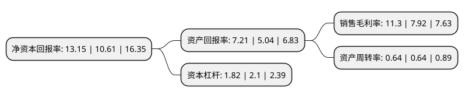

> 本页面由自动化程序生成于 2022年5月20日 01:40
> 内容可能存在错误，如有bug请提交issue至：https://github.com/Eroleice/doc-pi/issues
{.is-warning}

# 上市公司基本情况

## 基本资料

上海新致软件股份有限公司（以下简称“新致软件”）成立于1994年06月04日，上海市。于2020年12月07日在上交所科创板上市。

新致软件注册资本18,202.228万元，专注于为金融机构提供基于自有产品的信息化通用解决方案，为企业客户提供行业信息化定制解决方案以及向海外发包商提供软件外包服务。以下是详细信息：

- 公司名称: 上海新致软件股份有限公司
- 股票代码: 688590.SH
- 所在地: 上海 - 上海市
- 成立日期: 1994年06月04日
- 注册资本: 18,202.228万元
- 法定代表人: 郭玮
- 主营业务: 专注于为金融机构提供基于自有产品的信息化通用解决方案，为企业客户提供行业信息化定制解决方案以及向海外发包商提供软件外包服务
- 公司官网: www.newtouch.com
- 公司介绍: 公司是国内领先的软件和信息技术服务提供商，专注于为金融机构提供基于自有产品的信息化通用解决方案，为企业客户提供行业信息化定制解决方案以及向海外发包商提供软件外包服务,公司客户包括中国太保、中国人寿、中国人保、交通银行、建设银行、中国电信、中国移动、中国联通、上海汽车、复星集团、NEC、富士通、TIS、松下等行业龙头企业,公司承担多项上海市重要科研课题或研发产业化项目。公司是国家发展和改革委员会、工业和信息化部、商务部、财政部和国家税务总局联合认定的“国家规划布局内重点软件企业”，是“高新技术企业”、“上海市企业技术中心”、“上海市科技小巨人企业”、“上海软件企业规模百强”，连续多年被评为“上海市明星软件企业”。公司获得了280余项软件著作权，在金融行业有诸多典型案例，其中“新致金融大数据ECIF平台”、“新致金融风控预警监控平台”及“新致智能机器人服务平台”入选由工信部下属中国信息通信研究院编写的《2019年金融科技创新应用案例集》，另有20余款产品被评为上海市移动互联网优秀案例及优秀产品。公司拥有软件企业和软件产品“双软”认证，通过了ISO27001、ISO9001质量体系认证和CMMI5评估。

## 股东及高管情况

上市公司第一大股东为上海前置通信技术有限公司，持股48,129,120股，占比26.44%，**疑似为**上市公司实际控制人。

截至2022年03月31日，上市公司的前十大股东中，共有7名机构股东，3个海外主体，其中5%以上大股东共有2名。上市公司前十大股东明细如下：

> 未能通过持股比例判定出上市公司实际控制人（持股30%以上）
> 可能存在通过间接持股、联合持股、协议控制等方式拥有实际控制权的主体，具体请参考上市公司定期公告！
{.is-warning}

> 截至2022年03月31日，上市公司前十大股东信息如下：

| 股东名称 | 持股数量（股） | 持股比例 |
| --- | --- | --- |
| 上海前置通信技术有限公司 | 48,129,120 | 26.44% |
| 上海中件管理咨询有限公司 | 10,237,760 | 5.62% |
| 上海点距投资咨询合伙企业(有限合伙) | 7,629,556 | 4.19% |
| 旺道有限公司 | 7,051,920 | 3.87% |
| 德州仰岳创业投资合伙企业(有限合伙) | 5,875,019 | 3.23% |
| 常春藤(昆山)产业投资中心(有限合伙) | 5,785,560 | 3.18% |
| 乌鲁木齐东鹏创动股权投资管理合伙企业(有限合伙)-宁波东鹏合立股权投资合伙企业(有限合伙) | 5,593,487 | 3.07% |
| ACMECITY LIMITED | 4,704,480 | 2.58% |
| CENTRAL ERA LIMITED | 4,704,480 | 2.58% |
| OASIS COVE INVESTMENTS LIMITED | 4,704,480 | 2.58% |

## 利润表分析

上市公司2021年总收入为12.82亿元，净利润为1.44亿元，实现盈利。

## 杜邦分析

> 数据列示周期：2021年 | 2020年 | 2019年
{.is-info}

上市公司的净资产收益率在近一年有所上升，上升幅度为23.94%，其变化情况分解如下：
- 上市公司的销售毛利率在近一年上升了42.68%，可能是生产效率的提升、商品原材料价格下跌或商品价格的上涨所致。
- 上市公司的资产周转率在近一年下降了0%，可能是源自于更慢的销售回款或库存管理效果下降。
- 上市公司的财务杠杆比率在近一年下降了-13.33%，可能是减少负债降低财务费用。

