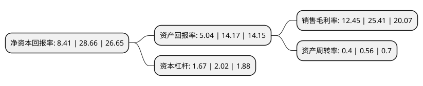

> 本页面由自动化程序生成于 2022年5月20日 01:40
> 内容可能存在错误，如有bug请提交issue至：https://github.com/Eroleice/doc-pi/issues
{.is-warning}

# 上市公司基本情况

## 基本资料

罗普特科技集团股份有限公司（以下简称“罗普特”）成立于2006年03月17日，厦门市。于2021年02月23日在上交所科创板上市。

罗普特注册资本18,728.802万元，主营业务包括社会安全系统解决方案设计实施，软硬件设计开发，产品销售及运维服务业务。以下是详细信息：

- 公司名称: 罗普特科技集团股份有限公司
- 股票代码: 688619.SH
- 所在地: 福建 - 厦门市
- 成立日期: 2006年03月17日
- 注册资本: 18,728.802万元
- 法定代表人: 江文涛
- 主营业务: 主营业务包括社会安全系统解决方案设计实施，软硬件设计开发，产品销售及运维服务业务
- 公司官网: www.ropeok.com
- 公司介绍: 公司是一家专注于视频智能分析技术、数据感知及计算技术在社会安全领域开发及应用的安全综合服务商和解决方案提供商，公司已取得建筑业企业资质证书(电子与智能化工程专业承包壹级)、防爆电气设备安装、修理资格证书、工程设计资质证书(建筑智能化系统设计专项乙级)等资质，具备进入重点行业、重要领域，承接重大社会安全工程的资质条件。此外，公司已取得装备承制单位资格证书、武器装备科研生产单位二级保密资格证书、涉密信息系统集成资质证书甲级(系统集成、安防监控、软件开发)等资质，具备了承接自主可控产品及项目、军工涉密产品及项目的能力。公司社会安全产品和系统集成服务已经在平安城市、雪亮工程、智慧城市、智慧交通、智慧监所、智慧消防、智慧边检、智慧军营、边海防、金融安全、教育安全、能源安全、森林防火等多个领域得到广泛运用，公司于2017年承接厦门“金砖国家领导人会晤”的重大安保工作，产品及服务受到各级政府及公安、政法系统的高度认可，是我国社会安全及信息技术科技领域的生力军。

## 股东及高管情况

上市公司第一大股东为陈延行，持股70,801,353股，占比37.8%，为上市公司实际控制人。

截至2022年04月11日，上市公司的前十大股东中，共有1名自然人股东，7名机构股东，2个产品账户，其中5%以上大股东共有3名。上市公司前十大股东明细如下：

> 截至2022年04月11日，上市公司前十大股东信息如下：

| 股东名称 | 持股数量（股） | 持股比例 |
| --- | --- | --- |
| 陈延行 | 70,801,353 | 37.8% |
| 厦门恒誉兴业投资合伙企业(有限合伙) | 9,523,012 | 5.08% |
| 厦门恒誉兴业壹号投资合伙企业(有限合伙) | 9,519,582 | 5.08% |
| 北京泰达博瑞投资管理有限公司 | 6,492,907 | 3.47% |
| 厦门恒誉兴业贰号投资合伙企业(有限合伙) | 4,139,779 | 2.21% |
| 厦门恒誉兴业叁号投资合伙企业(有限合伙) | 4,139,779 | 2.21% |
| 厦门永诚誉投资合伙企业(有限合伙) | 3,895,744 | 2.08% |
| 福建晋江十月华隆股权投资合伙企业(有限合伙) | 2,571,191 | 1.37% |
| 深圳市麦高富达基金管理有限公司-深圳汇智同安投资合伙企业(有限合伙) | 2,568,741 | 1.37% |
| 深圳市麦高富达基金管理有限公司-深圳汇智同舟投资合伙企业(有限合伙) | 2,568,741 | 1.37% |

## 利润表分析

上市公司2021年总收入为7.24亿元，净利润为0.9亿元，实现盈利。

## 杜邦分析

> 数据列示周期：2021年 | 2020年 | 2019年
{.is-info}

上市公司的净资产收益率在近一年有所下降，下降幅度为-70.66%，其变化情况分解如下：
- 上市公司的销售毛利率在近一年下降了-51%，可能是生产效率的下降、商品原材料价格上涨或商品价格的下跌所致。
- 上市公司的资产周转率在近一年下降了-28.57%，可能是源自于更慢的销售回款或库存管理效果下降。
- 上市公司的财务杠杆比率在近一年下降了-17.33%，可能是减少负债降低财务费用。

