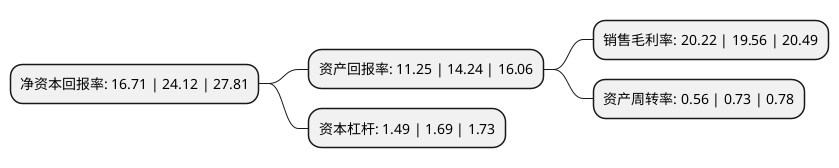

> 本页面由自动化程序生成于 2022年5月20日 01:40
> 内容可能存在错误，如有bug请提交issue至：https://github.com/Eroleice/doc-pi/issues
{.is-warning}

# 上市公司基本情况

## 基本资料

上海霍莱沃电子系统技术股份有限公司（以下简称“霍莱沃”）成立于2007年07月10日，上海市。于2021年04月20日在上交所科创板上市。

霍莱沃注册资本3,700万元，致力于电磁场与微波技术各类应用技术的测试和仿真，主要从事无线通信和雷达领域的测试，仿真和整体设备系统的业务。具体而言，公司依托自主研发的电磁场仿真分析与相控阵校准测试核心算法，围绕相控阵的设计，研发，生产和应用阶段，提供相应软件，系统和相关产品。以下是详细信息：

- 公司名称: 上海霍莱沃电子系统技术股份有限公司
- 股票代码: 688682.SH
- 所在地: 上海 - 上海市
- 成立日期: 2007年07月10日
- 注册资本: 3,700万元
- 法定代表人: 周建华
- 主营业务: 致力于电磁场与微波技术各类应用技术的测试和仿真，主要从事无线通信和雷达领域的测试，仿真和整体设备系统的业务具体而言，公司依托自主研发的电磁场仿真分析与相控阵校准测试核心算法，围绕相控阵的设计，研发，生产和应用阶段，提供相应软件，系统和相关产品
- 公司官网: www.holly-wave.com
- 公司介绍: 公司主要客户为军工集团的下属单位，产品主要应用于国防科技工业中的相控阵领域。近年来，随着相控阵技术在5G通信等领域的广泛应用，公司以相控阵校准测试算法为核心，快速发展5G基站测试系统业务，并已成为中兴通讯5G基站产线测试系统的主要供应商之一。公司为中国电子学会单位会员及中国通信标准化协会全权会员。公司作为骨干起草单位，参与制定了三项国家标准，分别为《GB/T6113.105-2018无线电骚扰和抗扰度测量设备和测量方法规范第1-5部分：无线电骚扰和抗扰度测量设备5MHz~18GHz天线校准场地和参考试验场地》《GB/T6113.106-2018无线电骚扰和抗扰度测量设备和测量方法规范第1-6部分：无线电骚扰和抗扰度测量设备EMC天线校准》和《GB/T38889-2020天线及接收系统的无线电干扰天线测量车载天线及系统》。

## 股东及高管情况

上市公司第一大股东为周建华，持股10,200,000股，占比27.57%，**疑似为**上市公司实际控制人。

截至2022年03月31日，上市公司的前十大股东中，共有5名自然人股东，3名机构股东，2个产品账户，其中5%以上大股东共有4名。上市公司前十大股东明细如下：

> 未能通过持股比例判定出上市公司实际控制人（持股30%以上）
> 可能存在通过间接持股、联合持股、协议控制等方式拥有实际控制权的主体，具体请参考上市公司定期公告！
{.is-warning}

> 截至2022年03月31日，上市公司前十大股东信息如下：

| 股东名称 | 持股数量（股） | 持股比例 |
| --- | --- | --- |
| 周建华 | 10,200,000 | 27.57% |
| 陆丹敏 | 5,445,000 | 14.72% |
| 上海莱珍投资合伙企业(有限合伙) | 2,800,000 | 7.57% |
| 方卫中 | 2,482,000 | 6.71% |
| 周菡清 | 1,200,000 | 3.24% |
| 富诚海富资管-海通证券-富诚海富通霍莱沃员工参与科创板战略配售集合资产管理计划 | 917,800 | 2.48% |
| 杨之华 | 800,000 | 2.16% |
| 海富产业投资基金管理有限公司-海富长江成长股权投资(湖北)合伙企业(有限合伙) | 800,000 | 2.16% |
| 广州鹏德投资咨询合伙企业(有限合伙) | 800,000 | 2.16% |
| 上海莱磁投资合伙企业(有限合伙) | 800,000 | 2.16% |

## 利润表分析

上市公司2021年总收入为3.29亿元，净利润为0.66亿元，实现盈利。

## 杜邦分析

> 数据列示周期：2021年 | 2020年 | 2019年
{.is-info}

上市公司的净资产收益率在近一年有所下降，下降幅度为-30.72%，其变化情况分解如下：
- 上市公司的销售毛利率在近一年上升了3.37%，可能是生产效率的提升、商品原材料价格下跌或商品价格的上涨所致。
- 上市公司的资产周转率在近一年下降了-23.29%，可能是源自于更慢的销售回款或库存管理效果下降。
- 上市公司的财务杠杆比率在近一年下降了-11.83%，可能是减少负债降低财务费用。

