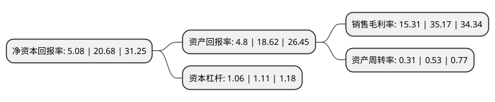

> 本页面由自动化程序生成于 2022年5月20日 01:40
> 内容可能存在错误，如有bug请提交issue至：https://github.com/Eroleice/doc-pi/issues
{.is-warning}

# 上市公司基本情况

## 基本资料

北京海天瑞声科技股份有限公司（以下简称“海天瑞声”）成立于2005年05月11日，北京市。于2021年08月13日在上交所科创板上市。

海天瑞声注册资本4,280万元，主要从事AI训练数据的研发设计，生产及销售业务。主要产品，服务包含训练数据定制服务，训练数据产品及训练数据相关的应用服务三类。以下是详细信息：

- 公司名称: 北京海天瑞声科技股份有限公司
- 股票代码: 688787.SH
- 所在地: 北京 - 北京市
- 成立日期: 2005年05月11日
- 注册资本: 4,280万元
- 法定代表人: 贺琳
- 主营业务: 主要从事AI训练数据的研发设计，生产及销售业务主要产品，服务包含训练数据定制服务，训练数据产品及训练数据相关的应用服务三类
- 公司官网: www.speechocean.com
- 公司介绍: 公司是我国领先的AI训练数据专业提供商。自2005年成立以来，发行人始终致力于为AI产业链上的各类机构提供AI算法模型开发训练所需的专业数据集。发行人所提供的训练数据覆盖智能语音(语音识别、语音合成等)、计算机视觉、自然语言等多个AI核心领域，全面服务于人机交互、智能驾驶、智慧城市等多种创新应用场景。公司的产品和服务已获得阿里巴巴、腾讯、百度、科大讯飞、海康威视、微软、亚马逊、三星等国内外客户的认可，应用于其研发的个人助手、智能音箱、语音导航、搜索服务、智能驾驶、机器翻译等多种人工智能产品相关算法模型的训练过程中。凭借丰富的行业经验、先进的核心技术和优质的产品服务，公司先后获得国家重点软件企业、国家高新技术企业、中关村高新技术企业等资质，并成为中国人工智能产业发展联盟理事单位、中国语音产业联盟理事会员单位、中关村高新技术企业协会理事单位。

## 股东及高管情况

上市公司第一大股东为贺琳，持股8,669,725股，占比20.26%，**疑似为**上市公司实际控制人。

截至2022年03月31日，上市公司的前十大股东中，共有2名自然人股东，7名机构股东，1个产品账户，其中5%以上大股东共有5名。上市公司前十大股东明细如下：

> 未能通过持股比例判定出上市公司实际控制人（持股30%以上）
> 可能存在通过间接持股、联合持股、协议控制等方式拥有实际控制权的主体，具体请参考上市公司定期公告！
{.is-warning}

> 截至2022年03月31日，上市公司前十大股东信息如下：

| 股东名称 | 持股数量（股） | 持股比例 |
| --- | --- | --- |
| 贺琳 | 8,669,725 | 20.26% |
| 北京中瑞安投资中心(有限合伙) | 4,954,128 | 11.58% |
| 中移投资控股有限责任公司 | 3,855,000 | 9.01% |
| 唐涤飞 | 3,577,982 | 8.36% |
| 北京清德投资中心(有限合伙) | 2,545,463 | 5.95% |
| 上海丰琬投资合伙企业(有限合伙) | 1,880,374 | 4.39% |
| 北京中瑞立投资中心(有限合伙) | 1,871,560 | 4.37% |
| 上海兴富创业投资管理中心(有限合伙) | 1,323,112 | 3.09% |
| 中国互联网投资基金管理有限公司-中国互联网投资基金(有限合伙) | 1,290,000 | 3.01% |
| 天津金星创业投资有限公司 | 935,780 | 2.19% |

## 利润表分析

上市公司2021年总收入为2.06亿元，净利润为0.31亿元，实现盈利。

## 杜邦分析

> 数据列示周期：2021年 | 2020年 | 2019年
{.is-info}

上市公司的净资产收益率在近一年有所下降，下降幅度为-75.44%，其变化情况分解如下：
- 上市公司的销售毛利率在近一年下降了-56.47%，可能是生产效率的下降、商品原材料价格上涨或商品价格的下跌所致。
- 上市公司的资产周转率在近一年下降了-41.51%，可能是源自于更慢的销售回款或库存管理效果下降。
- 上市公司的财务杠杆比率在近一年下降了-4.5%，可能是减少负债降低财务费用。

