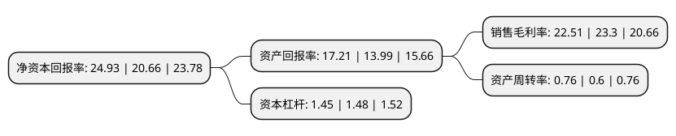

> 本页面由自动化程序生成于 2022年5月20日 01:04
> 内容可能存在错误，如有bug请提交issue至：https://github.com/Eroleice/doc-pi/issues
{.is-warning}

# 上市公司基本情况

## 基本资料

河北承德露露股份有限公司（以下简称“承德露露”）成立于1997年10月17日，承德市。于1997年11月13日在深交所主板上市。

承德露露注册资本107,641.9万元，主营业务是饮料的生产和销售，属饮料食品行业，主要产品是植物蛋白饮料——杏仁露。以下是详细信息：

- 公司名称: 河北承德露露股份有限公司
- 股票代码: 000848.SZ
- 所在地: 河北 - 承德市
- 成立日期: 1997年10月17日
- 注册资本: 107,641.9万元
- 法定代表人: 沈志军
- 主营业务: 主营业务是饮料的生产和销售，属饮料食品行业，主要产品是植物蛋白饮料——杏仁露
- 公司官网: www.lolo.com.cn
- 公司介绍: 公司以生产露露系列天然饮料为主业，跨地区、跨行业和跨国多元化经营的现代企业集团，是全国最大的杏仁露生产企业。公司主营业务是饮料的生产和销售，主导产品是植物蛋白饮料――“露露”牌杏仁露，公司现有承德本部、北京怀柔、河北廊坊、河南郑州四个生产基地，杏仁露产销量的市场占有率超过90%，是全国最具价值民营品牌百强、全国最具价值饮料品牌五强，中国饮料工业十强企业，国家农业产业化重点龙头企业。

## 股东及高管情况

上市公司第一大股东为万向三农集团有限公司，持股437,931,866股，占比40.68%，为上市公司实际控制人。

截至2022年04月26日，上市公司的前十大股东中，共有1名自然人股东，2名机构股东，3个产品账户，4个海外主体，其中5%以上大股东共有2名。上市公司前十大股东明细如下：

> 截至2022年04月26日，上市公司前十大股东信息如下：

| 股东名称 | 持股数量（股） | 持股比例 |
| --- | --- | --- |
| 万向三农集团有限公司 | 437,931,866 | 40.68% |
| 香港中央结算有限公司(陆股通) | 59,845,616 | 5.56% |
| 瑞银资产管理(新加坡)有限公司-瑞银卢森堡投资SICAV | 25,065,054 | 2.33% |
| 全国社保基金四一三组合 | 14,400,053 | 1.34% |
| 全国社保基金六零四组合 | 7,647,300 | 0.71% |
| MERRILL LYNCH INTERNATIONAL | 6,486,592 | 0.6% |
| JPMORGAN CHASE BANK,NATIONAL ASSOCIATION | 5,589,018 | 0.52% |
| UBS AG | 4,646,864 | 0.43% |
| 胡卫青 | 4,506,699 | 0.42% |
| 交通银行股份有限公司-永赢港股通品质生活慧选混合型证券投资基金 | 4,000,053 | 0.37% |

## 利润表分析

上市公司2021年总收入为25.23亿元，净利润为5.68亿元，实现盈利。

## 杜邦分析

> 数据列示周期：2021年 | 2020年 | 2019年
{.is-info}

上市公司的净资产收益率在近一年有所上升，上升幅度为20.67%，其变化情况分解如下：
- 上市公司的销售毛利率在近一年下降了-3.39%，可能是生产效率的下降、商品原材料价格上涨或商品价格的下跌所致。
- 上市公司的资产周转率在近一年上升了26.67%，可能是源自于更快的销售回款或库存管理效果提升。
- 上市公司的财务杠杆比率在近一年下降了-2.03%，可能是减少负债降低财务费用。

