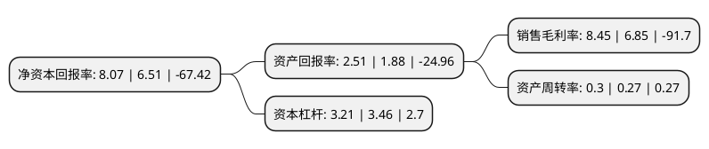

> 本页面由自动化程序生成于 2022年5月20日 01:24
> 内容可能存在错误，如有bug请提交issue至：https://github.com/Eroleice/doc-pi/issues
{.is-warning}

# 上市公司基本情况

## 基本资料

吉林泉阳泉股份有限公司（以下简称“泉阳泉”）成立于1998年09月29日，长春市。于1998年10月07日在上交所主板上市。

泉阳泉注册资本71,519.781万元，主要业务:木材产品业务，进口木材贸易及定制家居业务，长白山天然饮用矿泉水的生产，销售以及园林景观规划设计，园林工程施工，园林养护和苗木种植销售以下是详细信息：

- 公司名称: 吉林泉阳泉股份有限公司
- 股票代码: 600189.SH
- 所在地: 吉林 - 长春市
- 成立日期: 1998年09月29日
- 注册资本: 71,519.781万元
- 法定代表人: 王尽晖
- 主营业务: 木材产品业务，进口木材贸易及定制家居业务，长白山天然饮用矿泉水的生产，销售以及园林景观规划设计，园林工程施工，园林养护和苗木种植销售
- 公司官网: www.jlsg.com.cn
- 公司介绍: 公司是以森林培育和林木采伐为基础，以林产加工为主导、以科技开发为动力，林工贸结合，产加销一体的现代化大型森工企业。主营业务为森林培育和采伐、木材、木制品、人造板、林化产品加工和销售、食用菌、动植物、林副土特产品、机械电子、建材、保健品加工和销售、进出口贸易等。其中最具特色的是绿色人造板为主的“露水河”牌刨花板系列产品，连续多年被评为省、部优产品，已成为国内知名品牌。2017年，公司收购新泉阳泉75.45%股权和园区园林100%股权，主营业务将包括园林景观设计、园林工程施工、绿化苗木种植销售和长白山天然饮用矿泉水的生产、销售等。

## 股东及高管情况

上市公司第一大股东为中国吉林森林工业集团有限责任公司，持股216,254,080股，占比30.24%，为上市公司实际控制人。

截至2022年03月31日，上市公司的前十大股东中，共有4名自然人股东，5名机构股东，1名其他股东，其中5%以上大股东共有3名。上市公司前十大股东明细如下：

> 截至2022年03月31日，上市公司前十大股东信息如下：

| 股东名称 | 持股数量（股） | 持股比例 |
| --- | --- | --- |
| 中国吉林森林工业集团有限责任公司 | 216,254,080 | 30.24% |
| 常州璞信通远创业投资合伙企业(有限合伙) | 51,193,531 | 7.16% |
| 赵志华 | 48,880,794 | 6.83% |
| 上海集虹企业管理合伙企业(有限合伙) | 19,950,302 | 2.79% |
| 中国外贸金融租赁有限公司 | 9,550,000 | 1.34% |
| 吉林省泉阳林业局 | 4,919,058 | 0.69% |
| 吉林省吉盛资产管理有限责任公司 | 4,812,667 | 0.67% |
| 陈建宏 | 3,607,200 | 0.5% |
| 顾崇平 | 3,118,627 | 0.44% |
| 朱六平 | 2,585,000 | 0.36% |

## 杜邦分析

> 数据列示周期：2021年 | 2020年 | 2019年
{.is-info}

上市公司的净资产收益率在近一年有所上升，上升幅度为23.96%，其变化情况分解如下：
- 上市公司的销售毛利率在近一年上升了23.36%，可能是生产效率的提升、商品原材料价格下跌或商品价格的上涨所致。
- 上市公司的资产周转率在近一年上升了11.11%，可能是源自于更快的销售回款或库存管理效果提升。
- 上市公司的财务杠杆比率在近一年下降了-7.23%，可能是减少负债降低财务费用。

