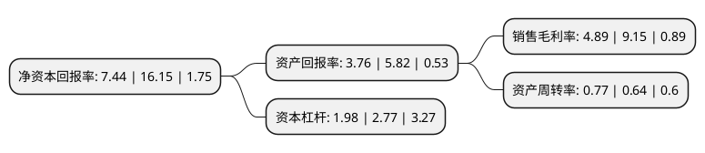

> 本页面由自动化程序生成于 2022年5月20日 01:25
> 内容可能存在错误，如有bug请提交issue至：https://github.com/Eroleice/doc-pi/issues
{.is-warning}

# 上市公司基本情况

## 基本资料

维维食品饮料股份有限公司（以下简称“维维股份”）成立于1994年05月12日，徐州市。于2000年06月30日在上交所主板上市。

维维股份注册资本167,200万元，主要产品:豆奶粉，炼乳以下是详细信息：

- 公司名称: 维维食品饮料股份有限公司
- 股票代码: 600300.SH
- 所在地: 江苏 - 徐州市
- 成立日期: 1994年05月12日
- 注册资本: 167,200万元
- 法定代表人: 林斌
- 主营业务: 主要产品:豆奶粉，炼乳
- 公司官网: www.vvgroup.com
- 公司介绍: 公司是一家以“生态农业、大粮食、大食品”为主的跨行业、跨地区的大型企业集团，国家级农业产业化龙头企业。公司在同行业中率先通过了ISO9001质量体系认证和HACCP食品安全管理体系认证。多年来，公司推进行业整合与规模扩张，先后在全国各地组建了多个加工基地及奶牛养殖基地，开发出新乳品。为了推动奶源基地建设，加快基地周边地区农民饲养的奶牛种群改良速度，公司引进澳洲良种奶牛，建成多个养殖场，呈现了良好的发展势头。维维在做大做强核心产业的同时，一直以来，都能够根据国家宏观经济环境和自身发展的需要，及时进行结构性战略调整，创新型投资涉足金融、矿业、化工、地产等产业，取得了良好的效益。公司在发展过程中，注重兼顾“经济效益、社会效益、环境效益”的均衡。在促进社会就业、带动农民致富、城镇化建设、新农村建设等方面做了不少的贡献。

## 股东及高管情况

上市公司第一大股东为徐州市新盛投资控股集团有限公司，持股499,928,000股，占比29.9%，**疑似为**上市公司实际控制人。

截至2022年03月31日，上市公司的前十大股东中，共有7名自然人股东，3名机构股东，其中5%以上大股东共有2名。上市公司前十大股东明细如下：

> 未能通过持股比例判定出上市公司实际控制人（持股30%以上）
> 可能存在通过间接持股、联合持股、协议控制等方式拥有实际控制权的主体，具体请参考上市公司定期公告！
{.is-warning}

> 截至2022年03月31日，上市公司前十大股东信息如下：

| 股东名称 | 持股数量（股） | 持股比例 |
| --- | --- | --- |
| 徐州市新盛投资控股集团有限公司 | 499,928,000 | 29.9% |
| 大冢(中国)投资有限公司 | 104,731,478 | 6.26% |
| 维维集团股份有限公司 | 48,108,107 | 2.88% |
| 陈坚民 | 11,466,082 | 0.69% |
| 杨小刚 | 10,519,400 | 0.63% |
| 闫修权 | 10,030,000 | 0.6% |
| 赵志超 | 7,550,000 | 0.45% |
| 崔久红 | 6,805,491 | 0.41% |
| 李勃 | 6,160,000 | 0.37% |
| 毛伟松 | 4,997,500 | 0.3% |

## 利润表分析

上市公司2021年总收入为45.68亿元，净利润为2.23亿元，实现盈利。

## 杜邦分析

> 数据列示周期：2021年 | 2020年 | 2019年
{.is-info}

上市公司的净资产收益率在近一年有所下降，下降幅度为-53.93%，其变化情况分解如下：
- 上市公司的销售毛利率在近一年下降了-46.56%，可能是生产效率的下降、商品原材料价格上涨或商品价格的下跌所致。
- 上市公司的资产周转率在近一年上升了20.31%，可能是源自于更快的销售回款或库存管理效果提升。
- 上市公司的财务杠杆比率在近一年下降了-28.52%，可能是减少负债降低财务费用。

