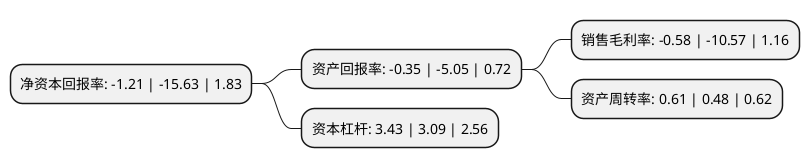

> 本页面由自动化程序生成于 2022年5月20日 01:30
> 内容可能存在错误，如有bug请提交issue至：https://github.com/Eroleice/doc-pi/issues
{.is-warning}

# 上市公司基本情况

## 基本资料

国投中鲁果汁股份有限公司（以下简称“国投中鲁”）成立于1991年09月18日，北京市。于2004年06月22日在上交所主板上市。

国投中鲁注册资本26,221万元，浓缩苹果清汁以下是详细信息：

- 公司名称: 国投中鲁果汁股份有限公司
- 股票代码: 600962.SH
- 所在地: 北京 - 北京市
- 成立日期: 1991年09月18日
- 注册资本: 26,221万元
- 法定代表人: 杜仁堂
- 主营业务: 浓缩苹果清汁
- 公司官网: www.sdiczl.com
- 公司介绍: 公司主要从事浓缩果蔬汁、饮料生产和销售，主导产品为浓缩苹果汁。公司拥有多项自主研发的核心技术，先后开发出苹果浊汁、脱色果汁、梨汁等20多种产品，公司生产厂分布于山东、山西、陕西、河北、辽宁、江苏、云南等苹果优势产区，浓缩果汁产品出口率占到90%。作为出口外向型企业，公司高度重视食品安全管理及质量控制体系的建设，并通过FSSC22000等认证，是中国食品土畜进出口商会果汁分会理事长单位，中国饮料工业协会常务理事单位，中国首批国家农业产业化重点龙头企业、北京农业产业化龙头企业协会副会长单位。产品远销美国、日本、澳大利亚等20多个国家和地区，与世界著名的三菱公司、雀巢公司等保持着密切的贸易伙伴关系。

## 股东及高管情况

上市公司第一大股东为国家开发投资集团有限公司，持股116,855,469股，占比44.57%，为上市公司实际控制人。

截至2022年03月31日，上市公司的前十大股东中，共有8名自然人股东，2名机构股东，其中5%以上大股东共有1名。上市公司前十大股东明细如下：

> 截至2022年03月31日，上市公司前十大股东信息如下：

| 股东名称 | 持股数量（股） | 持股比例 |
| --- | --- | --- |
| 国家开发投资集团有限公司 | 116,855,469 | 44.57% |
| 乳山市经济开发投资公司 | 8,190,000 | 3.12% |
| 曹洪波 | 2,010,000 | 0.77% |
| 许福建 | 1,980,000 | 0.76% |
| 赵传法 | 1,940,000 | 0.74% |
| 刘亚军 | 1,390,501 | 0.53% |
| 吴忠华 | 1,200,000 | 0.46% |
| 周建中 | 1,120,000 | 0.43% |
| 高晓霞 | 971,800 | 0.37% |
| 何全波 | 918,145 | 0.35% |

## 利润表分析

上市公司2021年总收入为14.49亿元，净利润为-0.09亿元，**未实现盈利**。

## 杜邦分析

> 数据列示周期：2021年 | 2020年 | 2019年
{.is-info}

上市公司的净资产收益率在近一年有所下降，下降幅度为-92.26%，其变化情况分解如下：
- 上市公司的销售毛利率在近一年下降了-94.51%，可能是生产效率的下降、商品原材料价格上涨或商品价格的下跌所致。
- 上市公司的资产周转率在近一年上升了27.08%，可能是源自于更快的销售回款或库存管理效果提升。
- 上市公司的财务杠杆比率在近一年上升了11%，可能是增加负债扩大生产规模。

