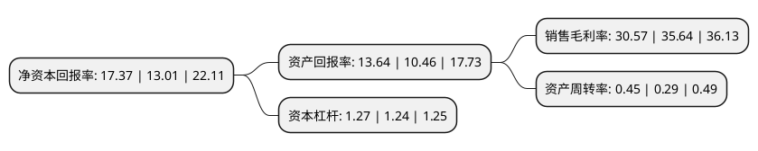

> 本页面由自动化程序生成于 2022年5月20日 01:33
> 内容可能存在错误，如有bug请提交issue至：https://github.com/Eroleice/doc-pi/issues
{.is-warning}

# 上市公司基本情况

## 基本资料

河北养元智汇饮品股份有限公司（以下简称“养元饮品”）成立于1997年09月24日，衡水市。于2018年02月12日在上交所主板上市。

养元饮品注册资本126,549.36万元，主营业务是以核桃为主要原料的植物蛋白饮料食品的研发，生产和销售。公司的主要产品分为两大类:核桃饮料和核桃食品。核桃饮料中，根据其配方中其他原料，配料的添加情况，主要有核桃露，核桃花生露，核桃杏仁露三大品种，共六个系列，其中“养元六个核桃”核桃露为公司主导产品。核桃罐头食品中，主要有核桃八宝粥。以下是详细信息：

- 公司名称: 河北养元智汇饮品股份有限公司
- 股票代码: 603156.SH
- 所在地: 河北 - 衡水市
- 成立日期: 1997年09月24日
- 注册资本: 126,549.36万元
- 法定代表人: 姚奎章
- 主营业务: 主营业务是以核桃为主要原料的植物蛋白饮料食品的研发，生产和销售公司的主要产品分为两大类:核桃饮料和核桃食品核桃饮料中，根据其配方中其他原料，配料的添加情况，主要有核桃露，核桃花生露，核桃杏仁露三大品种，共六个系列，其中“养元六个核桃”核桃露为公司主导产品核桃罐头食品中，主要有核桃八宝粥
- 公司官网: www.hbyangyuan.com
- 公司介绍: 公司是中国最早进入核桃饮料行业的企业之一，是国内核桃饮料生产规模最大的龙头企业。经过多年发展，公司与其“养元”、“养元六个核桃”核桃饮料成为公司销售区域中消费者认知度最高的核桃饮料厂商和品牌之一，并且“YANGYUAN及图”商标已被国家工商行政管理总局认定为“中国驰名商标”。公司被河北省工商行政管理局、中国食品产业成长之星评选委员会、糖烟酒周刊杂志社评为“河北省著名商标”、“中国食品产业最具成长性企业”、“中国食品产业(植物蛋白饮料)标杆品牌”。公司的技术中心被河北省发展改革委、省科技厅、省财政厅、省国税局、省地税局、石家庄海关评为“河北省企业技术中心”、“(国家级)诚信示范单位”等称号。

## 股东及高管情况

上市公司第一大股东为姚奎章，持股267,648,195股，占比21.15%，**疑似为**上市公司实际控制人。

截至2022年03月31日，上市公司的前十大股东中，共有9名自然人股东，1名机构股东，其中5%以上大股东共有4名。上市公司前十大股东明细如下：

> 未能通过持股比例判定出上市公司实际控制人（持股30%以上）
> 可能存在通过间接持股、联合持股、协议控制等方式拥有实际控制权的主体，具体请参考上市公司定期公告！
{.is-warning}

> 截至2022年03月31日，上市公司前十大股东信息如下：

| 股东名称 | 持股数量（股） | 持股比例 |
| --- | --- | --- |
| 姚奎章 | 267,648,195 | 21.15% |
| 雅智顺投资有限公司 | 232,219,592 | 18.35% |
| 李红兵 | 125,290,872 | 9.9% |
| 范召林 | 125,206,435 | 9.89% |
| 高森林 | 38,732,097 | 3.06% |
| 邓立峰 | 23,861,617 | 1.89% |
| 李志斌 | 23,711,203 | 1.87% |
| 邢淑兰 | 23,658,303 | 1.87% |
| 李营威 | 23,602,947 | 1.87% |
| 朱占波 | 23,568,203 | 1.86% |

## 利润表分析

上市公司2021年总收入为69.05亿元，净利润为21.1亿元，实现盈利。

## 杜邦分析

> 数据列示周期：2021年 | 2020年 | 2019年
{.is-info}

上市公司的净资产收益率在近一年有所上升，上升幅度为33.51%，其变化情况分解如下：
- 上市公司的销售毛利率在近一年下降了-14.23%，可能是生产效率的下降、商品原材料价格上涨或商品价格的下跌所致。
- 上市公司的资产周转率在近一年上升了55.17%，可能是源自于更快的销售回款或库存管理效果提升。
- 上市公司的财务杠杆比率在近一年上升了2.42%，可能是增加负债扩大生产规模。

