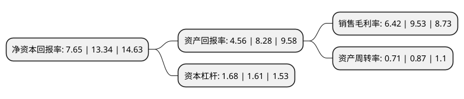

> 本页面由自动化程序生成于 2022年5月20日 01:35
> 内容可能存在错误，如有bug请提交issue至：https://github.com/Eroleice/doc-pi/issues
{.is-warning}

# 上市公司基本情况

## 基本资料

香飘飘食品股份有限公司（以下简称“香飘飘”）成立于2005年08月12日，湖州市。于2017年11月30日在上交所主板上市。

香飘飘注册资本41,511.38万元，主营业务为奶茶产品的研发，生产和销售。主要产品为“香飘飘”品牌杯装奶茶。以下是详细信息：

- 公司名称: 香飘飘食品股份有限公司
- 股票代码: 603711.SH
- 所在地: 浙江 - 湖州市
- 成立日期: 2005年08月12日
- 注册资本: 41,511.38万元
- 法定代表人: 蒋建琪
- 主营业务: 主营业务为奶茶产品的研发，生产和销售主要产品为“香飘飘”品牌杯装奶茶
- 公司官网: www.chinaxpp.com
- 公司介绍: 公司是专业的杯装奶茶制造商。公司一直致力于方便类食品的研发、生产和销售，先后开发出“香飘飘”、“磨坊农庄”等品牌二十余种系列的奶茶、速食年糕和休闲花生产品，销售范围覆盖全国所有省、市、自治区和直辖市。公司拥有全套标准化生产、检测、分析等系列的自动化仪器和设备。先后通过了ISO9001:2008质量管理体系、ISO14001:2004环境管理体系、ISO22000:2005食品安全管理体系、GB/T27341—2009危害分析与关键控制点(HACCP)体系、诚信管理体系(CMS)、计量检测体系、标准化良好行为企业的认证。

## 股东及高管情况

上市公司第一大股东为蒋建琪，持股235,946,520股，占比56.84%，为上市公司实际控制人。

截至2022年03月31日，上市公司的前十大股东中，共有8名自然人股东，1名机构股东，1个海外主体，其中5%以上大股东共有4名。上市公司前十大股东明细如下：

> 截至2022年03月31日，上市公司前十大股东信息如下：

| 股东名称 | 持股数量（股） | 持股比例 |
| --- | --- | --- |
| 蒋建琪 | 235,946,520 | 56.84% |
| 蒋建斌 | 36,000,000 | 8.67% |
| 安徽志周合道企业管理合伙企业(有限合伙) | 34,965,720 | 8.42% |
| 陆家华 | 28,800,000 | 6.94% |
| 蒋晓莹 | 18,000,000 | 4.34% |
| 蔡建峰 | 7,164,300 | 1.73% |
| 黄建武 | 2,300,000 | 0.55% |
| 香港中央结算有限公司(陆股通) | 2,061,609 | 0.5% |
| 胡敏 | 1,192,670 | 0.29% |
| 杨静 | 795,000 | 0.19% |

## 利润表分析

上市公司2021年总收入为34.66亿元，净利润为2.22亿元，实现盈利。

## 杜邦分析

> 数据列示周期：2021年 | 2020年 | 2019年
{.is-info}

上市公司的净资产收益率在近一年有所下降，下降幅度为-42.65%，其变化情况分解如下：
- 上市公司的销售毛利率在近一年下降了-32.63%，可能是生产效率的下降、商品原材料价格上涨或商品价格的下跌所致。
- 上市公司的资产周转率在近一年下降了-18.39%，可能是源自于更慢的销售回款或库存管理效果下降。
- 上市公司的财务杠杆比率在近一年上升了4.35%，可能是增加负债扩大生产规模。

