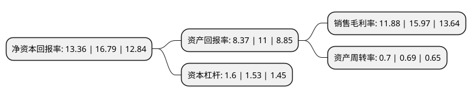

> 本页面由自动化程序生成于 2022年5月20日 01:09
> 内容可能存在错误，如有bug请提交issue至：https://github.com/Eroleice/doc-pi/issues
{.is-warning}

# 上市公司基本情况

## 基本资料

杭州巨星科技股份有限公司（以下简称“巨星科技”）成立于2001年08月09日，杭州市。于2010年07月13日在深交所中小板上市。

巨星科技注册资本114,343.849万元，公司的主营业务为:生产，销售手工具和电动工具。公司的主要产品为:手工具，手持式电动工具等工具五金产品。以下是详细信息：

- 公司名称: 杭州巨星科技股份有限公司
- 股票代码: 002444.SZ
- 所在地: 浙江 - 杭州市
- 成立日期: 2001年08月09日
- 注册资本: 114,343.849万元
- 法定代表人: 仇建平
- 主营业务: 公司的主营业务为:生产，销售手工具和电动工具公司的主要产品为:手工具，手持式电动工具等工具五金产品
- 公司官网: www.greatstartools.com
- 公司介绍: 公司是专业从事手动工具、激光产品、智能工具、服务机器人等产品研发、生产和销售的智能装备企业，技术水平居行业前列，是目前国内手工具行业的龙头企业。公司研发、销售各类手工具产品和电动工具产品。公司拥有覆盖全球的销售渠道和强大的研发能力，主要客户为欧美大型建材五金超市、大型百货连锁超市、全球工业企业工具供应商、欧美专业汽配连锁等。公司拥有强大的研发能力和丰富的产品系列以及一站式的服务能力，在巩固以工具五金为核心的主营业务基础上，加大电商投资力度，建立一站式电商销售平台，进一步拓宽电商销售网络；加强对机器人以及智能工具的研发、生产、销售和投入，以打造一个稳健经营、持续增长、健康发展的高科技智能化国际企业。

## 股东及高管情况

上市公司第一大股东为巨星控股集团有限公司，持股463,739,864股，占比40.56%，为上市公司实际控制人。

截至2022年03月31日，上市公司的前十大股东中，共有2名自然人股东，1名机构股东，6个产品账户，1个海外主体，其中5%以上大股东共有1名。上市公司前十大股东明细如下：

> 截至2022年03月31日，上市公司前十大股东信息如下：

| 股东名称 | 持股数量（股） | 持股比例 |
| --- | --- | --- |
| 巨星控股集团有限公司 | 463,739,864 | 40.56% |
| 香港中央结算有限公司(陆股通) | 50,404,316 | 4.41% |
| 仇建平 | 45,817,500 | 4.01% |
| 中国建设银行股份有限公司-交银施罗德经济新动力混合型证券投资基金 | 15,573,984 | 1.36% |
| 中国工商银行-广发稳健增长证券投资基金 | 15,000,000 | 1.31% |
| 王玲玲 | 12,950,960 | 1.13% |
| 全国社保基金一零六组合 | 12,828,313 | 1.12% |
| 全国社保基金一一五组合 | 12,800,000 | 1.12% |
| 招商银行股份有限公司-交银施罗德创新领航混合型证券投资基金 | 11,047,940 | 0.97% |
| 全国社保基金一一四组合 | 10,851,733 | 0.95% |

## 利润表分析

上市公司2021年总收入为109.19亿元，净利润为12.97亿元，实现盈利。

## 杜邦分析

> 数据列示周期：2021年 | 2020年 | 2019年
{.is-info}

上市公司的净资产收益率在近一年有所下降，下降幅度为-20.43%，其变化情况分解如下：
- 上市公司的销售毛利率在近一年下降了-25.61%，可能是生产效率的下降、商品原材料价格上涨或商品价格的下跌所致。
- 上市公司的资产周转率在近一年上升了1.45%，可能是源自于更快的销售回款或库存管理效果提升。
- 上市公司的财务杠杆比率在近一年上升了4.58%，可能是增加负债扩大生产规模。

