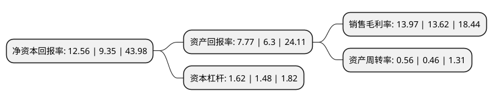

> 本页面由自动化程序生成于 2022年5月20日 01:10
> 内容可能存在错误，如有bug请提交issue至：https://github.com/Eroleice/doc-pi/issues
{.is-warning}

# 上市公司基本情况

## 基本资料

广东东方精工科技股份有限公司（以下简称“东方精工”）成立于1996年12月09日，佛山市。于2011年08月30日在深交所中小板上市。

东方精工注册资本133,193.817万元，公司主营业务为瓦楞纸箱多色印刷成套设备的研发，设计，生产，销售及服务。新能源汽车动力电池系统，舷外机动力设备以下是详细信息：

- 公司名称: 广东东方精工科技股份有限公司
- 股票代码: 002611.SZ
- 所在地: 广东 - 佛山市
- 成立日期: 1996年12月09日
- 注册资本: 133,193.817万元
- 法定代表人: 唐灼林
- 主营业务: 公司主营业务为瓦楞纸箱多色印刷成套设备的研发，设计，生产，销售及服务新能源汽车动力电池系统，舷外机动力设备
- 公司官网: www.df-global.cn
- 公司介绍: 公司是一家致力于数字化智能高端装备制造的高科技上市企业，公司的主营业务划分为“智能包装设备”和“高端核心零部件”两大板块。“智能包装设备”板块以“智能瓦楞纸箱包装自动化设备”的设计、研发、生产、销售与服务为主营业务，已经拥有东方精工佛山总部、意大利Fosber、美国Fosber、广东佛斯伯智能设备有限公司、意大利EDF公司等五个制造主体；并以参股、合资等投资方式，使公司同时具备了向客户提供智能物流仓储产品的配套能力，完成了对细分行业的全产业链布局。2017年，公司收购普莱德100%股份，普莱德专业从事新能源汽车动力电池系统PACK的设计、研发、生产、销售与服务，致力于为新能源汽车生产厂商提供动力电池整体解决方案。公司控股收购的苏州百胜动力机器股份有限公司是一家专业化生产舷外机、发电机、水泵和发动机的生产厂商，以技术含量高的舷外机为主要产品，是集研发、制造、销售和服务为一体的国家级高新技术企业。

## 股东及高管情况

上市公司第一大股东为唐灼林，持股270,737,568股，占比20.33%，**疑似为**上市公司实际控制人。

截至2022年03月31日，上市公司的前十大股东中，共有3名自然人股东，4名机构股东，2个产品账户，1个海外主体，其中5%以上大股东共有2名。上市公司前十大股东明细如下：

> 未能通过持股比例判定出上市公司实际控制人（持股30%以上）
> 可能存在通过间接持股、联合持股、协议控制等方式拥有实际控制权的主体，具体请参考上市公司定期公告！
{.is-warning}

> 截至2022年03月31日，上市公司前十大股东信息如下：

| 股东名称 | 持股数量（股） | 持股比例 |
| --- | --- | --- |
| 唐灼林 | 270,737,568 | 20.33% |
| 唐灼棉 | 96,885,134 | 7.27% |
| 北大先行科技产业有限公司 | 48,149,787 | 3.62% |
| 泸州产业发展投资集团有限公司 | 31,770,010 | 2.39% |
| 华融证券-招商证券-华融优智1号集合资产管理计划 | 31,372,549 | 2.36% |
| 青海普仁智能科技研发中心(有限合伙) | 26,628,340 | 2% |
| 香港中央结算有限公司(陆股通) | 26,506,021 | 1.99% |
| 邱业致 | 23,382,388 | 1.76% |
| 盛稷股权投资基金(上海)有限公司 | 19,607,843 | 1.47% |
| 宁德时代新能源科技股份有限公司 | 18,118,868 | 1.36% |

## 利润表分析

上市公司2021年总收入为35.24亿元，净利润为4.92亿元，实现盈利。

## 杜邦分析

> 数据列示周期：2021年 | 2020年 | 2019年
{.is-info}

上市公司的净资产收益率在近一年有所上升，上升幅度为34.33%，其变化情况分解如下：
- 上市公司的销售毛利率在近一年上升了2.57%，可能是生产效率的提升、商品原材料价格下跌或商品价格的上涨所致。
- 上市公司的资产周转率在近一年上升了21.74%，可能是源自于更快的销售回款或库存管理效果提升。
- 上市公司的财务杠杆比率在近一年上升了9.46%，可能是增加负债扩大生产规模。

