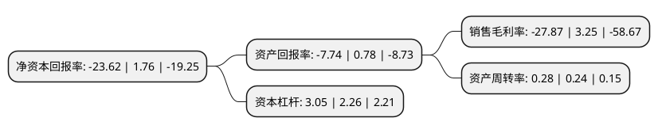

> 本页面由自动化程序生成于 2022年5月20日 01:15
> 内容可能存在错误，如有bug请提交issue至：https://github.com/Eroleice/doc-pi/issues
{.is-warning}

# 上市公司基本情况

## 基本资料

福能东方装备科技股份有限公司（以下简称“福能东方”）成立于1997年04月18日，佛山市。于2011年02月01日在深交所创业板上市。

福能东方注册资本73,472.57万元，主要从事3C自动化设备及机器人自动化生产线业务以下是详细信息：

- 公司名称: 福能东方装备科技股份有限公司
- 股票代码: 300173.SZ
- 所在地: 广东 - 佛山市
- 成立日期: 1997年04月18日
- 注册资本: 73,472.57万元
- 法定代表人: 王贵银
- 主营业务: 主要从事3C自动化设备及机器人自动化生产线业务
- 公司官网: www.fnorient.com
- 公司介绍: 公司是一家集研发、制造、销售和服务于一体的新材料装备生产企业，经过多年的技术创新和经验积累，为各行业的定制化要求提供多样化的设备；产品应用领域涉及多个行业：新能源材料行业、光电材料行业、功能纸材料行业、功能性包装材料行业，工厂生产信息化管理行业等。该公司的主要业务为全资子公司大宇精雕关于“3C自动化设备及机器人自动化生产线”的业务。目前大宇精雕已发展成为工业自动化领域内集研发创新、生产销售于一体的方案供应商。

## 股东及高管情况

上市公司第一大股东为佛山市公用事业控股有限公司，持股139,529,247股，占比18.99%，**疑似为**上市公司实际控制人。

截至2022年03月31日，上市公司的前十大股东中，共有3名自然人股东，6名机构股东，1个产品账户，其中5%以上大股东共有1名。上市公司前十大股东明细如下：

> 未能通过持股比例判定出上市公司实际控制人（持股30%以上）
> 可能存在通过间接持股、联合持股、协议控制等方式拥有实际控制权的主体，具体请参考上市公司定期公告！
{.is-warning}

> 截至2022年03月31日，上市公司前十大股东信息如下：

| 股东名称 | 持股数量（股） | 持股比例 |
| --- | --- | --- |
| 佛山市公用事业控股有限公司 | 139,529,247 | 18.99% |
| 郭景松 | 34,182,844 | 4.65% |
| 超源科技(香港)有限公司 | 24,042,857 | 3.27% |
| 涌镒(厦门)资产管理有限公司-厦门绍绪智能设备投资合伙企业(有限合伙) | 17,128,348 | 2.33% |
| 深圳市博益安盈资产管理有限公司-博益安盈精英16号私募证券投资基金 | 14,100,000 | 1.92% |
| 佛山市电子政务科技有限公司 | 13,114,754 | 1.78% |
| 雷万春 | 12,425,600 | 1.69% |
| 张晓玲 | 10,845,299 | 1.48% |
| 深圳市高新投集团有限公司 | 9,700,000 | 1.32% |
| 涌镒(厦门)资产管理有限公司-厦门镒航投资合伙企业(有限合伙) | 8,674,285 | 1.18% |

## 利润表分析

上市公司2021年总收入为11.64亿元，净利润为-3.25亿元，**未实现盈利**。

## 杜邦分析

> 数据列示周期：2021年 | 2020年 | 2019年
{.is-info}

上市公司的净资产收益率在近一年有所下降，下降幅度为-1442.05%，其变化情况分解如下：
- 上市公司的销售毛利率在近一年下降了-957.54%，可能是生产效率的下降、商品原材料价格上涨或商品价格的下跌所致。
- 上市公司的资产周转率在近一年上升了16.67%，可能是源自于更快的销售回款或库存管理效果提升。
- 上市公司的财务杠杆比率在近一年上升了34.96%，可能是增加负债扩大生产规模。

