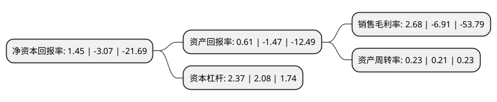

> 本页面由自动化程序生成于 2022年5月20日 01:15
> 内容可能存在错误，如有bug请提交issue至：https://github.com/Eroleice/doc-pi/issues
{.is-warning}

# 上市公司基本情况

## 基本资料

天津长荣科技集团股份有限公司（以下简称“长荣股份”）成立于1995年09月13日，天津市。于2011年03月29日在深交所创业板上市。

长荣股份注册资本42,338.736万元，主营业务是印后设备的设计制造，主要集中于印后加工设备的设计与制造。主要产品为印后加工设备。以下是详细信息：

- 公司名称: 天津长荣科技集团股份有限公司
- 股票代码: 300195.SZ
- 所在地: 天津 - 天津市
- 成立日期: 1995年09月13日
- 注册资本: 42,338.736万元
- 法定代表人: 李莉
- 主营业务: 主营业务是印后设备的设计制造，主要集中于印后加工设备的设计与制造主要产品为印后加工设备
- 公司官网: www.mkmchina.com
- 公司介绍: 公司是一家专业生产、销售印后设备的高新技术企业，拥有在印刷领域自主开发、研制印后设备的技术实力。公司主导产品为：圆压平电脑烫金机、高精密高速自动模切机、高精密自动平压平电脑全息烫印模切机以及高速自动糊折盒机等。公司生产的设备以技术先进、功能齐全、操作方便可靠，受到客户的青睐。公司产品多次参加国内及德国杜塞尔多夫、美国芝加哥、英国伯明翰等国际印刷展，深受国内外用户及业界好评。公司已发展成为国内领先的印后设备制造企业，产品遍布全国并出口至美国、英国、德国、瑞士、法国、日本、俄罗斯、西班牙、韩国、澳大利亚、巴西等多个国家和地区。

## 股东及高管情况

上市公司第一大股东为李莉，持股81,993,000股，占比19.37%，**疑似为**上市公司实际控制人。

截至2022年03月31日，上市公司的前十大股东中，共有8名自然人股东，1名机构股东，1名其他股东，其中5%以上大股东共有2名。上市公司前十大股东明细如下：

> 未能通过持股比例判定出上市公司实际控制人（持股30%以上）
> 可能存在通过间接持股、联合持股、协议控制等方式拥有实际控制权的主体，具体请参考上市公司定期公告！
{.is-warning}

> 截至2022年03月31日，上市公司前十大股东信息如下：

| 股东名称 | 持股数量（股） | 持股比例 |
| --- | --- | --- |
| 李莉 | 81,993,000 | 19.37% |
| 天津名轩投资有限公司 | 48,931,000 | 11.56% |
| 王建军 | 13,049,300 | 3.08% |
| 陈丽华 | 3,932,200 | 0.93% |
| 胡伟 | 3,000,000 | 0.71% |
| 谢良玉 | 2,844,742 | 0.67% |
| 杜景葱 | 2,400,739 | 0.57% |
| 法国兴业银行 | 1,999,800 | 0.47% |
| 张运海 | 1,200,000 | 0.28% |
| 丁国庆 | 1,200,000 | 0.28% |

## 利润表分析

上市公司2021年总收入为14.67亿元，净利润为0.39亿元，实现盈利。

## 杜邦分析

> 数据列示周期：2021年 | 2020年 | 2019年
{.is-info}

上市公司的净资产收益率在近一年有所下降，下降幅度为-147.23%，其变化情况分解如下：
- 上市公司的销售毛利率在近一年下降了-138.78%，可能是生产效率的下降、商品原材料价格上涨或商品价格的下跌所致。
- 上市公司的资产周转率在近一年上升了9.52%，可能是源自于更快的销售回款或库存管理效果提升。
- 上市公司的财务杠杆比率在近一年上升了13.94%，可能是增加负债扩大生产规模。

