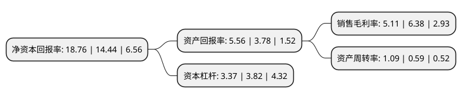

> 本页面由自动化程序生成于 2022年5月20日 01:01
> 内容可能存在错误，如有bug请提交issue至：https://github.com/Eroleice/doc-pi/issues
{.is-warning}

# 上市公司基本情况

## 基本资料

中国国际海运集装箱(集团)股份有限公司（以下简称“中集集团”）成立于1980年01月14日，深圳市。于1994年04月08日在深交所主板上市。

中集集团注册资本359,501.359万元，主要产品:集装箱，道路运输车辆，能源，化工及液态食品装备等。主营业务:现代化交通运输装备，能源，化工及液态食品装备，海洋工程装备，物流服务，空港装备的制造及服务业务。以下是详细信息：

- 公司名称: 中国国际海运集装箱(集团)股份有限公司
- 股票代码: 000039.SZ
- 所在地: 广东 - 深圳市
- 成立日期: 1980年01月14日
- 注册资本: 359,501.359万元
- 法定代表人: 麦伯良
- 主营业务: 主要产品:集装箱，道路运输车辆，能源，化工及液态食品装备等主营业务:现代化交通运输装备，能源，化工及液态食品装备，海洋工程装备，物流服务，空港装备的制造及服务业务
- 公司官网: www.cimc.com
- 公司介绍: 公司是世界领先的物流装备和能源装备供应商，总部位于中国深圳。公司致力于在如下主要业务领域：集装箱、道路运输车辆、能源化工及食品装备、海洋工程、物流服务、空港设备等，提供高品质与可信赖的装备和服务。支持这些业务蓬勃发展的有：提供专业资金管理的财务公司，以及提供金融解决方案的融资租赁公司。作为一家为全球市场服务的多元化跨国产业集团，中集在亚洲、北美、欧洲、澳洲等地区拥有300余家成员企业及2家上市公司，客户和销售网络分布在全球100多个国家和地区。

## 股东及高管情况

上市公司第一大股东为香港中央结算(代理人)有限公司，持股2,107,051,869股，占比58.61%，为上市公司实际控制人。

截至2022年03月31日，上市公司的前十大股东中，共有1名自然人股东，5名机构股东，3个产品账户，1个海外主体，其中5%以上大股东共有2名。上市公司前十大股东明细如下：

> 截至2022年03月31日，上市公司前十大股东信息如下：

| 股东名称 | 持股数量（股） | 持股比例 |
| --- | --- | --- |
| 香港中央结算(代理人)有限公司 | 2,107,051,869 | 58.61% |
| 深圳市资本运营集团有限公司 | 350,000,000 | 9.74% |
| 中远海运发展股份有限公司 | 88,793,700 | 2.47% |
| 河南伊洛投资管理有限公司-君安9号伊洛私募证券投资基金 | 43,606,953 | 1.21% |
| 中远集装箱工业有限公司 | 41,079,451 | 1.14% |
| 河南伊洛投资管理有限公司-君行10号私募基金 | 34,656,786 | 0.96% |
| 苗艳芬 | 30,081,857 | 0.84% |
| 中信保诚人寿保险有限公司-分红账户 | 19,733,298 | 0.55% |
| 河南伊洛投资管理有限公司-君行4号私募基金 | 19,457,005 | 0.54% |
| 中国证券金融股份有限公司 | 14,398,270 | 0.4% |

## 利润表分析

上市公司2021年总收入为1,636.95亿元，净利润为83.6亿元，实现盈利。

## 杜邦分析

> 数据列示周期：2021年 | 2020年 | 2019年
{.is-info}

上市公司的净资产收益率在近一年有所上升，上升幅度为29.92%，其变化情况分解如下：
- 上市公司的销售毛利率在近一年下降了-19.91%，可能是生产效率的下降、商品原材料价格上涨或商品价格的下跌所致。
- 上市公司的资产周转率在近一年上升了84.75%，可能是源自于更快的销售回款或库存管理效果提升。
- 上市公司的财务杠杆比率在近一年下降了-11.78%，可能是减少负债降低财务费用。

