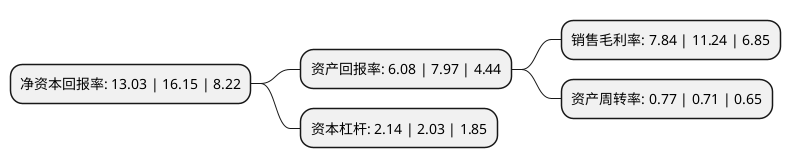

> 本页面由自动化程序生成于 2022年5月20日 01:08
> 内容可能存在错误，如有bug请提交issue至：https://github.com/Eroleice/doc-pi/issues
{.is-warning}

# 上市公司基本情况

## 基本资料

康力电梯股份有限公司（以下简称“康力电梯”）成立于1997年10月03日，苏州市。于2010年03月12日在深交所中小板上市。

康力电梯注册资本79,765.269万元，主要产品:电梯，自动扶梯，自动人行道及成套配件。主营业务:电梯，自动扶梯，自动人行道及成套配件产品研发，生产，销售及整机产品的安装和维保。以下是详细信息：

- 公司名称: 康力电梯股份有限公司
- 股票代码: 002367.SZ
- 所在地: 江苏 - 苏州市
- 成立日期: 1997年10月03日
- 注册资本: 79,765.269万元
- 法定代表人: 王友林
- 主营业务: 主要产品:电梯，自动扶梯，自动人行道及成套配件主营业务:电梯，自动扶梯，自动人行道及成套配件产品研发，生产，销售及整机产品的安装和维保
- 公司官网: www.canny-elevator.com
- 公司介绍: 公司是集设计、制造、销售、安装和维保于一体的现代化专业电梯企业。公司拥有国家质检总局办法的电梯制造、安装、改造和维修A级资质，获得欧洲CE认证、韩国KC认证、俄罗斯EAC认证、德国TUV认证。公司主要从事电梯、扶梯、自动人行步道整机产品、相关零部件的研发、制造、销售，以及相关安装、维保、改造服务；整机产品广泛应用于住宅地产、商业地产、城市交通、旅游景区、公共设施等建筑交通领域；苏州工业园区康力机器人产业投资有限公司为公司投向智能制造、工业机器人等领域的产业投资平台。公司先后荣获全国建设机械与电梯行业质量金奖、苏州市市长质量奖、江苏省质量奖。

## 股东及高管情况

上市公司第一大股东为王友林，持股358,591,306股，占比44.96%，为上市公司实际控制人。

截至2022年03月31日，上市公司的前十大股东中，共有4名自然人股东，5个产品账户，1个海外主体，其中5%以上大股东共有1名。上市公司前十大股东明细如下：

> 截至2022年03月31日，上市公司前十大股东信息如下：

| 股东名称 | 持股数量（股） | 持股比例 |
| --- | --- | --- |
| 王友林 | 358,591,306 | 44.96% |
| 康力电梯股份有限公司-第一期员工持股计划 | 30,084,286 | 3.77% |
| 香港中央结算有限公司(陆股通) | 21,170,471 | 2.65% |
| 朱美娟 | 17,280,000 | 2.17% |
| 芜湖长元股权投资基金(有限合伙) | 3,951,361 | 0.5% |
| 中国工商银行股份有限公司-富国中证红利指数增强型证券投资基金 | 3,752,771 | 0.47% |
| 顾兴生 | 3,732,400 | 0.47% |
| 中国建设银行股份有限公司-大成中证红利指数证券投资基金 | 3,470,794 | 0.44% |
| 宁波梅山保税港区守常投资管理有限公司-圭源守常腾飞5号私募基金 | 2,597,327 | 0.33% |
| 古顺杰 | 2,272,000 | 0.28% |

## 利润表分析

上市公司2021年总收入为51.69亿元，净利润为4.05亿元，实现盈利。

## 杜邦分析

> 数据列示周期：2021年 | 2020年 | 2019年
{.is-info}

上市公司的净资产收益率在近一年有所下降，下降幅度为-19.32%，其变化情况分解如下：
- 上市公司的销售毛利率在近一年下降了-30.25%，可能是生产效率的下降、商品原材料价格上涨或商品价格的下跌所致。
- 上市公司的资产周转率在近一年上升了8.45%，可能是源自于更快的销售回款或库存管理效果提升。
- 上市公司的财务杠杆比率在近一年上升了5.42%，可能是增加负债扩大生产规模。

