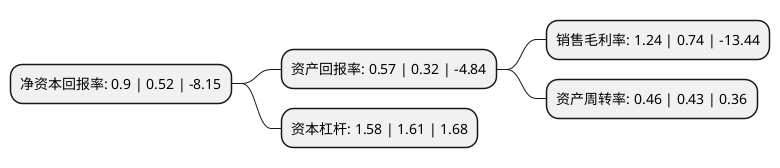

> 本页面由自动化程序生成于 2022年5月20日 01:11
> 内容可能存在错误，如有bug请提交issue至：https://github.com/Eroleice/doc-pi/issues
{.is-warning}

# 上市公司基本情况

## 基本资料

沈阳远大智能工业集团股份有限公司（以下简称“远大智能”）成立于2001年09月24日，沈阳市。于2012年07月17日在深交所中小板上市。

远大智能注册资本104,331.073万元，主营业务为主要从事电梯，自动扶梯，自动人行道的设计，制造，销售，安装和维保，主要产品包括乘客电梯系列，家用电梯系列，货梯系列，杂物电梯系列，商用自动扶梯和自动人行道系列，公交型自动扶梯系列等各系列电梯，自动扶梯，自动人行道。以下是详细信息：

- 公司名称: 沈阳远大智能工业集团股份有限公司
- 股票代码: 002689.SZ
- 所在地: 辽宁 - 沈阳市
- 成立日期: 2001年09月24日
- 注册资本: 104,331.073万元
- 法定代表人: 康宝华
- 主营业务: 主营业务为主要从事电梯，自动扶梯，自动人行道的设计，制造，销售，安装和维保，主要产品包括乘客电梯系列，家用电梯系列，货梯系列，杂物电梯系列，商用自动扶梯和自动人行道系列，公交型自动扶梯系列等各系列电梯，自动扶梯，自动人行道
- 公司官网: www.bltelevator.com.cn
- 公司介绍: 公司是从事现代电梯产品的设计、制造、安装及售后服务的大型专业化公司，中国电梯行业民族品牌领先企业之一。公司在同行业率先通过ISO9001：2008质量体系认证、“VDI4707A类”电梯能效认证。公司自主研发了4米/秒的高速电梯采用永磁同步技术，实现了节能设计和大型高速曳引机的自制化及核心驱动技术的自主知识产权。公司产品系列全部通过欧盟CE认证和俄罗斯GOST国家强制认证以及北美CSA认证。公司产品广泛应用于北京、天津等地铁项目，北京饭店等五星级酒店项目，新加坡建屋局组屋电梯项目，伦敦希思罗机场工程项目等。公司国内业务范围覆盖了中国各大中城市，建立百余个销售、安装、维保服务代理点，销售服务网络遍及全国。在国际市场，公司在多个国家和地区建立了产品销售和服务网络，全面实现全球业务和服务网络的整合、辐射功能。

## 股东及高管情况

上市公司第一大股东为沈阳远大铝业集团有限公司，持股377,042,279股，占比36.14%，为上市公司实际控制人。

截至2022年03月31日，上市公司的前十大股东中，共有5名自然人股东，4名机构股东，1个海外主体，其中5%以上大股东共有2名。上市公司前十大股东明细如下：

> 截至2022年03月31日，上市公司前十大股东信息如下：

| 股东名称 | 持股数量（股） | 持股比例 |
| --- | --- | --- |
| 沈阳远大铝业集团有限公司 | 377,042,279 | 36.14% |
| 远大铝业工程(新加坡)有限公司 | 173,306,391 | 16.61% |
| 许磊 | 26,180,000 | 2.51% |
| 沈阳卓辉投资有限公司 | 14,824,997 | 1.42% |
| 沈阳福康投资有限公司 | 11,108,067 | 1.06% |
| 许喆 | 8,580,000 | 0.82% |
| 顾永兴 | 7,800,000 | 0.75% |
| JPMORGAN CHASE BANK,NATIONAL ASSOCIATION | 6,929,383 | 0.66% |
| 王明杰 | 4,443,438 | 0.43% |
| 黄树勋 | 4,230,000 | 0.41% |

## 利润表分析

上市公司2021年总收入为9.69亿元，净利润为0.12亿元，实现盈利。

## 杜邦分析

> 数据列示周期：2021年 | 2020年 | 2019年
{.is-info}

上市公司的净资产收益率在近一年有所上升，上升幅度为73.08%，其变化情况分解如下：
- 上市公司的销售毛利率在近一年上升了67.57%，可能是生产效率的提升、商品原材料价格下跌或商品价格的上涨所致。
- 上市公司的资产周转率在近一年上升了6.98%，可能是源自于更快的销售回款或库存管理效果提升。
- 上市公司的财务杠杆比率在近一年下降了-1.86%，可能是减少负债降低财务费用。

