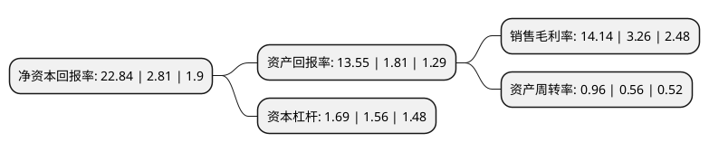

> 本页面由自动化程序生成于 2022年5月20日 01:12
> 内容可能存在错误，如有bug请提交issue至：https://github.com/Eroleice/doc-pi/issues
{.is-warning}

# 上市公司基本情况

## 基本资料

快意电梯股份有限公司（以下简称“快意电梯”）成立于1998年09月16日，东莞市。于2017年03月24日在深交所中小板上市。

快意电梯注册资本33,668.79万元，主要从事电梯，自动扶梯和自动人行道的设计研发，制造，销售及产品的安装，改造和维保服务。公司产品主要包括乘客电梯，载货电梯，自动扶梯和自动人行道4个类型。以下是详细信息：

- 公司名称: 快意电梯股份有限公司
- 股票代码: 002774.SZ
- 所在地: 广东 - 东莞市
- 成立日期: 1998年09月16日
- 注册资本: 33,668.79万元
- 法定代表人: 罗爱文
- 主营业务: 主要从事电梯，自动扶梯和自动人行道的设计研发，制造，销售及产品的安装，改造和维保服务公司产品主要包括乘客电梯，载货电梯，自动扶梯和自动人行道4个类型
- 公司官网: www.ifelift.com
- 公司介绍: 公司具备国家质监总局颁发的特种设备制造、安装、改造和维修保养A级资质，是一家集研发、设计、生产、安装和售后服务为一体的大型专业电梯企业。公司自1998年成立至今一直从事电梯、自动扶梯和自动人行道的研发设计、制造、销售及相关产品的安装、改造和维保服务。公司主要产品包括乘客电梯、载货电梯、自动扶梯和自动人行道等。公司为国家高新技术企业和国家火炬计划重点高新技术企业，以“广东省企业技术中心”和“广东省电梯节能工程技术研究开发中心”为依托，秉承“生产一代、储备一代、研究一代、构思一代”的研发思想，公司形成了较强的技术研发能力。近年来，公司已获得“用户满意服务单位”、“AAA+级中国质量信用企业”、“广东省用户满意企业”、“广东省名牌产品”等荣誉称号，在行业内已具有一定的品牌影响力。

## 股东及高管情况

上市公司第一大股东为东莞市快意股权投资有限公司，持股151,330,520股，占比44.95%，为上市公司实际控制人。

截至2022年03月31日，上市公司的前十大股东中，共有6名自然人股东，3名机构股东，1个产品账户，其中5%以上大股东共有2名。上市公司前十大股东明细如下：

> 截至2022年03月31日，上市公司前十大股东信息如下：

| 股东名称 | 持股数量（股） | 持股比例 |
| --- | --- | --- |
| 东莞市快意股权投资有限公司 | 151,330,520 | 44.95% |
| 罗爱文 | 57,216,910 | 16.99% |
| 罗爱明 | 15,893,378 | 4.72% |
| 东莞市合生股权投资合伙企业(有限合伙) | 15,500,000 | 4.6% |
| 深圳纽富斯投资管理有限公司-纽富斯惠丰1号私募证券投资基金 | 3,800,000 | 1.13% |
| 中信证券股份有限公司 | 1,226,040 | 0.36% |
| 周臻琦 | 849,800 | 0.25% |
| 李兴昌 | 800,000 | 0.24% |
| 陈玉萍 | 785,000 | 0.23% |
| 李京生 | 521,500 | 0.15% |

## 利润表分析

上市公司2021年总收入为19.84亿元，净利润为2.8亿元，实现盈利。

## 杜邦分析

> 数据列示周期：2021年 | 2020年 | 2019年
{.is-info}

上市公司的净资产收益率在近一年有所上升，上升幅度为712.81%，其变化情况分解如下：
- 上市公司的销售毛利率在近一年上升了333.74%，可能是生产效率的提升、商品原材料价格下跌或商品价格的上涨所致。
- 上市公司的资产周转率在近一年上升了71.43%，可能是源自于更快的销售回款或库存管理效果提升。
- 上市公司的财务杠杆比率在近一年上升了8.33%，可能是增加负债扩大生产规模。

