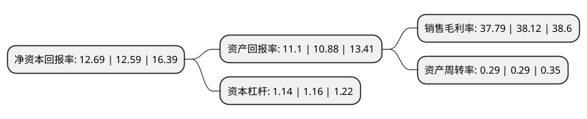

> 本页面由自动化程序生成于 2022年5月20日 01:13
> 内容可能存在错误，如有bug请提交issue至：https://github.com/Eroleice/doc-pi/issues
{.is-warning}

# 上市公司基本情况

## 基本资料

深圳科安达电子科技股份有限公司（以下简称“科安达”）成立于1998年07月30日，深圳市。于2019年12月27日在深交所中小板上市。

科安达注册资本17,632万元，本公司主要围绕轨道交通领域提供产品，服务和系统解决方案。目前公司的产品主要有轨道交通信号计轴系统，铁路站场综合防雷系统，信号监测防雷分线柜，道岔融雪系统等产品及相关解决方案，同时为轨道交通领域客户提供工程建设和系统集成服务。以下是详细信息：

- 公司名称: 深圳科安达电子科技股份有限公司
- 股票代码: 002972.SZ
- 所在地: 广东 - 深圳市
- 成立日期: 1998年07月30日
- 注册资本: 17,632万元
- 法定代表人: 郭丰明
- 主营业务: 本公司主要围绕轨道交通领域提供产品，服务和系统解决方案目前公司的产品主要有轨道交通信号计轴系统，铁路站场综合防雷系统，信号监测防雷分线柜，道岔融雪系统等产品及相关解决方案，同时为轨道交通领域客户提供工程建设和系统集成服务
- 公司官网: www.keanda.com.cn
- 公司介绍: 公司是国内城市轨道交通、铁路等轨道交通领域中领先的信号控制系统和雷电防护专业解决方案提供商,公司主要产品分为轨道交通信号控制系统与防雷产品两大系列。产品在北京、上海、广州、深圳等20多个城市的多条地铁线路中得到广泛的应用.公司是国家高新技术企业、深圳防雷协会副会长单位、深圳市电子行业协会副会长单位，是原铁道部《铁路综合接地系统测量方法》(TB/T3233-2010)行业标准主要起草单位之一，公司的全系列轨道交通信号控制产品计轴系统和防雷产品均是业内首家通过CRCC产品认证，公司的产品“BVB信号防雷分线柜”曾分别获得原铁道部“铁道科技奖三等奖”和广铁集团“科技进步奖一等奖”，公司注册商标“BVB”被评为广东省著名商标。

## 股东及高管情况

上市公司第一大股东为郭丰明，持股91,537,190股，占比51.92%，为上市公司实际控制人。

截至2022年04月27日，上市公司的前十大股东中，共有6名自然人股东，2名机构股东，2个产品账户，其中5%以上大股东共有3名。上市公司前十大股东明细如下：

> 截至2022年04月27日，上市公司前十大股东信息如下：

| 股东名称 | 持股数量（股） | 持股比例 |
| --- | --- | --- |
| 郭丰明 | 91,537,190 | 51.92% |
| 张帆 | 13,884,298 | 7.87% |
| 郭泽珊 | 11,575,448 | 6.57% |
| 林秋萍 | 1,948,300 | 1.1% |
| 深圳达邦股权投资有限公司 | 1,668,000 | 0.95% |
| 深圳科安达电子科技股份有限公司回购专用证券账户 | 1,198,900 | 0.68% |
| 陈楚华 | 1,112,292 | 0.63% |
| 深圳众微首润智能装备创业投资合伙企业(有限合伙) | 936,000 | 0.53% |
| 陈旭然 | 763,039 | 0.43% |
| 醴陵众微创新创业投资基金合伙企业(有限合伙) | 624,000 | 0.35% |

## 利润表分析

上市公司2021年总收入为4亿元，净利润为1.51亿元，实现盈利。

## 杜邦分析

> 数据列示周期：2021年 | 2020年 | 2019年
{.is-info}

上市公司的净资产收益率在近一年有所上升，上升幅度为0.79%，其变化情况分解如下：
- 上市公司的销售毛利率在近一年下降了-0.87%，可能是生产效率的下降、商品原材料价格上涨或商品价格的下跌所致。
- 上市公司的资产周转率在近一年下降了0%，可能是源自于更慢的销售回款或库存管理效果下降。
- 上市公司的财务杠杆比率在近一年下降了-1.72%，可能是减少负债降低财务费用。

