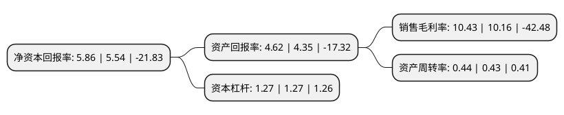

> 本页面由自动化程序生成于 2022年5月20日 01:17
> 内容可能存在错误，如有bug请提交issue至：https://github.com/Eroleice/doc-pi/issues
{.is-warning}

# 上市公司基本情况

## 基本资料

浙江永贵电器股份有限公司（以下简称“永贵电器”）成立于1990年03月19日，台州市。于2012年09月20日在深交所创业板上市。

永贵电器注册资本38,364.186万元，主要业务:各类电连接器，连接器组件及精密智能产品的研发，制造，销售和技术支持。以下是详细信息：

- 公司名称: 浙江永贵电器股份有限公司
- 股票代码: 300351.SZ
- 所在地: 浙江 - 台州市
- 成立日期: 1990年03月19日
- 注册资本: 38,364.186万元
- 法定代表人: 范纪军
- 主营业务: 各类电连接器，连接器组件及精密智能产品的研发，制造，销售和技术支持
- 公司官网: www.yonggui.com
- 公司介绍: 公司是一家专注于各类电连接器、连接器组件及精密智能产品的研发、制造、销售和技术支持的国家高新技术企业。公司产品以连接器为核心，各大领域纵深拓展，形成具有公司特色的产品结构：轨道交通板块、新能源汽车板块、通信板块、军工板块。公司从事连接器行业时间较长，培养了一支经验丰富的研发团队，拥有多位业内高端核心技术人才，并设置了合理的薪酬激励机制，为激励和吸引研发人才创造了有利条件。公司坚持核心技术的研发与创新，公司产品已获得了百余项国家专利授权，拥有多家独立的技术研发中心，在浙江总部、四川绵阳、北京、深圳、江苏等地均拥有专业研发设计能力的专家队伍，致力于为客户提供完善、可靠的整体解决方案和技术支持，提供高质量的产品及优质、高效的品牌服务。公司被认定为“国家火炬计划重点高新技术企业”、“国家高新技术企业”、“浙江省专利示范企业”、“浙江省名牌产品”、“浙江省著名商标”等。

## 股东及高管情况

上市公司第一大股东为范永贵，持股53,767,200股，占比14.01%，**疑似为**上市公司实际控制人。

截至2022年03月31日，上市公司的前十大股东中，共有8名自然人股东，1名机构股东，1个产品账户，其中5%以上大股东共有4名。上市公司前十大股东明细如下：

> 未能通过持股比例判定出上市公司实际控制人（持股30%以上）
> 可能存在通过间接持股、联合持股、协议控制等方式拥有实际控制权的主体，具体请参考上市公司定期公告！
{.is-warning}

> 截至2022年03月31日，上市公司前十大股东信息如下：

| 股东名称 | 持股数量（股） | 持股比例 |
| --- | --- | --- |
| 范永贵 | 53,767,200 | 14.01% |
| 浙江天台永贵投资有限公司 | 36,210,000 | 9.44% |
| 范正军 | 31,352,500 | 8.17% |
| 范纪军 | 30,201,600 | 7.87% |
| 娄爱芹 | 17,963,440 | 4.68% |
| 汪敏华 | 16,991,200 | 4.43% |
| 卢素珍 | 16,991,200 | 4.43% |
| 卢红萍 | 15,670,095 | 4.08% |
| 许利银 | 7,719,400 | 2.01% |
| 中国建设银行股份有限公司-信达澳银新能源产业股票型证券投资基金 | 4,395,700 | 1.15% |

## 利润表分析

上市公司2021年总收入为11.49亿元，净利润为1.19亿元，实现盈利。

## 杜邦分析

> 数据列示周期：2021年 | 2020年 | 2019年
{.is-info}

上市公司的净资产收益率在近一年有所上升，上升幅度为5.78%，其变化情况分解如下：
- 上市公司的销售毛利率在近一年上升了2.66%，可能是生产效率的提升、商品原材料价格下跌或商品价格的上涨所致。
- 上市公司的资产周转率在近一年上升了2.33%，可能是源自于更快的销售回款或库存管理效果提升。
- 上市公司的财务杠杆比率在近一年下降了0%，可能是减少负债降低财务费用。

