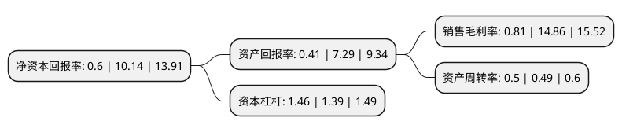

> 本页面由自动化程序生成于 2022年5月20日 01:18
> 内容可能存在错误，如有bug请提交issue至：https://github.com/Eroleice/doc-pi/issues
{.is-warning}

# 上市公司基本情况

## 基本资料

山东朗进科技股份有限公司（以下简称“朗进科技”）成立于2000年04月07日，济南市。于2019年06月21日在深交所创业板上市。

朗进科技注册资本9,093.495万元，轨道交通车辆节能变频热泵空调及变频控制器的研发，生产，销售及服务以下是详细信息：

- 公司名称: 山东朗进科技股份有限公司
- 股票代码: 300594.SZ
- 所在地: 山东 - 济南市
- 成立日期: 2000年04月07日
- 注册资本: 9,093.495万元
- 法定代表人: 李敬茂
- 主营业务: 轨道交通车辆节能变频热泵空调及变频控制器的研发，生产，销售及服务
- 公司官网: www.longertek.com
- 公司介绍: 公司是一家拥有变频节能技术及系统控制核心技术的空调系统集成设计与制造商，主要从事轨道交通车辆节能变频热泵空调及变频控制器的研发、生产、销售及服务。公司主要产品包括轨道交通车辆节能变频热泵(冷暖)空调和变频控制器。目前公司的收入和盈利主要来源于轨道交通车辆空调的销售。随着轨道交通建设项目的开展，中国轨道交通车辆的产量呈现爆发式增长，为公司的节能变频空调带来了巨大的市场空间。随着“一带一路”、“中国制造2025”等国家战略的不断升温，城市化建设步伐加快，轨道交通建设增加，轨道交通装备制造业市场前景广阔，公司抓住技术升级和产业发展的机遇，贯彻“朗进造=德国造”品质追求，将迎来更多的市场空间。

## 股东及高管情况

上市公司第一大股东为青岛朗进集团有限公司，持股20,735,000股，占比22.8%，**疑似为**上市公司实际控制人。

截至2022年03月31日，上市公司的前十大股东中，共有5名自然人股东，4名机构股东，1个产品账户，其中5%以上大股东共有2名。上市公司前十大股东明细如下：

> 未能通过持股比例判定出上市公司实际控制人（持股30%以上）
> 可能存在通过间接持股、联合持股、协议控制等方式拥有实际控制权的主体，具体请参考上市公司定期公告！
{.is-warning}

> 截至2022年03月31日，上市公司前十大股东信息如下：

| 股东名称 | 持股数量（股） | 持股比例 |
| --- | --- | --- |
| 青岛朗进集团有限公司 | 20,735,000 | 22.8% |
| 浙江省经济建设投资有限公司 | 12,000,000 | 13.2% |
| 莱芜创业投资有限公司 | 4,050,000 | 4.45% |
| 江瀚(宁波)资产管理有限公司 | 1,451,938 | 1.6% |
| 周文新 | 1,128,412 | 1.24% |
| 张恒 | 733,548 | 0.81% |
| 章梦来 | 523,300 | 0.58% |
| 华舆正心(天津)股权投资基金合伙企业(有限合伙) | 419,300 | 0.46% |
| 张峰赫 | 395,400 | 0.43% |
| 万华印 | 311,100 | 0.34% |

## 利润表分析

上市公司2021年总收入为6.75亿元，净利润为0.05亿元，实现盈利。

## 杜邦分析

> 数据列示周期：2021年 | 2020年 | 2019年
{.is-info}

上市公司的净资产收益率在近一年有所下降，下降幅度为-94.08%，其变化情况分解如下：
- 上市公司的销售毛利率在近一年下降了-94.55%，可能是生产效率的下降、商品原材料价格上涨或商品价格的下跌所致。
- 上市公司的资产周转率在近一年上升了2.04%，可能是源自于更快的销售回款或库存管理效果提升。
- 上市公司的财务杠杆比率在近一年上升了5.04%，可能是增加负债扩大生产规模。

