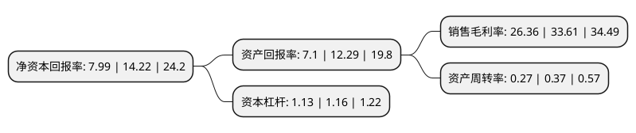

> 本页面由自动化程序生成于 2022年5月20日 01:21
> 内容可能存在错误，如有bug请提交issue至：https://github.com/Eroleice/doc-pi/issues
{.is-warning}

# 上市公司基本情况

## 基本资料

北京交大思诺科技股份有限公司（以下简称“交大思诺”）成立于2001年06月06日，北京市。于2020年07月17日在深交所创业板上市。

交大思诺注册资本8,693.34万元，公司主营业务为轨道交通列车运行控制系统关键设备的研发设计，组织生产，销售及技术支持，主要体现为产品的系统设计及软硬件开发和产品实现的全流程管控。公司主要产品分为应答器系统，机车信号CPU组件和轨道电路读取器(TCR)三大类，其作为列车运行控制系统的关键设备，保障行车安全。以下是详细信息：

- 公司名称: 北京交大思诺科技股份有限公司
- 股票代码: 300851.SZ
- 所在地: 北京 - 北京市
- 成立日期: 2001年06月06日
- 注册资本: 8,693.34万元
- 法定代表人: 李伟
- 主营业务: 公司主营业务为轨道交通列车运行控制系统关键设备的研发设计，组织生产，销售及技术支持，主要体现为产品的系统设计及软硬件开发和产品实现的全流程管控公司主要产品分为应答器系统，机车信号CPU组件和轨道电路读取器(TCR)三大类，其作为列车运行控制系统的关键设备，保障行车安全
- 公司官网: www.jd-signal.com
- 公司介绍: 公司主营业务为轨道交通列车运行控制系统关键设备的研发设计、组织生产、销售及技术支持，主要体现为产品的系统设计及软硬件开发和产品实现的全流程管控。公司专注于应答器系统、机车信号车载设备和轨道电路读取器(TCR)等列控系统关键设备的自主研发，研制的产品均实现了业界安全完整性等级中最高的安全等级SIL4级。公司提供的主要产品包括应答器系统、机车信号CPU组件和轨道电路读取器(TCR)，广泛应用于普铁、高铁、城轨等领域。在产品应用领域方面，随着我国城市轨道交通的迅猛发展，针对城市轨道交通列车密度高、行车间隔短等特点，公司进一步开发适用于城市轨道交通的应答器系统和轨道电路读取器，实现了城市轨道交通列车运行控制系统关键设备的进口替代。在产品类型方面，公司自主研发的列车运行监控装置(LKJ)取得了铁路产品认证证书(试用证书)，并已开始正式上道试用。截至本招股意向书签署日，公司及其子公司已取得专利权84项(其中发明专利55项)，软件著作权58项，具备较强的研发水平和技术优势。

## 股东及高管情况

上市公司第一大股东为邱宽民，持股20,898,000股，占比24.04%，**疑似为**上市公司实际控制人。

截至2022年03月31日，上市公司的前十大股东中，共有9名自然人股东，1名机构股东，其中5%以上大股东共有6名。上市公司前十大股东明细如下：

> 未能通过持股比例判定出上市公司实际控制人（持股30%以上）
> 可能存在通过间接持股、联合持股、协议控制等方式拥有实际控制权的主体，具体请参考上市公司定期公告！
{.is-warning}

> 截至2022年03月31日，上市公司前十大股东信息如下：

| 股东名称 | 持股数量（股） | 持股比例 |
| --- | --- | --- |
| 邱宽民 | 20,898,000 | 24.04% |
| 徐迅 | 10,284,000 | 11.83% |
| 北京交大资产经营有限公司 | 6,520,000 | 7.5% |
| 赵胜凯 | 5,220,000 | 6% |
| 赵明 | 4,536,000 | 5.22% |
| 张民 | 4,422,000 | 5.09% |
| 赵会兵 | 2,610,000 | 3% |
| 李伟 | 2,428,000 | 2.79% |
| 赵林海 | 2,152,000 | 2.48% |
| 王永和 | 1,560,000 | 1.79% |

## 利润表分析

上市公司2021年总收入为3.62亿元，净利润为0.95亿元，实现盈利。

## 杜邦分析

> 数据列示周期：2021年 | 2020年 | 2019年
{.is-info}

上市公司的净资产收益率在近一年有所下降，下降幅度为-43.81%，其变化情况分解如下：
- 上市公司的销售毛利率在近一年下降了-21.57%，可能是生产效率的下降、商品原材料价格上涨或商品价格的下跌所致。
- 上市公司的资产周转率在近一年下降了-27.03%，可能是源自于更慢的销售回款或库存管理效果下降。
- 上市公司的财务杠杆比率在近一年下降了-2.59%，可能是减少负债降低财务费用。

