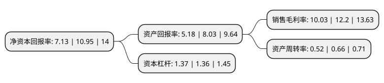

> 本页面由自动化程序生成于 2022年5月20日 01:21
> 内容可能存在错误，如有bug请提交issue至：https://github.com/Eroleice/doc-pi/issues
{.is-warning}

# 上市公司基本情况

## 基本资料

通用电梯股份有限公司（以下简称“通用电梯”）成立于2003年08月21日，苏州市。于2021年01月21日在深交所创业板上市。

通用电梯注册资本24,014.6万元，主要从事电梯，自动扶梯，自动人行道的产品研发，设计，制造，销售，安装，改造及维保业务以下是详细信息：

- 公司名称: 通用电梯股份有限公司
- 股票代码: 300931.SZ
- 所在地: 江苏 - 苏州市
- 成立日期: 2003年08月21日
- 注册资本: 24,014.6万元
- 法定代表人: 徐志明
- 主营业务: 主要从事电梯，自动扶梯，自动人行道的产品研发，设计，制造，销售，安装，改造及维保业务
- 公司官网: www.sge-elevator.com
- 公司介绍: 公司主要从事电梯、自动扶梯、自动人行道的产品研发、设计、制造、销售、安装、改造及维保业务，是一家为各类建筑的电梯提供系统性的解决方案及全面的更新改造方案的科技创新型企业。自成立以来，公司坚持以“畅通世界”为目标，注重生产、研发的投入，持续优化电梯制造工艺技术，以人才创新带动技术创新，引进了光纤激光切割机、数控冲床、数控剪板机、数控折弯机等数控加工设备及自动焊接机器人、轿壁自动生产线、门板自动生产线、门机自动生产线、控制系统生产线等一系列国内外先进设备。经过多年的技术研发、生产工艺革新，公司产品的优良品质获得了市场的广泛认可，产品线覆盖乘客电梯、观光电梯、医用电梯、家用电梯、载货电梯、汽车电梯、既有建筑加装电梯、自动扶梯、自动人行道等各系列电梯。

## 股东及高管情况

上市公司第一大股东为徐志明，持股40,219,200股，占比16.75%，**疑似为**上市公司实际控制人。

截至2022年03月31日，上市公司的前十大股东中，共有8名自然人股东，1名机构股东，1个产品账户，其中5%以上大股东共有5名。上市公司前十大股东明细如下：

> 未能通过持股比例判定出上市公司实际控制人（持股30%以上）
> 可能存在通过间接持股、联合持股、协议控制等方式拥有实际控制权的主体，具体请参考上市公司定期公告！
{.is-warning}

> 截至2022年03月31日，上市公司前十大股东信息如下：

| 股东名称 | 持股数量（股） | 持股比例 |
| --- | --- | --- |
| 徐志明 | 40,219,200 | 16.75% |
| 牟玉芳 | 22,579,200 | 9.4% |
| 徐斌 | 18,345,600 | 7.64% |
| 徐津 | 18,345,600 | 7.64% |
| 苏州吉亿企业管理合伙企业(有限合伙) | 13,612,000 | 5.67% |
| 尹金根 | 5,644,800 | 2.35% |
| 江苏中茂节能环保产业创业投资基金合伙企业(有限合伙) | 4,163,000 | 1.73% |
| 张建林 | 2,822,400 | 1.18% |
| 孙峰 | 2,822,400 | 1.18% |
| 徐方奇 | 2,822,400 | 1.18% |

## 利润表分析

上市公司2021年总收入为4.71亿元，净利润为0.47亿元，实现盈利。

## 杜邦分析

> 数据列示周期：2021年 | 2020年 | 2019年
{.is-info}

上市公司的净资产收益率在近一年有所下降，下降幅度为-34.89%，其变化情况分解如下：
- 上市公司的销售毛利率在近一年下降了-17.79%，可能是生产效率的下降、商品原材料价格上涨或商品价格的下跌所致。
- 上市公司的资产周转率在近一年下降了-21.21%，可能是源自于更慢的销售回款或库存管理效果下降。
- 上市公司的财务杠杆比率在近一年上升了0.74%，可能是增加负债扩大生产规模。

