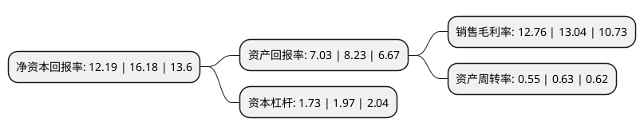

> 本页面由自动化程序生成于 2022年5月20日 01:22
> 内容可能存在错误，如有bug请提交issue至：https://github.com/Eroleice/doc-pi/issues
{.is-warning}

# 上市公司基本情况

## 基本资料

森赫电梯股份有限公司（以下简称“森赫股份”）成立于2007年12月07日，湖州市。于2021年09月07日在深交所创业板上市。

森赫股份注册资本26,678.667万元，公司专业从事电梯，自动扶梯和自动人行道的研发，制造和销售，并提供相关安装和调试服务，以及电梯维修保养，配件销售，更新改造等后市场服务。公司产品主要包括电梯，自动扶梯和自动人行道两大类型。以下是详细信息：

- 公司名称: 森赫电梯股份有限公司
- 股票代码: 301056.SZ
- 所在地: 浙江 - 湖州市
- 成立日期: 2007年12月07日
- 注册资本: 26,678.667万元
- 法定代表人: 李东流
- 主营业务: 公司专业从事电梯，自动扶梯和自动人行道的研发，制造和销售，并提供相关安装和调试服务，以及电梯维修保养，配件销售，更新改造等后市场服务公司产品主要包括电梯，自动扶梯和自动人行道两大类型
- 公司官网: www.sicher-elevator.com
- 公司介绍: 公司专业从事电梯、自动扶梯和自动人行道的研发、制造和销售，并提供相关安装和调试服务，以及电梯维修保养、配件销售、更新改造等后市场服务。自设立以来，公司坚持“国际化、科技化、产业化”的发展战略，形成了以乘客电梯、载货电梯、自动扶梯和自动人行道等十余种系列产品的布局，致力于成为优质的电梯系统解决方案服务商。公司产品主要包括电梯、自动扶梯和自动人行道两大类型。公司不断加强新产品、新技术和新工艺的研发力度，丰富和完善产品线。公司主要拥有11个系列22种型号的垂直电梯产品、2个系列6种型号的自动扶梯和自动人行道产品。公司注重技术创新和产品研发，自2011年起被认定为“国家高新技术企业”，先后建立了“省级高新技术企业研究开发中心”、“省级博士后工作站”、“省级企业技术中心”“省级企业研究院”“省级工业设计中心”“省级院士专家工作站”等创新平台。

## 股东及高管情况

上市公司第一大股东为李东流，持股121,054,450股，占比45.37%，为上市公司实际控制人。

截至2022年03月31日，上市公司的前十大股东中，共有4名自然人股东，6名机构股东，其中5%以上大股东共有3名。上市公司前十大股东明细如下：

> 截至2022年03月31日，上市公司前十大股东信息如下：

| 股东名称 | 持股数量（股） | 持股比例 |
| --- | --- | --- |
| 李东流 | 121,054,450 | 45.37% |
| 浙江米高投资有限公司 | 45,326,550 | 16.99% |
| 湖州尚得投资管理有限公司 | 20,009,000 | 7.5% |
| 湖州迈森投资合伙企业(有限合伙) | 7,250,000 | 2.72% |
| 湖州途森投资合伙企业(有限合伙) | 6,450,000 | 2.42% |
| 华泰证券股份有限公司 | 1,086,287 | 0.41% |
| 中国国际金融香港资产管理有限公司-客户资金2 | 782,107 | 0.29% |
| 吕翔 | 706,100 | 0.26% |
| 何琴 | 488,319 | 0.18% |
| 黄航路 | 463,067 | 0.17% |

## 利润表分析

上市公司2021年总收入为5.75亿元，净利润为0.73亿元，实现盈利。

## 杜邦分析

> 数据列示周期：2021年 | 2020年 | 2019年
{.is-info}

上市公司的净资产收益率在近一年有所下降，下降幅度为-24.66%，其变化情况分解如下：
- 上市公司的销售毛利率在近一年下降了-2.15%，可能是生产效率的下降、商品原材料价格上涨或商品价格的下跌所致。
- 上市公司的资产周转率在近一年下降了-12.7%，可能是源自于更慢的销售回款或库存管理效果下降。
- 上市公司的财务杠杆比率在近一年下降了-12.18%，可能是减少负债降低财务费用。

