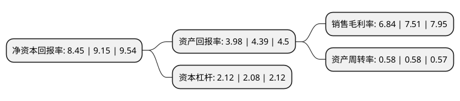

> 本页面由自动化程序生成于 2022年5月20日 01:27
> 内容可能存在错误，如有bug请提交issue至：https://github.com/Eroleice/doc-pi/issues
{.is-warning}

# 上市公司基本情况

## 基本资料

中铁高新工业股份有限公司（以下简称“中铁工业”）成立于1999年09月24日，北京市。于2001年05月28日在上交所主板上市。

中铁工业注册资本222,155.159万元，主要业务:铁路工程项目，其他工程项目。以下是详细信息：

- 公司名称: 中铁高新工业股份有限公司
- 股票代码: 600528.SH
- 所在地: 北京 - 北京市
- 成立日期: 1999年09月24日
- 注册资本: 222,155.159万元
- 法定代表人: 易铁军
- 主营业务: 铁路工程项目，其他工程项目
- 公司官网: www.crhic.cn
- 公司介绍: 公司拥有铁路工程施工、公路、市政公用工程等总承包特级资质，以及城市轨道交通工程专业承包资质，原主营各类工业、能源、交通等工程项目施工承包和机械租赁，是中国铁路建设系统第一家上市公司。2017年公司通过重大资产重组，公司置出原有建筑工程施工、房地产开发等业务，置入中铁山桥、中铁宝桥、中铁科工及中铁装备系中国中铁工业制造板块的核心企业，主要从事道岔、钢结构、隧道掘进设备及大型工程施工机械等工业制造业务，公司主营业务从传统的建筑工程施工、房地产开发和物资销售转变为以道岔、隧道掘进设备及工程机械等高端装备制造及钢结构制造为主的工业制造业务，实现战略转型。

## 股东及高管情况

上市公司第一大股东为中铁二局建设有限公司，持股634,973,795股，占比28.58%，**疑似为**上市公司实际控制人。

截至2022年03月31日，上市公司的前十大股东中，共有4名机构股东，6个产品账户，其中5%以上大股东共有3名。上市公司前十大股东明细如下：

> 未能通过持股比例判定出上市公司实际控制人（持股30%以上）
> 可能存在通过间接持股、联合持股、协议控制等方式拥有实际控制权的主体，具体请参考上市公司定期公告！
{.is-warning}

> 截至2022年03月31日，上市公司前十大股东信息如下：

| 股东名称 | 持股数量（股） | 持股比例 |
| --- | --- | --- |
| 中铁二局建设有限公司 | 634,973,795 | 28.58% |
| 中国中铁股份有限公司 | 456,387,811 | 20.54% |
| 中原股权投资管理有限公司 | 125,878,558 | 5.67% |
| 华融瑞通股权投资管理有限公司 | 59,305,994 | 2.67% |
| 广东省铁路发展基金有限责任公司 | 37,854,889 | 1.7% |
| 山东聚赢产业基金合伙企业(有限合伙) | 37,854,889 | 1.7% |
| 农银汇理(上海)资产-农业银行-华宝信托-投资【6】号集合资金信托计划 | 37,854,889 | 1.7% |
| 易方达基金-中央汇金资产管理有限责任公司-易方达基金-汇金资管单一资产管理计划 | 27,765,900 | 1.25% |
| 全国社保基金四一三组合 | 18,180,000 | 0.82% |
| 国寿安保基金-建设银行-人寿保险-中国人寿保险(集团)公司委托国寿安保基金混合型组合 | 13,023,769 | 0.59% |

## 利润表分析

上市公司2021年总收入为271.57亿元，净利润为18.58亿元，实现盈利。

## 杜邦分析

> 数据列示周期：2021年 | 2020年 | 2019年
{.is-info}

上市公司的净资产收益率在近一年有所下降，下降幅度为-7.65%，其变化情况分解如下：
- 上市公司的销售毛利率在近一年下降了-8.92%，可能是生产效率的下降、商品原材料价格上涨或商品价格的下跌所致。
- 上市公司的资产周转率在近一年下降了0%，可能是源自于更慢的销售回款或库存管理效果下降。
- 上市公司的财务杠杆比率在近一年上升了1.92%，可能是增加负债扩大生产规模。

