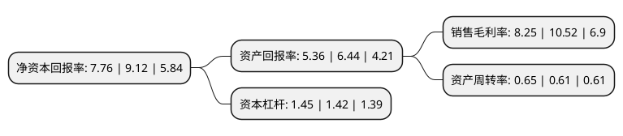

> 本页面由自动化程序生成于 2022年5月20日 01:29
> 内容可能存在错误，如有bug请提交issue至：https://github.com/Eroleice/doc-pi/issues
{.is-warning}

# 上市公司基本情况

## 基本资料

广州广日股份有限公司（以下简称“广日股份”）成立于1988年10月24日，广州市。于1996年03月28日在上交所主板上市。

广日股份注册资本85,994.69万元，以电梯整机制造，电梯零部件生产及物流服务为主业以下是详细信息：

- 公司名称: 广州广日股份有限公司
- 股票代码: 600894.SH
- 所在地: 广东 - 广州市
- 成立日期: 1988年10月24日
- 注册资本: 85,994.69万元
- 法定代表人: 蒙锦昌
- 主营业务: 以电梯整机制造，电梯零部件生产及物流服务为主业
- 公司官网: www.guangrigf.com
- 公司介绍: 公司是国内电梯制造历史最悠久的企业之一，以电梯业务为核心，向上下游产业链延伸。公司经过近四十年的发展，形成了以电梯整机制造、电梯零部件生产及物流服务三大业务板块为主的产业一体化经营格局，并引入国际化高端合作项目向相关产业领域拓展，成为科技研发实力和市场竞争能力突出的大型企业集团。目前，公司电梯整机及零部件业务拥有广州、天津、昆山三个制造基地，形成辐射华南、华东、华北的全国性生产能力，正致力于由区域性企业向全国性的电梯生产及服务企业转变，由传统性企业向先进、高端的装备制造业转型。未来，公司将不断开拓进取，锐意创新，借助资本平台实现跨越式发展，以更加优良的业绩、优质的产品和服务，更好地回报广大投资者、回报社会。

## 股东及高管情况

上市公司第一大股东为广州智能装备产业集团有限公司，持股486,361,929股，占比56.56%，为上市公司实际控制人。

截至2022年03月31日，上市公司的前十大股东中，共有5名自然人股东，5名机构股东，其中5%以上大股东共有1名。上市公司前十大股东明细如下：

> 截至2022年03月31日，上市公司前十大股东信息如下：

| 股东名称 | 持股数量（股） | 持股比例 |
| --- | --- | --- |
| 广州智能装备产业集团有限公司 | 486,361,929 | 56.56% |
| 中央汇金资产管理有限责任公司 | 16,280,000 | 1.89% |
| 广州维亚通用实业有限公司 | 11,074,315 | 1.29% |
| 广州花都通用集团有限公司 | 6,687,291 | 0.78% |
| 广州市南头科技有限公司 | 6,332,872 | 0.74% |
| 黄敏慧 | 2,868,000 | 0.33% |
| 徐炯 | 2,210,000 | 0.26% |
| 孙波 | 2,081,501 | 0.24% |
| 苏润连 | 1,900,000 | 0.22% |
| 陈周雁 | 1,537,000 | 0.18% |

## 利润表分析

上市公司2021年总收入为77.66亿元，净利润为6.4亿元，实现盈利。

## 杜邦分析

> 数据列示周期：2021年 | 2020年 | 2019年
{.is-info}

上市公司的净资产收益率在近一年有所下降，下降幅度为-14.91%，其变化情况分解如下：
- 上市公司的销售毛利率在近一年下降了-21.58%，可能是生产效率的下降、商品原材料价格上涨或商品价格的下跌所致。
- 上市公司的资产周转率在近一年上升了6.56%，可能是源自于更快的销售回款或库存管理效果提升。
- 上市公司的财务杠杆比率在近一年上升了2.11%，可能是增加负债扩大生产规模。

