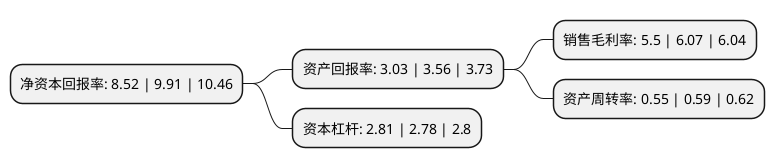

> 本页面由自动化程序生成于 2022年5月20日 01:31
> 内容可能存在错误，如有bug请提交issue至：https://github.com/Eroleice/doc-pi/issues
{.is-warning}

# 上市公司基本情况

## 基本资料

中国中车股份有限公司（以下简称“中国中车”）成立于2007年12月28日，北京市。于2008年08月18日在上交所主板上市。

中国中车注册资本2,869,886.409万元，主要从事铁路机车，客车，货车，动车组，城轨地铁车辆及重要零部件的研发，制造，销售，修理和租赁，以及轨道交通装备专有技术延伸产业。以下是详细信息：

- 公司名称: 中国中车股份有限公司
- 股票代码: 601766.SH
- 所在地: 北京 - 北京市
- 成立日期: 2007年12月28日
- 注册资本: 2,869,886.409万元
- 法定代表人: 孙永才
- 主营业务: 主要从事铁路机车，客车，货车，动车组，城轨地铁车辆及重要零部件的研发，制造，销售，修理和租赁，以及轨道交通装备专有技术延伸产业
- 公司官网: www.crrcgc.cc
- 公司介绍: 公司是经国务院同意，国务院国资委批准，由中国北车股份有限公司、中国南车股份有限公司按照对等原则合并组建的A+H股上市公司。公司承继了中国北车股份有限公司、中国南车股份有限公司的全部业务和资产，是全球规模最大、品种最全、技术领先的轨道交通装备供应商。主要经营：铁路机车车辆、动车组、城市轨道交通车辆、工程机械、各类机电设备、电子设备及零部件、电子电器及环保设备产品的研发、设计、制造、修理、销售、租赁与技术服务；信息咨询；实业投资与管理；资产管理；进出口业务。公司坚持自主创新、开放创新和协同创新，持续完善技术创新体系，不断提升技术创新能力，建设了世界领先的轨道交通装备产品技术平台和制造基地，以高速动车组、大功率机车、铁路货车、城市轨道车辆为代表的系列产品，已经全面达到世界先进水平，能够适应各种复杂的地理环境，满足多样化的市场需求。中国中车制造的高速动车组系列产品，已经成为中国向世界展示发展成就的重要名片。产品现已出口全球六大洲近百个国家和地区，并逐步从产品出口向技术输出、资本输出和全球化经营转变。

## 股东及高管情况

上市公司第一大股东为中国中车集团有限公司，持股14,558,389,450股，占比50.73%，为上市公司实际控制人。

截至2022年03月31日，上市公司的前十大股东中，共有2名机构股东，6个产品账户，2个海外主体，其中5%以上大股东共有2名。上市公司前十大股东明细如下：

> 截至2022年03月31日，上市公司前十大股东信息如下：

| 股东名称 | 持股数量（股） | 持股比例 |
| --- | --- | --- |
| 中国中车集团有限公司 | 14,558,389,450 | 50.73% |
| 香港中央结算(代理人)有限公司 | 4,358,320,003 | 15.19% |
| 中国证券金融股份有限公司 | 605,663,637 | 2.11% |
| 香港中央结算有限公司(陆股通) | 288,114,709 | 1% |
| 中欧基金-农业银行-中欧中证金融资产管理计划 | 234,982,900 | 0.82% |
| 博时基金-农业银行-博时中证金融资产管理计划 | 234,982,900 | 0.82% |
| 南方基金-农业银行-南方中证金融资产管理计划 | 234,982,900 | 0.82% |
| 华夏基金-农业银行-华夏中证金融资产管理计划 | 234,982,900 | 0.82% |
| 广发基金-农业银行-广发中证金融资产管理计划 | 234,982,900 | 0.82% |
| 银华基金-农业银行-银华中证金融资产管理计划 | 234,982,900 | 0.82% |

## 利润表分析

上市公司2021年总收入为2,257.31亿元，净利润为124.17亿元，实现盈利。

## 杜邦分析

> 数据列示周期：2021年 | 2020年 | 2019年
{.is-info}

上市公司的净资产收益率在近一年有所下降，下降幅度为-14.03%，其变化情况分解如下：
- 上市公司的销售毛利率在近一年下降了-9.39%，可能是生产效率的下降、商品原材料价格上涨或商品价格的下跌所致。
- 上市公司的资产周转率在近一年下降了-6.78%，可能是源自于更慢的销售回款或库存管理效果下降。
- 上市公司的财务杠杆比率在近一年上升了1.08%，可能是增加负债扩大生产规模。

