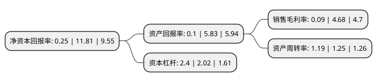

> 本页面由自动化程序生成于 2022年5月20日 01:33
> 内容可能存在错误，如有bug请提交issue至：https://github.com/Eroleice/doc-pi/issues
{.is-warning}

# 上市公司基本情况

## 基本资料

宣城市华菱精工科技股份有限公司（以下简称“华菱精工”）成立于2005年09月07日，宣城市。于2018年01月24日在上交所主板上市。

华菱精工注册资本13,334万元，主营业务:电梯配重产品，钣金产品等电梯配件的研发，生产和销售。主要产品:重块和新型补偿缆等配重产品，电梯专用的钣金产品等电梯配件，以及木材干燥，炭化设备。以下是详细信息：

- 公司名称: 宣城市华菱精工科技股份有限公司
- 股票代码: 603356.SH
- 所在地: 安徽 - 宣城市
- 成立日期: 2005年09月07日
- 注册资本: 13,334万元
- 法定代表人: 黄业华
- 主营业务: 主营业务:电梯配重产品，钣金产品等电梯配件的研发，生产和销售主要产品:重块和新型补偿缆等配重产品，电梯专用的钣金产品等电梯配件，以及木材干燥，炭化设备
- 公司官网: www.xchualing.com
- 公司介绍: 公司自2005年设立以来始终专注于电梯配重产品、钣金产品等电梯配件的研发、生产和销售。公司主要产品包括对重块、新型补偿缆等配重产品以及电梯专用的钣金产品等电梯配件。除电梯行业外，自2016年初开始，本公司充分发挥机械加工方面的装备、工艺、技术等优势，开发、推广应用于智能停车库等升降机领域钣金件新产品，逐步向智能停车库领域拓展，目前车库钣金件业务稳步增长。公司已具备相应车库制造、安装、改造、维修业务资质。本公司子公司福沃德主要从事木材干燥、炭化设备的研发、生产和销售。公司始终秉承“创新奠定基业、服务成就未来”的经营理念，坚持“低成本、低能耗、高质量”的经营方针，推行“信誉至上、服务为先、人才为本、创新争优、环境友好”的发展战略。

## 股东及高管情况

上市公司第一大股东为黄业华，持股31,445,000股，占比23.58%，**疑似为**上市公司实际控制人。

截至2022年03月31日，上市公司的前十大股东中，共有10名自然人股东，其中5%以上大股东共有1名。上市公司前十大股东明细如下：

> 未能通过持股比例判定出上市公司实际控制人（持股30%以上）
> 可能存在通过间接持股、联合持股、协议控制等方式拥有实际控制权的主体，具体请参考上市公司定期公告！
{.is-warning}

> 截至2022年03月31日，上市公司前十大股东信息如下：

| 股东名称 | 持股数量（股） | 持股比例 |
| --- | --- | --- |
| 黄业华 | 31,445,000 | 23.58% |
| 薛飞 | 5,880,600 | 4.41% |
| 马息萍 | 4,756,600 | 3.57% |
| 黄超 | 4,750,000 | 3.56% |
| 田三红 | 4,710,000 | 3.53% |
| 蒋小明 | 4,370,000 | 3.28% |
| 朱龙腾 | 2,900,000 | 2.17% |
| 詹明之 | 2,096,699 | 1.57% |
| 郁汉文 | 1,889,400 | 1.42% |
| 胡永强 | 1,658,361 | 1.24% |

## 利润表分析

上市公司2021年总收入为22.33亿元，净利润为0.01亿元，实现盈利。

## 杜邦分析

> 数据列示周期：2021年 | 2020年 | 2019年
{.is-info}

上市公司的净资产收益率在近一年有所下降，下降幅度为-97.88%，其变化情况分解如下：
- 上市公司的销售毛利率在近一年下降了-98.08%，可能是生产效率的下降、商品原材料价格上涨或商品价格的下跌所致。
- 上市公司的资产周转率在近一年下降了-4.8%，可能是源自于更慢的销售回款或库存管理效果下降。
- 上市公司的财务杠杆比率在近一年上升了18.81%，可能是增加负债扩大生产规模。

