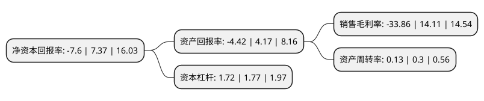

> 本页面由自动化程序生成于 2022年5月20日 01:36
> 内容可能存在错误，如有bug请提交issue至：https://github.com/Eroleice/doc-pi/issues
{.is-warning}

# 上市公司基本情况

## 基本资料

青岛威奥轨道股份有限公司（以下简称“威奥股份”）成立于2007年10月08日，青岛市。于2020年05月22日在上交所主板上市。

威奥股份注册资本39,288.6万元，发行人主要从事轨道交通车辆配套产品的研发，生产，销售和服务，公司主要产品包括内装产品，卫生间系统，金属结构件，模块化产品和车外结构件等五大类。以下是详细信息：

- 公司名称: 青岛威奥轨道股份有限公司
- 股票代码: 605001.SH
- 所在地: 山东 - 青岛市
- 成立日期: 2007年10月08日
- 注册资本: 39,288.6万元
- 法定代表人: 孙汉本
- 主营业务: 发行人主要从事轨道交通车辆配套产品的研发，生产，销售和服务，公司主要产品包括内装产品，卫生间系统，金属结构件，模块化产品和车外结构件等五大类
- 公司官网: www.victall.com
- 公司介绍: 公司与中国中车下属的长春客车、唐山客车、青岛四方及合资公司四方庞巴迪等主要整车制造企业建立了稳定的合作关系，并多次获得上述企业授予的“优秀供应商”称号。在国际市场上，公司已成为西门子、庞巴迪、阿尔斯通等国外知名轨道交通车辆制造商的供应商，并分别与西门子、庞巴迪达成战略合作协议，成为其全球战略合作伙伴。公司主要产品包括内装产品、卫生间系统、金属结构件、模块化产品和车外结构件等五大类，涵盖客室/司机室内装、车头外壳、受电弓导流罩、裙板、真空集便系统、卫生间、风道系统、前端开闭机构系统、贯通道系统、照明系统、厨房模块、行李架、司机室遮阳帘、司机室后墙和门、设备舱框架、设备舱底板、底部导流罩、VIP边柜、BC类件等各类细分产品。公司产品主要涵盖了动车车辆内装配套产品的绝大多数类别，是行业内产品线最为丰富的企业之一，能够满足整车制造企业的“一站式”采购需求。公司拥有171项专利，其中发明专利17项，“《一种轨道车辆用前段开闭机构》”发明专利获2018年国家知识产权局第二十届中国专利优秀奖。

## 股东及高管情况

上市公司第一大股东为宿青燕，持股97,869,925股，占比24.91%，**疑似为**上市公司实际控制人。

截至2022年03月31日，上市公司的前十大股东中，共有5名自然人股东，4名机构股东，1个产品账户，其中5%以上大股东共有3名。上市公司前十大股东明细如下：

> 未能通过持股比例判定出上市公司实际控制人（持股30%以上）
> 可能存在通过间接持股、联合持股、协议控制等方式拥有实际控制权的主体，具体请参考上市公司定期公告！
{.is-warning}

> 截至2022年03月31日，上市公司前十大股东信息如下：

| 股东名称 | 持股数量（股） | 持股比例 |
| --- | --- | --- |
| 宿青燕 | 97,869,925 | 24.91% |
| 唐山锐泽股权投资管理中心(有限合伙) | 59,543,300 | 15.16% |
| 孙汉本 | 38,220,384 | 9.73% |
| 宁波梅山保税港区久盈二期新能源投资合伙企业(有限合伙) | 16,350,000 | 4.16% |
| 孙继龙 | 13,650,191 | 3.47% |
| 乌兰察布太证盛宏股权投资基金(有限合伙) | 11,856,200 | 3.02% |
| 李卓 | 10,668,235 | 2.72% |
| 沈岭 | 4,355,313 | 1.11% |
| 北京通原欣荣投资管理中心(有限合伙) | 4,341,870 | 1.11% |
| 青岛威奥股权投资有限公司 | 3,806,833 | 0.97% |

## 利润表分析

上市公司2021年总收入为6.14亿元，净利润为-2.09亿元，**未实现盈利**。

## 杜邦分析

> 数据列示周期：2021年 | 2020年 | 2019年
{.is-info}

上市公司的净资产收益率在近一年有所下降，下降幅度为-203.12%，其变化情况分解如下：
- 上市公司的销售毛利率在近一年下降了-339.97%，可能是生产效率的下降、商品原材料价格上涨或商品价格的下跌所致。
- 上市公司的资产周转率在近一年下降了-56.67%，可能是源自于更慢的销售回款或库存管理效果下降。
- 上市公司的财务杠杆比率在近一年下降了-2.82%，可能是减少负债降低财务费用。

