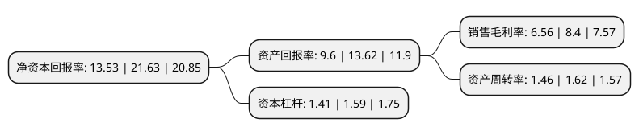

> 本页面由自动化程序生成于 2022年5月20日 01:37
> 内容可能存在错误，如有bug请提交issue至：https://github.com/Eroleice/doc-pi/issues
{.is-warning}

# 上市公司基本情况

## 基本资料

江苏同力日升机械股份有限公司（以下简称“同力日升”）成立于2003年09月30日，镇江市。于2021年03月22日在上交所主板上市。

同力日升注册资本16,800万元，主要从事电梯部件及电梯金属材料的研发，生产和销售。主要产品包括扶梯部件，直梯部件和电梯金属材料等三大类。以下是详细信息：

- 公司名称: 江苏同力日升机械股份有限公司
- 股票代码: 605286.SH
- 所在地: 江苏 - 镇江市
- 成立日期: 2003年09月30日
- 注册资本: 16,800万元
- 法定代表人: 李国平
- 主营业务: 主要从事电梯部件及电梯金属材料的研发，生产和销售主要产品包括扶梯部件，直梯部件和电梯金属材料等三大类
- 公司官网: www.jstljx.com
- 公司介绍: 公司生产电梯配套产品的绝大多数类别，是行业内产品线最为丰富的企业之一，能够满足整梯制造企业的“一站式、多样化”采购需求，公司拥有国内外先进的加工、研发和检测设备，凭借领先的制造工艺、突出的工装模具设计能力和快速响应的综合服务能力，能够深入配合客户实现电梯产品的整体开发，是上述领域产品设计、研发、生产及综合配套能力方面的领先企业，公司参与了中国电梯创新发展历程，参与了世界一线电梯品牌大量配套产品的开发，公司多次被知名电梯主机厂评为优秀供应商称号，所生产的电梯配套部件也随之在全球范围内的优质工程项目中广泛应用，服务于美国、加拿大、德国、法国、意大利、新加坡、印度等主要国家以及“一带一路”沿线重大工程项目；在国内，产品应用于北京、上海、广州、深圳、中国香港等各大城市地铁项目及多地地铁、高铁、机场建设项目等。

## 股东及高管情况

上市公司第一大股东为李国平，持股56,815,060股，占比33.82%，为上市公司实际控制人。

截至2022年03月31日，上市公司的前十大股东中，共有5名自然人股东，4名机构股东，1个产品账户，其中5%以上大股东共有2名。上市公司前十大股东明细如下：

> 截至2022年03月31日，上市公司前十大股东信息如下：

| 股东名称 | 持股数量（股） | 持股比例 |
| --- | --- | --- |
| 李国平 | 56,815,060 | 33.82% |
| 李腊琴 | 40,801,064 | 24.29% |
| 丹阳市日升企业管理有限公司 | 5,945,505 | 3.54% |
| 李静 | 5,753,424 | 3.42% |
| 李铮 | 5,753,424 | 3.42% |
| 丹阳市合力企业管理中心(有限合伙) | 4,931,523 | 2.94% |
| 宁波梅山保税港区子今投资管理合伙企业(有限合伙)-宁波梅山保税港区宜安投资合伙企业(有限合伙) | 2,800,000 | 1.67% |
| 孟林华 | 1,650,000 | 0.98% |
| 宁波梅山保税港区子今投资管理合伙企业(有限合伙)-宁波梅山保税港区曦华股权投资合伙企业(有限合伙) | 1,550,000 | 0.92% |
| 中国农业银行股份有限公司-华安智能生活混合型证券投资基金 | 1,134,997 | 0.68% |

## 利润表分析

上市公司2021年总收入为22.95亿元，净利润为1.5亿元，实现盈利。

## 杜邦分析

> 数据列示周期：2021年 | 2020年 | 2019年
{.is-info}

上市公司的净资产收益率在近一年有所下降，下降幅度为-37.45%，其变化情况分解如下：
- 上市公司的销售毛利率在近一年下降了-21.9%，可能是生产效率的下降、商品原材料价格上涨或商品价格的下跌所致。
- 上市公司的资产周转率在近一年下降了-9.88%，可能是源自于更慢的销售回款或库存管理效果下降。
- 上市公司的财务杠杆比率在近一年下降了-11.32%，可能是减少负债降低财务费用。

