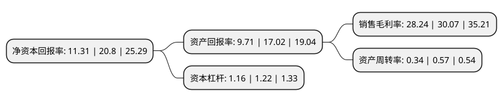

> 本页面由自动化程序生成于 2022年5月20日 01:37
> 内容可能存在错误，如有bug请提交issue至：https://github.com/Eroleice/doc-pi/issues
{.is-warning}

# 上市公司基本情况

## 基本资料

江苏必得科技股份有限公司（以下简称“必得科技”）成立于2002年09月26日，无锡市。于2021年03月01日在上交所主板上市。

必得科技注册资本10,800万元，公司成立以来专注于中高速动车组列车，城轨列车等轨道交通车辆配套产品的研发，生产与销售，主要产品包括车辆通风系统，电缆保护系统和智能控制撒砂系统等系统化，系列化产品及其他轨道交通车辆配套产品。以下是详细信息：

- 公司名称: 江苏必得科技股份有限公司
- 股票代码: 605298.SH
- 所在地: 江苏 - 无锡市
- 成立日期: 2002年09月26日
- 注册资本: 10,800万元
- 法定代表人: 王坚群
- 主营业务: 公司成立以来专注于中高速动车组列车，城轨列车等轨道交通车辆配套产品的研发，生产与销售，主要产品包括车辆通风系统，电缆保护系统和智能控制撒砂系统等系统化，系列化产品及其他轨道交通车辆配套产品
- 公司官网: www.bidekeji.com
- 公司介绍: 公司成立以来专注于中高速动车组列车、城轨列车等轨道交通车辆配套产品的研发、生产与销售，主要产品包括车辆通风系统、电缆保护系统和智能控制撒砂系统等系统化、系列化产品及其他轨道交通车辆配套产品。经过多年的创新发展，公司在产品种类、产品结构、生产工艺、新材料应用、技术服务等方面不断优化升级，自主研发了多个技术水平行业领先的系统化、系列化产品，在生产工艺方面先后通过多项权威国际认证，包括国际铁路行业质量管理体系认证(ISO/TS22163：2017)、DIN6701粘接体系认证、EN15085-2轨道车辆焊接体系认证、美国CWF焊接体系认证等。凭借优秀的产品品质、专业的技术和周到的服务，公司与中车青岛、中车长春、中车唐山、北京地铁、四方庞巴迪等国内主要整车制造厂商长期保持良好的合作关系。公司产品已被广泛应用于国内外多种型号动车组列车以及北京、上海、广州、深圳、南京、苏州、成都、沈阳、青岛、土耳其伊兹密尔、新加坡、印度孟买、印度诺伊达等城市地铁车辆。

## 股东及高管情况

上市公司第一大股东为王坚群，持股57,600,000股，占比53.33%，为上市公司实际控制人。

截至2022年03月31日，上市公司的前十大股东中，共有9名自然人股东，1名机构股东，其中5%以上大股东共有3名。上市公司前十大股东明细如下：

> 截至2022年03月31日，上市公司前十大股东信息如下：

| 股东名称 | 持股数量（股） | 持股比例 |
| --- | --- | --- |
| 王坚群 | 57,600,000 | 53.33% |
| 刘英 | 17,400,000 | 16.11% |
| 江阴联成投资企业(有限合伙) | 6,000,000 | 5.56% |
| 曾亚狮 | 331,289 | 0.31% |
| 顾青 | 330,000 | 0.31% |
| 周信钢 | 209,000 | 0.19% |
| 李尹红 | 195,198 | 0.18% |
| 丁凯 | 150,000 | 0.14% |
| 高劲松 | 150,000 | 0.14% |
| 刘易斯 | 143,000 | 0.13% |

## 利润表分析

上市公司2021年总收入为3亿元，净利润为0.84亿元，实现盈利。

## 杜邦分析

> 数据列示周期：2021年 | 2020年 | 2019年
{.is-info}

上市公司的净资产收益率在近一年有所下降，下降幅度为-45.62%，其变化情况分解如下：
- 上市公司的销售毛利率在近一年下降了-6.09%，可能是生产效率的下降、商品原材料价格上涨或商品价格的下跌所致。
- 上市公司的资产周转率在近一年下降了-40.35%，可能是源自于更慢的销售回款或库存管理效果下降。
- 上市公司的财务杠杆比率在近一年下降了-4.92%，可能是减少负债降低财务费用。

