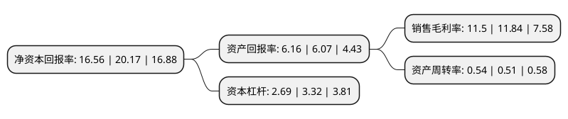

> 本页面由自动化程序生成于 2022年5月20日 01:37
> 内容可能存在错误，如有bug请提交issue至：https://github.com/Eroleice/doc-pi/issues
{.is-warning}

# 上市公司基本情况

## 基本资料

交控科技股份有限公司（以下简称“交控科技”）成立于2009年12月04日，北京市。于2019年07月22日在上交所科创板上市。

交控科技注册资本18,705.48万元，以具有自主知识产权的CBTC技术为核心，专业从事城市轨道交通信号系统的研发，关键设备的研制，系统集成以及信号系统总承包。以下是详细信息：

- 公司名称: 交控科技股份有限公司
- 股票代码: 688015.SH
- 所在地: 北京 - 北京市
- 成立日期: 2009年12月04日
- 注册资本: 18,705.48万元
- 法定代表人: 郜春海
- 主营业务: 以具有自主知识产权的CBTC技术为核心，专业从事城市轨道交通信号系统的研发，关键设备的研制，系统集成以及信号系统总承包
- 公司官网: www.bj-tct.com
- 公司介绍: 公司的主营业务是以具有自主知识产权的CBTC技术为核心，专业从事城市轨道交通信号系统的研发、关键设备的研制、系统集成以及信号系统总承包。公司的CBTC技术为城市轨道交通安全、高效、可靠、准点、舒适、低碳、人性化的发展目标奠定了基础。公司主要产品包括三种：基础CBTC系统、CBTC互联互通列车运行控制系统(I-CBTC系统)、全自动运行系统(FAO系统)。公司从产品的应用市场包括新建线路市场、既有线路改造市场和重载铁路市场。作为行业内国产厂商的龙头企业，公司也是多项行业标准制定的重要参与者，推动了全自动运行、互联互通、车车通信等行业技术的发展和进步，是国内自主化城市轨道交通信号系统技术的领跑者。

## 股东及高管情况

上市公司第一大股东为北京市基础设施投资有限公司，持股31,978,822股，占比17.1%，**疑似为**上市公司实际控制人。

截至2022年04月13日，上市公司的前十大股东中，共有3名自然人股东，3名机构股东，4个产品账户，其中5%以上大股东共有6名。上市公司前十大股东明细如下：

> 未能通过持股比例判定出上市公司实际控制人（持股30%以上）
> 可能存在通过间接持股、联合持股、协议控制等方式拥有实际控制权的主体，具体请参考上市公司定期公告！
{.is-warning}

> 截至2022年04月13日，上市公司前十大股东信息如下：

| 股东名称 | 持股数量（股） | 持股比例 |
| --- | --- | --- |
| 北京市基础设施投资有限公司 | 31,978,822 | 17.1% |
| 郜春海 | 17,918,145 | 9.5791% |
| 北京交大资产经营有限公司 | 17,544,857 | 9.38% |
| 北京交大资产经营有限公司 | 17,544,857 | 9.38% |
| 张鸥 | 13,414,778 | 7.17% |
| 张鸥 | 13,414,778 | 7.17% |
| 国投招商投资管理有限公司-先进制造产业投资基金二期(有限合伙) | 6,997,900 | 3.74% |
| 中国工商银行股份有限公司-广发多因子灵活配置混合型证券投资基金 | 5,943,205 | 3.18% |
| 北京基石创业投资基金(有限合伙) | 5,332,783 | 2.85% |
| 京津冀产业协同发展投资基金(有限合伙) | 3,498,950 | 1.87% |

## 利润表分析

上市公司2021年总收入为25.82亿元，净利润为2.96亿元，实现盈利。

## 杜邦分析

> 数据列示周期：2021年 | 2020年 | 2019年
{.is-info}

上市公司的净资产收益率在近一年有所下降，下降幅度为-17.9%，其变化情况分解如下：
- 上市公司的销售毛利率在近一年下降了-2.87%，可能是生产效率的下降、商品原材料价格上涨或商品价格的下跌所致。
- 上市公司的资产周转率在近一年上升了5.88%，可能是源自于更快的销售回款或库存管理效果提升。
- 上市公司的财务杠杆比率在近一年下降了-18.98%，可能是减少负债降低财务费用。

