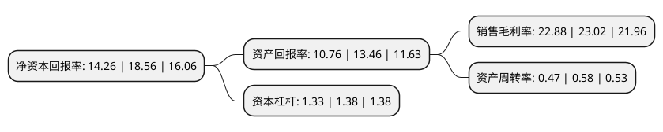

> 本页面由自动化程序生成于 2022年5月20日 01:39
> 内容可能存在错误，如有bug请提交issue至：https://github.com/Eroleice/doc-pi/issues
{.is-warning}

# 上市公司基本情况

## 基本资料

合肥工大高科信息科技股份有限公司（以下简称“工大高科”）成立于2000年12月26日，合肥市。于2021年06月28日在上交所科创板上市。

工大高科注册资本8,675.3万元，工业铁路信号控制与智能调度产品研发，生产，销售及技术服务;信息系统集成及技术服务以下是详细信息：

- 公司名称: 合肥工大高科信息科技股份有限公司
- 股票代码: 688367.SH
- 所在地: 安徽 - 合肥市
- 成立日期: 2000年12月26日
- 注册资本: 8,675.3万元
- 法定代表人: 魏臻
- 主营业务: 工业铁路信号控制与智能调度产品研发，生产，销售及技术服务;信息系统集成及技术服务
- 公司官网: www.gocom.cn
- 公司介绍: 公司是一家专业从事工业铁路信号控制与智能调度产品研发、生产、销售及技术服务的国家创新型企业。核心产品按应用场景分为地面工业铁路信号控制与智能调度、矿井井下窄轨信号控制与智能调度两大系列，主要应用于矿山、冶金、石化、港口、电力以及其他专用线与专用铁路领域。同时，为提升公司两大核心产品智能化应用中所需的系统架构及网络安全的设计与实施能力，公司还从事信息系统集成及技术服务业务。公司获得了国家专利和软件着作权逾百项、国家矿用产品安全标志证书多项，为提升我国煤炭、非煤矿山、冶金、石化、港口等国民经济支柱行业的安全生产能力发挥重要作用。

## 股东及高管情况

上市公司第一大股东为魏臻，持股13,294,710股，占比15.32%，**疑似为**上市公司实际控制人。

截至2022年03月31日，上市公司的前十大股东中，共有5名自然人股东，4名机构股东，1个产品账户，其中5%以上大股东共有4名。上市公司前十大股东明细如下：

> 未能通过持股比例判定出上市公司实际控制人（持股30%以上）
> 可能存在通过间接持股、联合持股、协议控制等方式拥有实际控制权的主体，具体请参考上市公司定期公告！
{.is-warning}

> 截至2022年03月31日，上市公司前十大股东信息如下：

| 股东名称 | 持股数量（股） | 持股比例 |
| --- | --- | --- |
| 魏臻 | 13,294,710 | 15.32% |
| 合肥华臻投资管理有限公司 | 8,294,000 | 9.56% |
| 合肥工业大学资产经营有限公司 | 5,720,000 | 6.59% |
| 张利 | 5,563,430 | 6.41% |
| 合肥惟同投资中心(有限合伙) | 3,600,000 | 4.15% |
| 诸葛战斌 | 3,082,650 | 3.55% |
| 东方证券股份有限公司-中庚价值先锋股票型证券投资基金 | 3,025,937 | 3.49% |
| 陆阳 | 2,791,330 | 3.22% |
| 国元股权投资有限公司 | 2,574,000 | 2.97% |
| 程运安 | 2,531,510 | 2.92% |

## 利润表分析

上市公司2021年总收入为2.5亿元，净利润为0.57亿元，实现盈利。

## 杜邦分析

> 数据列示周期：2021年 | 2020年 | 2019年
{.is-info}

上市公司的净资产收益率在近一年有所下降，下降幅度为-23.17%，其变化情况分解如下：
- 上市公司的销售毛利率在近一年下降了-0.61%，可能是生产效率的下降、商品原材料价格上涨或商品价格的下跌所致。
- 上市公司的资产周转率在近一年下降了-18.97%，可能是源自于更慢的销售回款或库存管理效果下降。
- 上市公司的财务杠杆比率在近一年下降了-3.62%，可能是减少负债降低财务费用。

