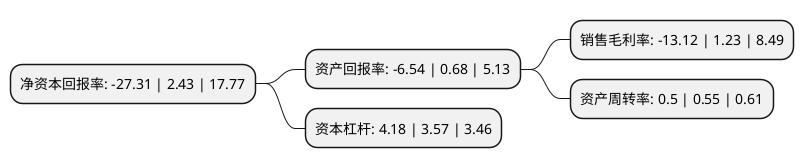

> 本页面由自动化程序生成于 2022年5月20日 01:01
> 内容可能存在错误，如有bug请提交issue至：https://github.com/Eroleice/doc-pi/issues
{.is-warning}

# 上市公司基本情况

## 基本资料

深圳市特发信息股份有限公司（以下简称“特发信息”）成立于1999年07月29日，深圳市。于2000年05月11日在深交所主板上市。

特发信息注册资本84,457.909万元，主要产品:光缆，光传输设备，铝电解电容器，有线电视产品。以下是详细信息：

- 公司名称: 深圳市特发信息股份有限公司
- 股票代码: 000070.SZ
- 所在地: 广东 - 深圳市
- 成立日期: 1999年07月29日
- 注册资本: 84,457.909万元
- 法定代表人: 高天亮
- 主营业务: 主要产品:光缆，光传输设备，铝电解电容器，有线电视产品
- 公司官网: www.sdgi.com.cn
- 公司介绍: 公司是国内最早开拓并一直专注于光纤、光缆及光通讯设备开发、生产的国家级高科技企业之一，主要经营光纤光缆、电子元器件、光通讯设备，公司产品广泛应用于电信、移动、联通、广电、电力、石油、矿山、城域网、交通、航空、军工、智能建筑以及消费类和工业电子等领域。公司作为光纤光缆通信行业国家标准及行业标准的制订者之一，产品先后荣获国家级、省部级、地市级的科技进步奖、重点新产品、科技创新奖、科技成果奖、优秀产品奖等荣誉，还率先创造了多项全国第一：国内最早研发出ADSS光缆并保持最大使用跨距纪录；国内第一条OPPC光缆；国内最大芯数光缆-1000芯骨架式光缆；国内第一条实用的OPPC光缆线路，国内第一条12芯带骨架式光缆；国内最早的新型概念SST系列产品等。

## 股东及高管情况

上市公司第一大股东为深圳市特发集团有限公司，持股313,086,853股，占比37.07%，为上市公司实际控制人。

截至2022年05月09日，上市公司的前十大股东中，共有6名自然人股东，3名机构股东，1个海外主体，其中5%以上大股东共有1名。上市公司前十大股东明细如下：

> 截至2022年05月09日，上市公司前十大股东信息如下：

| 股东名称 | 持股数量（股） | 持股比例 |
| --- | --- | --- |
| 深圳市特发集团有限公司 | 313,086,853 | 37.07% |
| 五矿企荣有限公司 | 20,112,000 | 2.38% |
| 陈传荣 | 12,574,908 | 1.49% |
| 汉国三和有限公司 | 9,903,504 | 1.17% |
| 骆勇强 | 4,749,588 | 0.56% |
| 香港中央结算有限公司(陆股通) | 4,712,937 | 0.56% |
| 戴荣 | 4,641,980 | 0.55% |
| 詹冰洁 | 2,754,000 | 0.33% |
| 关海果 | 2,674,400 | 0.32% |
| 阴陶 | 2,636,636 | 0.31% |

## 利润表分析

上市公司2021年总收入为45.9亿元，净利润为-6.03亿元，**未实现盈利**。

## 杜邦分析

> 数据列示周期：2021年 | 2020年 | 2019年
{.is-info}

上市公司的净资产收益率在近一年有所下降，下降幅度为-1223.87%，其变化情况分解如下：
- 上市公司的销售毛利率在近一年下降了-1166.67%，可能是生产效率的下降、商品原材料价格上涨或商品价格的下跌所致。
- 上市公司的资产周转率在近一年下降了-9.09%，可能是源自于更慢的销售回款或库存管理效果下降。
- 上市公司的财务杠杆比率在近一年上升了17.09%，可能是增加负债扩大生产规模。

