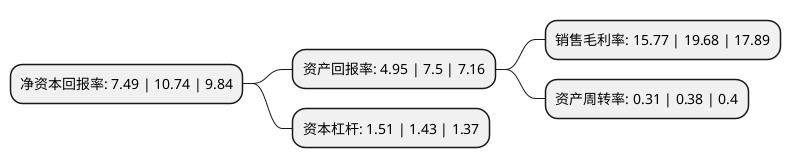

> 本页面由自动化程序生成于 2022年5月20日 01:02
> 内容可能存在错误，如有bug请提交issue至：https://github.com/Eroleice/doc-pi/issues
{.is-warning}

# 上市公司基本情况

## 基本资料

航天工业发展股份有限公司（以下简称“航天发展”）成立于1993年11月20日，福州市。于1993年11月30日在深交所主板上市。

航天发展注册资本160,368.511万元，主要业务:通信行业，发电机组，机电新材料，技术服务业。以下是详细信息：

- 公司名称: 航天工业发展股份有限公司
- 股票代码: 000547.SZ
- 所在地: 福建 - 福州市
- 成立日期: 1993年11月20日
- 注册资本: 160,368.511万元
- 法定代表人: 张兆勇
- 主营业务: 通信行业，发电机组，机电新材料，技术服务业
- 公司官网: www.casic-addsino.com
- 公司介绍: 公司是中国航天科工集团公司通过反向收购而新组建的第7家上市公司，致力于军用产业、军民融合产业领域的高新技术公司，以信息技术作为主业和基业。公司目前拥有航天科工集团公司通信网络技术中心、电磁防护技术研发中心、精密电子研发中心、环境试验中心、射频仿真及电子模拟系统工程技术研究中心等具有实力的技术研究中心。公司坚守“科技强军，航天报国”的神圣使命，把打赢信息化条件下局部战争作为目标，深入构建在复杂电磁环境下，集战术战法研究、体系攻防对抗演练、武器装备性能验证等诸多功能于一体的电子蓝军体系，打造中国电子蓝军主要设备供应商。

## 股东及高管情况

上市公司第一大股东为中国航天科工集团有限公司，持股151,453,634股，占比9.44%，**疑似为**上市公司实际控制人。

截至2022年03月31日，上市公司的前十大股东中，共有1名自然人股东，5名机构股东，2个产品账户，1个海外主体，1名其他股东，其中5%以上大股东共有2名。上市公司前十大股东明细如下：

> 未能通过持股比例判定出上市公司实际控制人（持股30%以上）
> 可能存在通过间接持股、联合持股、协议控制等方式拥有实际控制权的主体，具体请参考上市公司定期公告！
{.is-warning}

> 上市公司第一大股东持股不超过10%，请检查是否存在公司控制权风险！
{.is-danger}

> 截至2022年03月31日，上市公司前十大股东信息如下：

| 股东名称 | 持股数量（股） | 持股比例 |
| --- | --- | --- |
| 中国航天科工集团有限公司 | 151,453,634 | 9.44% |
| 中国航天科工防御技术研究院(中国长峰机电技术研究设计院) | 116,146,578 | 7.24% |
| 航天科工资产管理有限公司 | 58,184,405 | 3.63% |
| 南京江北新区产业投资集团有限公司 | 53,095,578 | 3.31% |
| 南京康海航空航天产业投资合伙企业(有限合伙) | 28,373,155 | 1.77% |
| 香港中央结算有限公司(陆股通) | 26,085,359 | 1.63% |
| 大家人寿保险股份有限公司-万能产品 | 21,681,540 | 1.35% |
| 中国建设银行股份有限公司-国泰中证军工交易型开放式指数证券投资基金 | 14,201,329 | 0.89% |
| 周蓉 | 12,359,300 | 0.77% |
| 华夏人寿保险股份有限公司-自有资金 | 11,939,892 | 0.74% |

## 利润表分析

上市公司2021年总收入为41.43亿元，净利润为6.53亿元，实现盈利。

## 杜邦分析

> 数据列示周期：2021年 | 2020年 | 2019年
{.is-info}

上市公司的净资产收益率在近一年有所下降，下降幅度为-30.26%，其变化情况分解如下：
- 上市公司的销售毛利率在近一年下降了-19.87%，可能是生产效率的下降、商品原材料价格上涨或商品价格的下跌所致。
- 上市公司的资产周转率在近一年下降了-18.42%，可能是源自于更慢的销售回款或库存管理效果下降。
- 上市公司的财务杠杆比率在近一年上升了5.59%，可能是增加负债扩大生产规模。

