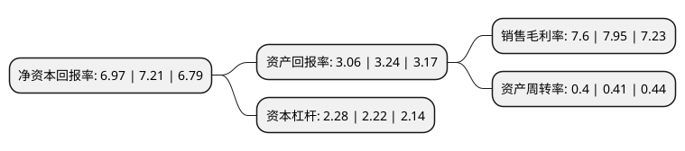

> 本页面由自动化程序生成于 2022年5月20日 01:02
> 内容可能存在错误，如有bug请提交issue至：https://github.com/Eroleice/doc-pi/issues
{.is-warning}

# 上市公司基本情况

## 基本资料

陕西烽火电子股份有限公司（以下简称“烽火电子”）成立于1992年08月15日，宝鸡市。于1994年05月09日在深交所主板上市。

烽火电子注册资本60,469.232万元，主要产品:通信设备，电声器材，电线电缆和高端纺织机械;主营业务为电子产品，无线通讯设备，电声器材，电子元器件，声像，电教产品，机电产品，电线电缆的研制，生产，销售，安装，维修，技术服务等。以下是详细信息：

- 公司名称: 陕西烽火电子股份有限公司
- 股票代码: 000561.SZ
- 所在地: 陕西 - 宝鸡市
- 成立日期: 1992年08月15日
- 注册资本: 60,469.232万元
- 法定代表人: 宋涛
- 主营业务: 主要产品:通信设备，电声器材，电线电缆和高端纺织机械;主营业务为电子产品，无线通讯设备，电声器材，电子元器件，声像，电教产品，机电产品，电线电缆的研制，生产，销售，安装，维修，技术服务等
- 公司官网: www.fenghuo.cn
- 公司介绍: 公司始建于1956年，是我国军事通信装备和电声产品研制生产的核心骨干企业。主要产品包括无线通信设备、航空搜救定位设备、机(车)内通信系统、网络通信系统、物联通信系统、电声组合件及有源降噪系统、通信导航天线、半导体照明和光伏切片等，形成了“以高新通信为核心的通信业务为主体、以光伏和半导体照明业务为辅助、以机电等其他业务为补充”的业务发展格局。公司坚持“我们的绩效是由顾客来评价和决定的，为顾客创造价值是我们第一位的工作”、“产品和服务源于顾客需求，终于顾客满意”，全心全意为顾客解决挑战性问题。追求与顾客及相关方建立长期伙伴关系，共创共享共同发展。产品市场覆盖陆、海、空等军兵种，广泛应用于国民经济各领域并远销东南亚、非洲及拉美等国际市场。

## 股东及高管情况

上市公司第一大股东为陕西烽火通信集团有限公司，持股250,059,547股，占比41.35%，为上市公司实际控制人。

截至2022年03月31日，上市公司的前十大股东中，共有7名自然人股东，2名机构股东，1个产品账户，其中5%以上大股东共有2名。上市公司前十大股东明细如下：

> 截至2022年03月31日，上市公司前十大股东信息如下：

| 股东名称 | 持股数量（股） | 持股比例 |
| --- | --- | --- |
| 陕西烽火通信集团有限公司 | 250,059,547 | 41.35% |
| 陕西电子信息集团有限公司 | 77,037,508 | 12.74% |
| 何海潮 | 10,382,314 | 1.72% |
| 中国建设银行股份有限公司-国泰中证军工交易型开放式指数证券投资基金 | 3,923,700 | 0.65% |
| 何静 | 3,287,180 | 0.54% |
| 蒋孝义 | 1,889,000 | 0.31% |
| 林金蓉 | 1,651,200 | 0.27% |
| 蒋子明 | 1,636,400 | 0.27% |
| 林雅莉 | 1,624,300 | 0.27% |
| 郑兰桂 | 1,614,700 | 0.27% |

## 利润表分析

上市公司2021年总收入为15.02亿元，净利润为1.14亿元，实现盈利。

## 杜邦分析

> 数据列示周期：2021年 | 2020年 | 2019年
{.is-info}

上市公司的净资产收益率在近一年有所下降，下降幅度为-3.33%，其变化情况分解如下：
- 上市公司的销售毛利率在近一年下降了-4.4%，可能是生产效率的下降、商品原材料价格上涨或商品价格的下跌所致。
- 上市公司的资产周转率在近一年下降了-2.44%，可能是源自于更慢的销售回款或库存管理效果下降。
- 上市公司的财务杠杆比率在近一年上升了2.7%，可能是增加负债扩大生产规模。

