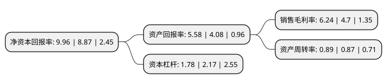

> 本页面由自动化程序生成于 2022年5月20日 01:02
> 内容可能存在错误，如有bug请提交issue至：https://github.com/Eroleice/doc-pi/issues
{.is-warning}

# 上市公司基本情况

## 基本资料

四川汇源光通信股份有限公司（以下简称“汇源通信”）成立于1994年03月04日，成都市。于1995年12月20日在深交所主板上市。

汇源通信注册资本19,344万元，主要业务:进出口，光缆及相关产品，通讯设备。以下是详细信息：

- 公司名称: 四川汇源光通信股份有限公司
- 股票代码: 000586.SZ
- 所在地: 四川 - 成都市
- 成立日期: 1994年03月04日
- 注册资本: 19,344万元
- 法定代表人: 何波
- 主营业务: 进出口，光缆及相关产品，通讯设备
- 公司官网: www.schy.com.cn
- 公司介绍: 公司是一家集光纤光缆、光通信设备及配套产品研发、制造、销售和通信及信息系统软件开发、工程设计、系统集成及相关服务等为一体的高科技上市公司，独家拥有处于国内先进水平的中心束管式异型铠装光缆和带状光缆等国家级专利。公司产品已获得了电信、广电、移动和联通等多家营运商的信任，主要产品早已批量销往国外市场。公司在通信工程及系统集成业务上有着本地化的快速客户响应及较强的信息系统软件开发、工程设计等能力，以及成熟稳定的研发和技术团队。公司已实现光通信一体化战略，而低水峰光线的开发成功大大提升了公司的技术水平，其核心竞争力得到了很好的体现。受三网融合，智能电网建设等因素的影响，电力光缆、光器件及通信工程建设服务业务的需求大幅增加，为公司创造了良好的外部市场环境。

## 股东及高管情况

上市公司第一大股东为广州蕙富骐骥投资合伙企业(有限合伙)，持股40,000,000股，占比20.68%，**疑似为**上市公司实际控制人。

截至2022年03月31日，上市公司的前十大股东中，共有6名自然人股东，4名机构股东，其中5%以上大股东共有2名。上市公司前十大股东明细如下：

> 未能通过持股比例判定出上市公司实际控制人（持股30%以上）
> 可能存在通过间接持股、联合持股、协议控制等方式拥有实际控制权的主体，具体请参考上市公司定期公告！
{.is-warning}

> 截至2022年03月31日，上市公司前十大股东信息如下：

| 股东名称 | 持股数量（股） | 持股比例 |
| --- | --- | --- |
| 广州蕙富骐骥投资合伙企业(有限合伙) | 40,000,000 | 20.68% |
| 北京鼎耘科技发展有限公司 | 27,273,330 | 14.1% |
| 泉州市晟辉投资有限公司 | 9,672,301 | 5% |
| 长飞光纤光缆股份有限公司 | 5,392,325 | 2.79% |
| 周宇光 | 2,974,200 | 1.54% |
| 雷立 | 1,333,301 | 0.69% |
| 黄来荣 | 805,800 | 0.42% |
| 窦才定 | 727,200 | 0.38% |
| 钱佳平 | 721,800 | 0.37% |
| 冯慧 | 686,100 | 0.35% |

## 利润表分析

上市公司2021年总收入为4.49亿元，净利润为0.28亿元，实现盈利。

## 杜邦分析

> 数据列示周期：2021年 | 2020年 | 2019年
{.is-info}

上市公司的净资产收益率在近一年有所上升，上升幅度为12.29%，其变化情况分解如下：
- 上市公司的销售毛利率在近一年上升了32.77%，可能是生产效率的提升、商品原材料价格下跌或商品价格的上涨所致。
- 上市公司的资产周转率在近一年上升了2.3%，可能是源自于更快的销售回款或库存管理效果提升。
- 上市公司的财务杠杆比率在近一年下降了-17.97%，可能是减少负债降低财务费用。

