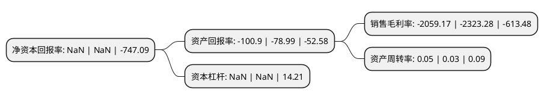

> 本页面由自动化程序生成于 2022年5月20日 01:03
> 内容可能存在错误，如有bug请提交issue至：https://github.com/Eroleice/doc-pi/issues
{.is-warning}

# 上市公司基本情况

## 基本资料

华讯方舟股份有限公司（以下简称“*ST华讯”）成立于1997年02月01日，深圳市。于1997年02月21日在深交所主板上市。

*ST华讯注册资本76,619.936万元，主要业务:粘胶长丝的生产及销售。主要产品:粘胶长丝。以下是详细信息：

- 公司名称: 华讯方舟股份有限公司
- 股票代码: 000687.SZ
- 所在地: 广东 - 深圳市
- 成立日期: 1997年02月01日
- 注册资本: 76,619.936万元
- 法定代表人: 沈志华
- 主营业务: 粘胶长丝的生产及销售主要产品:粘胶长丝
- 公司官网: www.huaxunchina.com.cn
- 公司介绍: 公司是一家致力于推进国防与军队信息化建设的综合防务服务商。公司目前搭建了深圳总部管理平台，组建了深圳技术中心、北京中央研究院等技术研发中心，打造了南京、成都、北京等产业基地，构建了以武汉、中国香港等多个办事处为市场分支的经营格局。在强大的电子技术、通信技术优势的支撑下，公司通过不断的探索、整合，逐步形成了以旗下南京华讯、成都国蓉、北京华鑫等子公司为主体的核心业务体系。公司主导以技术创新引领市场趋势，依托于全球领先的人才体系和技术体系，已积累了新型超宽带相控阵天线、全彩、通透型头载显示设备、电磁信息、特种飞行器、数字伺服控制、精密与超精密光电集成、光电及无人系统集成与产品总装总调等一系列企业核心技术能力。在特种电源、航空稳瞄、制导与控制、飞机自动操控装置、无线智能天线技术、定向天线自组网技术、恒模调制和单载波频域均衡技术等产品领域，形成(配套)科研和批产优势。

## 股东及高管情况

上市公司第一大股东为华讯方舟科技有限公司，持股225,695,802股，占比29.46%，**疑似为**上市公司实际控制人。

截至2022年03月31日，上市公司的前十大股东中，共有8名自然人股东，2名机构股东，其中5%以上大股东共有2名。上市公司前十大股东明细如下：

> 未能通过持股比例判定出上市公司实际控制人（持股30%以上）
> 可能存在通过间接持股、联合持股、协议控制等方式拥有实际控制权的主体，具体请参考上市公司定期公告！
{.is-warning}

> 截至2022年03月31日，上市公司前十大股东信息如下：

| 股东名称 | 持股数量（股） | 持股比例 |
| --- | --- | --- |
| 华讯方舟科技有限公司 | 225,695,802 | 29.46% |
| 中国恒天集团有限公司 | 86,748,100 | 11.32% |
| 易志高 | 6,579,300 | 0.86% |
| 吴光胜 | 5,335,028 | 0.7% |
| 王广林 | 3,355,000 | 0.44% |
| 左林 | 2,991,900 | 0.39% |
| 王申宁 | 2,113,700 | 0.28% |
| 赵术开 | 2,000,000 | 0.26% |
| 易文馨 | 1,950,000 | 0.25% |
| 刘付业兴 | 1,868,500 | 0.24% |

## 利润表分析

上市公司2021年总收入为0.35亿元，净利润为-7.22亿元，**未实现盈利**。

## 杜邦分析

> 数据列示周期：2021年 | 2020年 | 2019年
{.is-info}

上市公司的净资产收益率在近一年有所下降，下降幅度为NaN%，其变化情况分解如下：
- 上市公司的销售毛利率在近一年下降了-11.37%，可能是生产效率的下降、商品原材料价格上涨或商品价格的下跌所致。
- 上市公司的资产周转率在近一年上升了66.67%，可能是源自于更快的销售回款或库存管理效果提升。
- 上市公司的财务杠杆比率在近一年下降了NaN%，可能是减少负债降低财务费用。

