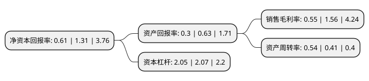

> 本页面由自动化程序生成于 2022年5月20日 01:04
> 内容可能存在错误，如有bug请提交issue至：https://github.com/Eroleice/doc-pi/issues
{.is-warning}

# 上市公司基本情况

## 基本资料

天津富通信息科技股份有限公司（以下简称“富通信息”）成立于1997年09月16日，天津市。于1997年09月29日在深交所主板上市。

富通信息注册资本120,845.522万元，主营业务:光通信业务以下是详细信息：

- 公司名称: 天津富通信息科技股份有限公司
- 股票代码: 000836.SZ
- 所在地: 天津 - 天津市
- 成立日期: 1997年09月16日
- 注册资本: 120,845.522万元
- 法定代表人: 徐东
- 主营业务: 主营业务:光通信业务
- 公司官网: www.000836.net
- 公司介绍: 公司专注光通信业务，投资、研发、制造、销售光棒、光纤、光缆等光通信产品，初步形成了“棒、纤、缆”全产业链格局,努力做大、做强、做精主营业务，不断提升品牌价值，致力于成为光通信产品制造和服务的领先企业。公司具有年产2,500万芯公里的光纤、年产600万芯公里光缆、年产220吨大套管的生产能力，为黄河以北重要的光纤制造商、全国重要光纤光缆制造商之一和我国天然石英光纤预制棒衬套管的唯一供应商。公司第一大股东富通科技控股股东富通集团是国内外知名的、深耕光通信产业三十多年的大型集团化企业，是国内外光纤光缆最大供应商之一，拥有完整的光通信产业链，积淀了雄厚的人才、技术、市场和品牌优势。在富通科技入主公司后，公司光通信业务势必将跨入新的发展阶段。

## 股东及高管情况

上市公司第一大股东为浙江富通科技集团有限公司，持股144,037,223股，占比11.92%，**疑似为**上市公司实际控制人。

截至2022年03月31日，上市公司的前十大股东中，共有7名自然人股东，3名机构股东，其中5%以上大股东共有2名。上市公司前十大股东明细如下：

> 未能通过持股比例判定出上市公司实际控制人（持股30%以上）
> 可能存在通过间接持股、联合持股、协议控制等方式拥有实际控制权的主体，具体请参考上市公司定期公告！
{.is-warning}

> 截至2022年03月31日，上市公司前十大股东信息如下：

| 股东名称 | 持股数量（股） | 持股比例 |
| --- | --- | --- |
| 浙江富通科技集团有限公司 | 144,037,223 | 11.92% |
| 天津鑫茂科技投资集团有限公司 | 87,222,616 | 7.22% |
| 李婷亚 | 6,828,700 | 0.57% |
| 张秀 | 5,576,700 | 0.46% |
| 徐智刚 | 5,488,000 | 0.45% |
| 杭州富通国泰投资有限公司 | 5,107,700 | 0.42% |
| 王晓茜 | 4,660,322 | 0.39% |
| 陈坤 | 4,589,200 | 0.38% |
| 吕帅 | 4,180,000 | 0.35% |
| 毛华锋 | 4,050,000 | 0.34% |

## 利润表分析

上市公司2021年总收入为14.29亿元，净利润为0.07亿元，实现盈利。

## 杜邦分析

> 数据列示周期：2021年 | 2020年 | 2019年
{.is-info}

上市公司的净资产收益率在近一年有所下降，下降幅度为-53.44%，其变化情况分解如下：
- 上市公司的销售毛利率在近一年下降了-64.74%，可能是生产效率的下降、商品原材料价格上涨或商品价格的下跌所致。
- 上市公司的资产周转率在近一年上升了31.71%，可能是源自于更快的销售回款或库存管理效果提升。
- 上市公司的财务杠杆比率在近一年下降了-0.97%，可能是减少负债降低财务费用。

