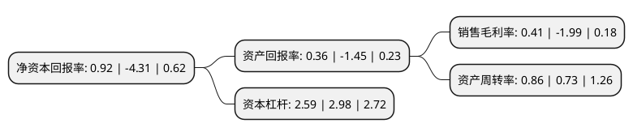

> 本页面由自动化程序生成于 2022年5月20日 01:04
> 内容可能存在错误，如有bug请提交issue至：https://github.com/Eroleice/doc-pi/issues
{.is-warning}

# 上市公司基本情况

## 基本资料

大唐高鸿网络股份有限公司（以下简称“高鸿股份”）成立于1994年01月20日，安顺市。于1998年06月09日在深交所主板上市。

高鸿股份注册资本114,003.222万元，主要产品:宽带产品，多媒体类产品。以下是详细信息：

- 公司名称: 大唐高鸿网络股份有限公司
- 股票代码: 000851.SZ
- 所在地: 贵州 - 安顺市
- 成立日期: 1994年01月20日
- 注册资本: 114,003.222万元
- 法定代表人: 付景林
- 主营业务: 主要产品:宽带产品，多媒体类产品
- 公司官网: www.gohigh.com.cn
- 公司介绍: 公司是由大唐电信科技产业集团整合了集团内多年积累的数据产业技术、产品和资源组建的高新技术企业，是大唐集团旗下两家上市公司之一。公司主要从事数据通信领域产品、业务和整体解决方案的提供、行业信息化客户信息系统解决方案的提供。产品广泛应用于通信公网、政府、公安、银行、企业和民用等领域，其销售和服务网络覆盖全国30个省市，并建立了全国性的渠道销售体系。高新技术企业，中国安全防范产品行业协会会员，全国重质量守信用企业，通过ISO9001国际质量管理体系认证，拥有及国家秘密的计算机信息系统集成甲级、一级计算机信息系统集成、甲级建筑智能化系统工程设计、一级安防工程企业资质证书等资质。

## 股东及高管情况

上市公司第一大股东为电信科学技术研究院有限公司，持股148,862,012股，占比13.06%，**疑似为**上市公司实际控制人。

截至2022年03月31日，上市公司的前十大股东中，共有5名自然人股东，2名机构股东，2个产品账户，1个海外主体，其中5%以上大股东共有1名。上市公司前十大股东明细如下：

> 未能通过持股比例判定出上市公司实际控制人（持股30%以上）
> 可能存在通过间接持股、联合持股、协议控制等方式拥有实际控制权的主体，具体请参考上市公司定期公告！
{.is-warning}

> 截至2022年03月31日，上市公司前十大股东信息如下：

| 股东名称 | 持股数量（股） | 持股比例 |
| --- | --- | --- |
| 电信科学技术研究院有限公司 | 148,862,012 | 13.06% |
| 曾东卫 | 11,981,540 | 1.05% |
| 姚梦丽 | 6,962,300 | 0.61% |
| 上海阿杏投资管理有限公司-阿杏松子10号私募证券投资基金 | 6,581,500 | 0.58% |
| 杜德全 | 5,479,400 | 0.48% |
| 许培兰 | 4,842,240 | 0.42% |
| 香港中央结算有限公司(陆股通) | 4,262,892 | 0.37% |
| 姚寅之 | 4,170,000 | 0.37% |
| 上海阿杏投资管理有限公司-阿杏格致8号私募证券投资基金 | 4,098,300 | 0.36% |
| 大唐高新创业投资有限公司 | 4,052,800 | 0.36% |

## 利润表分析

上市公司2021年总收入为85.48亿元，净利润为0.35亿元，实现盈利。

## 杜邦分析

> 数据列示周期：2021年 | 2020年 | 2019年
{.is-info}

上市公司的净资产收益率在近一年有所下降，下降幅度为-121.35%，其变化情况分解如下：
- 上市公司的销售毛利率在近一年下降了-120.6%，可能是生产效率的下降、商品原材料价格上涨或商品价格的下跌所致。
- 上市公司的资产周转率在近一年上升了17.81%，可能是源自于更快的销售回款或库存管理效果提升。
- 上市公司的财务杠杆比率在近一年下降了-13.09%，可能是减少负债降低财务费用。

