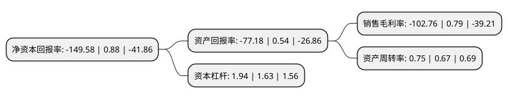

> 本页面由自动化程序生成于 2022年5月20日 01:04
> 内容可能存在错误，如有bug请提交issue至：https://github.com/Eroleice/doc-pi/issues
{.is-warning}

# 上市公司基本情况

## 基本资料

中嘉博创信息技术股份有限公司（以下简称“ST中嘉”）成立于1997年05月16日，秦皇岛市。于1997年12月18日在深交所主板上市。

ST中嘉注册资本93,629.112万元，主要业务:各类商品批发市场和商业广场开发，经营场地出售;零售和批发市场，商业广场租赁。以下是详细信息：

- 公司名称: 中嘉博创信息技术股份有限公司
- 股票代码: 000889.SZ
- 所在地: 河北 - 秦皇岛市
- 成立日期: 1997年05月16日
- 注册资本: 93,629.112万元
- 法定代表人: 吴鹰
- 主营业务: 各类商品批发市场和商业广场开发，经营场地出售;零售和批发市场，商业广场租赁
- 公司官网: www.zjbctech.com
- 公司介绍: 公司是控股型企业，主要业务为信息智能传输、通信网络维护，辅助业务包括移动互联网软件开发及应用服务、金融服务外包，主要业务由两家全资子公司创世漫道、长实通信和一家控股子公司嘉华信息经营，创世漫道主营信息智能传输，其他业务涉及移动互联网软件开发及应用服务和流量经营业务；长实通信主营通信网络维护；嘉华信息主营信息智能传输(移动信息传输)，其他业务涉及金融服务外包、软件工程和流量经营业务。作为移动信息智能传输服务综合信息服务平台运营商，移动信息智能传输服务的竞争优势包括经验丰富且高效稳定的人才结构、自主核心处理平台的技术优势、分布广泛且质量较高的客户结构、进入良性循环的业务规模、长期市场化经营建立的品牌影响力、全面完善的客户增值服务。

## 股东及高管情况

上市公司第一大股东为孝昌鹰溪谷投资中心(有限合伙)，持股207,705,182股，占比22.18%，**疑似为**上市公司实际控制人。

截至2022年03月31日，上市公司的前十大股东中，共有4名自然人股东，4名机构股东，1个产品账户，1个海外主体，其中5%以上大股东共有2名。上市公司前十大股东明细如下：

> 未能通过持股比例判定出上市公司实际控制人（持股30%以上）
> 可能存在通过间接持股、联合持股、协议控制等方式拥有实际控制权的主体，具体请参考上市公司定期公告！
{.is-warning}

> 截至2022年03月31日，上市公司前十大股东信息如下：

| 股东名称 | 持股数量（股） | 持股比例 |
| --- | --- | --- |
| 孝昌鹰溪谷投资中心(有限合伙) | 207,705,182 | 22.18% |
| 刘英魁 | 84,061,447 | 8.98% |
| 中兆投资管理有限公司 | 39,214,546 | 4.19% |
| 上海泽恒基金管理有限公司-泽恒鲲鹏二号私募证券投资基金 | 29,852,194 | 3.19% |
| 秦皇岛市国有资产经营控股有限公司 | 16,439,277 | 1.76% |
| 深圳市华美达一号投资中心(有限合伙) | 16,000,000 | 1.71% |
| 黄海权 | 4,342,535 | 0.46% |
| 龚维松 | 4,172,800 | 0.45% |
| 王霞 | 3,215,840 | 0.34% |
| UBS AG | 2,832,522 | 0.3% |

## 利润表分析

上市公司2021年总收入为19.51亿元，净利润为-20.05亿元，**未实现盈利**。

## 杜邦分析

> 数据列示周期：2021年 | 2020年 | 2019年
{.is-info}

上市公司的净资产收益率在近一年有所下降，下降幅度为-17097.73%，其变化情况分解如下：
- 上市公司的销售毛利率在近一年下降了-13107.59%，可能是生产效率的下降、商品原材料价格上涨或商品价格的下跌所致。
- 上市公司的资产周转率在近一年上升了11.94%，可能是源自于更快的销售回款或库存管理效果提升。
- 上市公司的财务杠杆比率在近一年上升了19.02%，可能是增加负债扩大生产规模。

