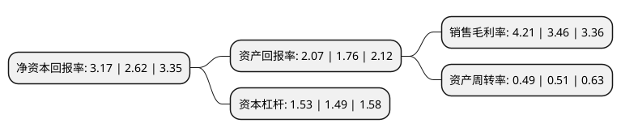

> 本页面由自动化程序生成于 2022年5月20日 01:05
> 内容可能存在错误，如有bug请提交issue至：https://github.com/Eroleice/doc-pi/issues
{.is-warning}

# 上市公司基本情况

## 基本资料

东信和平科技股份有限公司（以下简称“东信和平”）成立于1998年10月20日，珠海市。于2004年07月13日在深交所中小板上市。

东信和平注册资本44,648.608万元，主要产品:芯片卡，充值卡以下是详细信息：

- 公司名称: 东信和平科技股份有限公司
- 股票代码: 002017.SZ
- 所在地: 广东 - 珠海市
- 成立日期: 1998年10月20日
- 注册资本: 44,648.608万元
- 法定代表人: 万谦
- 主营业务: 主要产品:芯片卡，充值卡
- 公司官网: www.eastcompeace.com
- 公司介绍: 公司是全球知名的智能卡产品及相关系统集成与整体解决方案的提供商和服务商。自成立以来，公司始终坚持发展以智能卡为基础的信息安全产业，基于客户需求持续创新，在“通信、金融、移动支付、政府公共事业、物联网”等领域和“卡类、卡服务类、测试类、终端类、应用系统解决方案”上都取得了长足的发展，为全球多个国家和地区提供了安全、优质的产品与服务。公司是国家企业技术中心，国家规划布局内重点软件企业，省级智能卡工程技术研究开发中心，是“广东省企业技术中心”的依托单位，设有博士后工作站。

## 股东及高管情况

上市公司第一大股东为中电科东方通信集团有限公司，持股131,172,253股，占比29.38%，**疑似为**上市公司实际控制人。

截至2022年03月31日，上市公司的前十大股东中，共有3名自然人股东，3名机构股东，3个产品账户，1个海外主体，其中5%以上大股东共有3名。上市公司前十大股东明细如下：

> 未能通过持股比例判定出上市公司实际控制人（持股30%以上）
> 可能存在通过间接持股、联合持股、协议控制等方式拥有实际控制权的主体，具体请参考上市公司定期公告！
{.is-warning}

> 截至2022年03月31日，上市公司前十大股东信息如下：

| 股东名称 | 持股数量（股） | 持股比例 |
| --- | --- | --- |
| 中电科东方通信集团有限公司 | 131,172,253 | 29.38% |
| 普天东方通信集团有限公司 | 131,172,253 | 29.38% |
| 珠海普天和平电信工业有限公司 | 66,228,631 | 14.83% |
| 招商证券股份有限公司-建信中小盘先锋股票型证券投资基金 | 2,892,576 | 0.65% |
| BARCLAYS BANK PLC | 2,856,089 | 0.64% |
| 中国工商银行-建信优化配置混合型证券投资基金 | 1,895,600 | 0.42% |
| 中国银行股份有限公司-华安精致生活混合型证券投资基金 | 1,550,500 | 0.35% |
| 蒋爱东 | 1,260,000 | 0.28% |
| 吴虢骁 | 1,143,560 | 0.26% |
| 蒋日荣 | 1,030,000 | 0.23% |

## 利润表分析

上市公司2021年总收入为10.72亿元，净利润为0.45亿元，实现盈利。

## 杜邦分析

> 数据列示周期：2021年 | 2020年 | 2019年
{.is-info}

上市公司的净资产收益率在近一年有所上升，上升幅度为20.99%，其变化情况分解如下：
- 上市公司的销售毛利率在近一年上升了21.68%，可能是生产效率的提升、商品原材料价格下跌或商品价格的上涨所致。
- 上市公司的资产周转率在近一年下降了-3.92%，可能是源自于更慢的销售回款或库存管理效果下降。
- 上市公司的财务杠杆比率在近一年上升了2.68%，可能是增加负债扩大生产规模。

