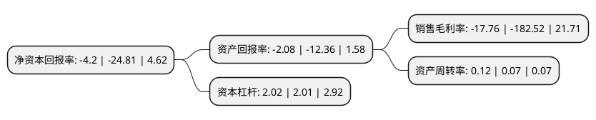

> 本页面由自动化程序生成于 2022年5月20日 01:06
> 内容可能存在错误，如有bug请提交issue至：https://github.com/Eroleice/doc-pi/issues
{.is-warning}

# 上市公司基本情况

## 基本资料

新海宜科技集团股份有限公司（以下简称“ST新海”）成立于1997年01月01日，苏州市。于2006年11月30日在深交所中小板上市。

ST新海注册资本137,466.962万元，主要产品:通信网络配线管理系统，通信网络监测系统，通信防雷工程和通信管材等，为电信运营网，广电网，国防专业通信网及其他专用通信网络提供“一站式”产品服务。主营业务:通信网络配套设备及软件，相关电子产品，安装线缆，电器机械及器材，报警系统出入口控制设备，报警系统视频监控设备及其他安全技术防范产品的开发，制造，加工，销售，电子工程施工业务。以下是详细信息：

- 公司名称: 新海宜科技集团股份有限公司
- 股票代码: 002089.SZ
- 所在地: 江苏 - 苏州市
- 成立日期: 1997年01月01日
- 注册资本: 137,466.962万元
- 法定代表人: 张亦斌
- 主营业务: 主要产品:通信网络配线管理系统，通信网络监测系统，通信防雷工程和通信管材等，为电信运营网，广电网，国防专业通信网及其他专用通信网络提供“一站式”产品服务主营业务:通信网络配套设备及软件，相关电子产品，安装线缆，电器机械及器材，报警系统出入口控制设备，报警系统视频监控设备及其他安全技术防范产品的开发，制造，加工，销售，电子工程施工业务
- 公司官网: www.nsu.com.cn
- 公司介绍: 公司是一家横跨新能源汽车、锂电池、LED芯片、量子通信、光通信、软件等产业领域的多元化民企企业高科技集团。经过几年的积累和发展，公司已经建成涵盖外延-芯片-封装-产品的LED节能照明产业链。在大通信领域，公司不仅在光通信领域营造生态，而且进军电子通信，提升在通信领域的地位。公司是国家火炬计划重点高新技术企业、江苏省高新技术企业和江苏省知识产权重点保护单位。公司在苏州工业园区和深圳软件园拥有两大研发、生产基地，并在北京、上海、西安、常州设立了研发生产的分支机构。公司覆盖全球的销售和服务网络，为运营商及大型通信企业提供优质快捷的售前、售中和售后全程服务，赢得了良好的市场声誉。公司是中国电信、中国移动、中国联通、华为、诺西、爱立信、美国新美亚、美国KMT等众多国际知名品牌的长期合作伙伴。

## 股东及高管情况

上市公司第一大股东为张亦斌，持股194,536,090股，占比14.15%，**疑似为**上市公司实际控制人。

截至2022年03月31日，上市公司的前十大股东中，共有8名自然人股东，1名机构股东，1个产品账户，其中5%以上大股东共有4名。上市公司前十大股东明细如下：

> 未能通过持股比例判定出上市公司实际控制人（持股30%以上）
> 可能存在通过间接持股、联合持股、协议控制等方式拥有实际控制权的主体，具体请参考上市公司定期公告！
{.is-warning}

> 截至2022年03月31日，上市公司前十大股东信息如下：

| 股东名称 | 持股数量（股） | 持股比例 |
| --- | --- | --- |
| 张亦斌 | 194,536,090 | 14.15% |
| 张亦斌 | 140,936,074 | 10.25% |
| 张亦斌 | 140,936,074 | 10.25% |
| 马玲芝 | 131,299,842 | 9.55% |
| 王骏飞 | 44,057,316 | 3.2% |
| 苏州工业园区民营工业区发展有限公司 | 21,679,904 | 1.58% |
| 陕西省国际信托股份有限公司-陕国投·祥瑞5号结构化证券投资集合资金信托计划 | 7,922,100 | 0.58% |
| 黄文忠 | 7,230,000 | 0.53% |
| 柏斯荣 | 6,200,076 | 0.45% |
| 马崇基 | 5,951,840 | 0.43% |

## 利润表分析

上市公司2021年总收入为2.35亿元，净利润为-0.42亿元，**未实现盈利**。

## 杜邦分析

> 数据列示周期：2021年 | 2020年 | 2019年
{.is-info}

上市公司的净资产收益率在近一年有所下降，下降幅度为-83.07%，其变化情况分解如下：
- 上市公司的销售毛利率在近一年下降了-90.27%，可能是生产效率的下降、商品原材料价格上涨或商品价格的下跌所致。
- 上市公司的资产周转率在近一年上升了71.43%，可能是源自于更快的销售回款或库存管理效果提升。
- 上市公司的财务杠杆比率在近一年上升了0.5%，可能是增加负债扩大生产规模。

